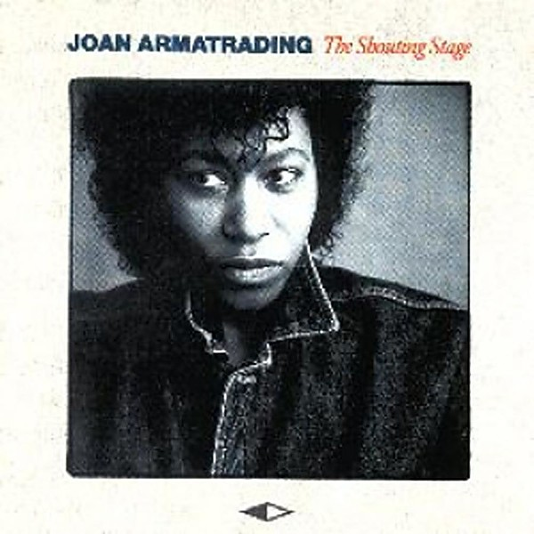

# The Shouting Stage

By **Joan Armatrading**

## Album Data

- **Catalog:** Beets
- **Format:** Digital, Album
- **Album:** The Shouting Stage
- **Artist:** Joan Armatrading
- **Albumartist:** Joan Armatrading
- **Genre:** Smooth Jazz
- **MusicBrainz Album Artist ID:** [fa598e78-5cc5-4a8b-a3b5-63934d4712c7](https://musicbrainz.org/artist/fa598e78-5cc5-4a8b-a3b5-63934d4712c7)
- **MusicBrainz Album ID:** [a7ad7641-7725-46fd-837e-48b7992b0a2a](https://musicbrainz.org/release/a7ad7641-7725-46fd-837e-48b7992b0a2a)
- **MusicBrainz Release Group ID:** [b10c8a63-a47a-3a98-bda8-e955528d77f4](https://musicbrainz.org/release-group/b10c8a63-a47a-3a98-bda8-e955528d77f4)
- **Year:** 1988
- **Catalog #:** 394732-2
- **Label:** A&M Records
- **Total Tracks:** 10

## Album Tracks

### Track 01 - Barefoot and Pregnant

- **Artist:** Joan Armatrading
- **Format:** MP3
- **Genre:** Rock
- **Length:** 3:41
- **MusicBrainz Track ID:** [9e5884cf-d701-4dea-ba57-e3314768087c](https://musicbrainz.org/recording/9e5884cf-d701-4dea-ba57-e3314768087c)
- **Title:** Barefoot and Pregnant
- **Track:** 01
- **Year:** 1978

### Track 02 - Your Letter

- **Artist:** Joan Armatrading
- **Format:** MP3
- **Genre:** Soft Rock
- **Length:** 3:43
- **MusicBrainz Track ID:** [ae2df706-374a-41fa-a85b-30ed4f693197](https://musicbrainz.org/recording/ae2df706-374a-41fa-a85b-30ed4f693197)
- **Title:** Your Letter
- **Track:** 02
- **Year:** 1978

### Track 03 - Am I Blue for You

- **Artist:** Joan Armatrading
- **Format:** MP3
- **Genre:** Blues
- **Length:** 4:27
- **MusicBrainz Track ID:** [4a642fff-63c1-4495-9b24-4104f48c2760](https://musicbrainz.org/recording/4a642fff-63c1-4495-9b24-4104f48c2760)
- **Title:** Am I Blue for You
- **Track:** 03
- **Year:** 1978

### Track 04 - You Rope You Tie Me

- **Artist:** Joan Armatrading
- **Format:** MP3
- **Genre:** Blues
- **Length:** 4:10
- **MusicBrainz Track ID:** [253ec6e0-be1a-41f6-a4e8-ce655af5b833](https://musicbrainz.org/recording/253ec6e0-be1a-41f6-a4e8-ce655af5b833)
- **Title:** You Rope You Tie Me
- **Track:** 04
- **Year:** 1978

### Track 05 - Baby I

- **Artist:** Joan Armatrading
- **Format:** MP3
- **Genre:** Blues
- **Length:** 4:52
- **MusicBrainz Track ID:** [0d2ff758-f72e-4adc-8a45-4d0e1dcfd673](https://musicbrainz.org/recording/0d2ff758-f72e-4adc-8a45-4d0e1dcfd673)
- **Title:** Baby I
- **Track:** 05
- **Year:** 1978

### Track 06 - Bottom to the Top

- **Artist:** Joan Armatrading
- **Format:** MP3
- **Genre:** Soft Rock
- **Length:** 3:36
- **MusicBrainz Track ID:** [79ccdb48-15ef-4509-bc11-55ed263641d3](https://musicbrainz.org/recording/79ccdb48-15ef-4509-bc11-55ed263641d3)
- **Title:** Bottom to the Top
- **Track:** 06
- **Year:** 1978

### Track 07 - Taking My Baby Up Town

- **Artist:** Joan Armatrading
- **Format:** MP3
- **Genre:** Blues
- **Length:** 3:26
- **MusicBrainz Track ID:** [a708e14c-34fd-4a0f-8628-ab00f14498d0](https://musicbrainz.org/recording/a708e14c-34fd-4a0f-8628-ab00f14498d0)
- **Title:** Taking My Baby Up Town
- **Track:** 07
- **Year:** 1978

### Track 08 - What Do You Want

- **Artist:** Joan Armatrading
- **Format:** MP3
- **Genre:** Blues
- **Length:** 3:47
- **MusicBrainz Track ID:** [5d4641c2-eed2-4037-a2c8-d2770b5bb922](https://musicbrainz.org/recording/5d4641c2-eed2-4037-a2c8-d2770b5bb922)
- **Title:** What Do You Want
- **Track:** 08
- **Year:** 1978

### Track 09 - Wishing

- **Artist:** Joan Armatrading
- **Format:** MP3
- **Genre:** Blues
- **Length:** 4:50
- **MusicBrainz Track ID:** [03e4a360-2d41-4eba-a964-a398a4420070](https://musicbrainz.org/recording/03e4a360-2d41-4eba-a964-a398a4420070)
- **Title:** Wishing
- **Track:** 09
- **Year:** 1978

### Track 10 - Let It Last

- **Artist:** Joan Armatrading
- **Format:** MP3
- **Genre:** Blues
- **Length:** 4:58
- **MusicBrainz Track ID:** [0962e555-50c1-4527-a1c4-9d1effbd56d0](https://musicbrainz.org/recording/0962e555-50c1-4527-a1c4-9d1effbd56d0)
- **Title:** Let It Last
- **Track:** 10
- **Year:** 1978

## See also

- [Sleight of Hand](Sleight_of_Hand.md)
- [The Key](The_Key.md)
- [To The Limit](To_The_Limit.md)
- [Vinyl: ](../../Vinyl/Joan_Armatrading/Joan_Armatrading_index.md)
- [Vinyl: Joan Armatrading](../../Vinyl/Joan_Armatrading/Joan_Armatrading.md)
- [Vinyl: Me Myself I](../../Vinyl/Joan_Armatrading/Me_Myself_I.md)
- [Vinyl: Track Record](../../Vinyl/Joan_Armatrading/Track_Record.md)
