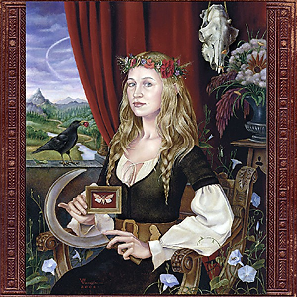

# Ys

By **Joanna Newsom**

## Album Data

- **Catalog:** Beets
- **Format:** Digital, Album
- **Album:** Ys
- **Artist:** Joanna Newsom
- **Albumartist:** Joanna Newsom
- **Genre:** Progressive Folk
- **MusicBrainz Album Artist ID:** [https](https://musicbrainz.org/artist/https)
- **MusicBrainz Album ID:** [https](https://musicbrainz.org/release/https)
- **MusicBrainz Release Group ID:** 
- **Year:** 2006
- **Catalog #:** 
- **Label:** Drag City Records
- **Total Tracks:** 05

## Album Tracks

### Track 01 - Emily

- **Artist:** Joanna Newsom
- **Format:** AAC
- **Genre:** Indie Folk
- **Length:** 12:08
- **MusicBrainz Track ID:** [https](https://musicbrainz.org/recording/https)
- **Title:** Emily
- **Track:** 01
- **Year:** 2006

### Track 02 - Monkey & Bear

- **Artist:** Joanna Newsom
- **Format:** AAC
- **Genre:** Indie Folk
- **Length:** 9:28
- **MusicBrainz Track ID:** [https](https://musicbrainz.org/recording/https)
- **Title:** Monkey & Bear
- **Track:** 02
- **Year:** 2006

### Track 03 - Sawdust & Diamonds

- **Artist:** Joanna Newsom
- **Format:** AAC
- **Genre:** Indie Folk
- **Length:** 9:55
- **MusicBrainz Track ID:** [https](https://musicbrainz.org/recording/https)
- **Title:** Sawdust & Diamonds
- **Track:** 03
- **Year:** 2006

### Track 04 - Only Skin

- **Artist:** Joanna Newsom
- **Format:** AAC
- **Genre:** Indie Folk
- **Length:** 16:53
- **MusicBrainz Track ID:** [https](https://musicbrainz.org/recording/https)
- **Title:** Only Skin
- **Track:** 04
- **Year:** 2006

### Track 05 - Cosmia

- **Artist:** Joanna Newsom
- **Format:** AAC
- **Genre:** Indie Folk
- **Length:** 7:17
- **MusicBrainz Track ID:** [https](https://musicbrainz.org/recording/https)
- **Title:** Cosmia
- **Track:** 05
- **Year:** 2006

