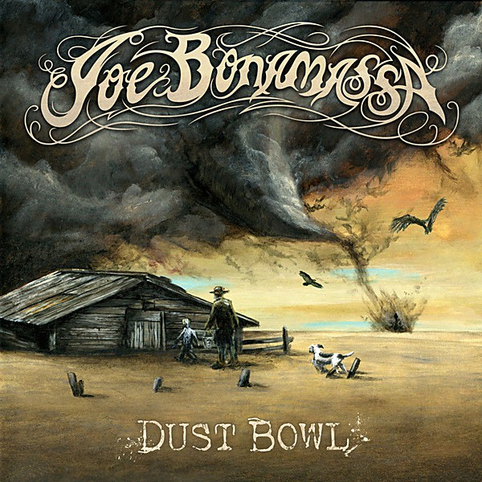

# Dust Bowl

By **Joe Bonamassa**

## Album Data

- **Catalog:** Beets
- **Format:** Digital, Album
- **Album:** Dust Bowl
- **Artist:** Joe Bonamassa
- **Albumartist:** Joe Bonamassa
- **Genre:** Rock
- **MusicBrainz Album Artist ID:** [984f8239-8fe1-4683-9c54-10ffb14439e9](https://musicbrainz.org/artist/984f8239-8fe1-4683-9c54-10ffb14439e9)
- **MusicBrainz Album ID:** [319a74f8-4afc-487b-b3e3-0812d0899fa5](https://musicbrainz.org/release/319a74f8-4afc-487b-b3e3-0812d0899fa5)
- **MusicBrainz Release Group ID:** [b5bbea93-d2ba-4c05-ac44-c0ccf0b2e6ad](https://musicbrainz.org/release-group/b5bbea93-d2ba-4c05-ac44-c0ccf0b2e6ad)
- **Year:** 2011
- **Catalog #:** PRAR93138
- **Label:** J&R Adventures
- **Total Tracks:** 12

## Album Tracks

### Track 01 - Slow Train

- **Artist:** Joe Bonamassa
- **Format:** MP3
- **Genre:** Hard Rock
- **Length:** 6:49
- **MusicBrainz Track ID:** [23d86787-a9ae-432e-a5a4-d085f813ef67](https://musicbrainz.org/recording/23d86787-a9ae-432e-a5a4-d085f813ef67)
- **Title:** Slow Train
- **Track:** 01
- **Year:** 2011

### Track 02 - Dust Bowl

- **Artist:** Joe Bonamassa
- **Format:** MP3
- **Genre:** Blues
- **Length:** 4:32
- **MusicBrainz Track ID:** [84e0ca20-166b-46a6-9bac-7924f6de4151](https://musicbrainz.org/recording/84e0ca20-166b-46a6-9bac-7924f6de4151)
- **Title:** Dust Bowl
- **Track:** 02
- **Year:** 2011

### Track 03 - Tennessee Plates

- **Artist:** Joe Bonamassa
- **Format:** MP3
- **Genre:** Rock
- **Length:** 4:18
- **MusicBrainz Track ID:** [7c924a34-6f5d-4562-9692-15138d74f503](https://musicbrainz.org/recording/7c924a34-6f5d-4562-9692-15138d74f503)
- **Title:** Tennessee Plates
- **Track:** 03
- **Year:** 2011

### Track 04 - The Meaning of the Blues

- **Artist:** Joe Bonamassa
- **Format:** MP3
- **Genre:** Rock
- **Length:** 5:43
- **MusicBrainz Track ID:** [39055981-ea7b-41e7-be5f-c2766d33c550](https://musicbrainz.org/recording/39055981-ea7b-41e7-be5f-c2766d33c550)
- **Title:** The Meaning of the Blues
- **Track:** 04
- **Year:** 2011

### Track 05 - Black Lung Heartache

- **Artist:** Joe Bonamassa
- **Format:** MP3
- **Genre:** Rock
- **Length:** 4:13
- **MusicBrainz Track ID:** [3b155e34-6f13-4f09-a7ec-eaea3f41c7e8](https://musicbrainz.org/recording/3b155e34-6f13-4f09-a7ec-eaea3f41c7e8)
- **Title:** Black Lung Heartache
- **Track:** 05
- **Year:** 2011

### Track 06 - You Better Watch Yourself

- **Artist:** Joe Bonamassa
- **Format:** MP3
- **Genre:** Rock
- **Length:** 3:30
- **MusicBrainz Track ID:** [dd29bff9-0a2f-4764-8e5f-058daeb6e136](https://musicbrainz.org/recording/dd29bff9-0a2f-4764-8e5f-058daeb6e136)
- **Title:** You Better Watch Yourself
- **Track:** 06
- **Year:** 2011

### Track 07 - The Last Matador of Bayonne

- **Artist:** Joe Bonamassa
- **Format:** MP3
- **Genre:** Rock
- **Length:** 5:23
- **MusicBrainz Track ID:** [5930377a-7a67-472c-85a9-938d1160569b](https://musicbrainz.org/recording/5930377a-7a67-472c-85a9-938d1160569b)
- **Title:** The Last Matador of Bayonne
- **Track:** 07
- **Year:** 2011

### Track 08 - Heartbreaker

- **Artist:** Joe Bonamassa
- **Format:** MP3
- **Genre:** Blues
- **Length:** 5:48
- **MusicBrainz Track ID:** [674b455e-577e-4dcd-9d75-7743077c226f](https://musicbrainz.org/recording/674b455e-577e-4dcd-9d75-7743077c226f)
- **Title:** Heartbreaker
- **Track:** 08
- **Year:** 2011

### Track 09 - No Love on the Street

- **Artist:** Joe Bonamassa
- **Format:** MP3
- **Genre:** Rock
- **Length:** 6:31
- **MusicBrainz Track ID:** [d8dfc9a2-4774-4609-baad-7aec42ed0dcd](https://musicbrainz.org/recording/d8dfc9a2-4774-4609-baad-7aec42ed0dcd)
- **Title:** No Love on the Street
- **Track:** 09
- **Year:** 2011

### Track 10 - The Whale That Swallowed Jonah

- **Artist:** Joe Bonamassa
- **Format:** MP3
- **Genre:** Rock
- **Length:** 4:45
- **MusicBrainz Track ID:** [bba58246-ee03-465e-be05-87d4c0f5060b](https://musicbrainz.org/recording/bba58246-ee03-465e-be05-87d4c0f5060b)
- **Title:** The Whale That Swallowed Jonah
- **Track:** 10
- **Year:** 2011

### Track 11 - Sweet Rowena

- **Artist:** Joe Bonamassa
- **Format:** MP3
- **Genre:** Blues
- **Length:** 4:33
- **MusicBrainz Track ID:** [5e2ff04d-8d4c-41f9-9ba1-7560f0222951](https://musicbrainz.org/recording/5e2ff04d-8d4c-41f9-9ba1-7560f0222951)
- **Title:** Sweet Rowena
- **Track:** 11
- **Year:** 2011

### Track 12 - Prisoner

- **Artist:** Joe Bonamassa
- **Format:** MP3
- **Genre:** Rock
- **Length:** 6:48
- **MusicBrainz Track ID:** [c37f2b02-236e-4776-94e2-f217bbffed8c](https://musicbrainz.org/recording/c37f2b02-236e-4776-94e2-f217bbffed8c)
- **Title:** Prisoner
- **Track:** 12
- **Year:** 2011

## See also

- [Vinyl: Dust Bowl](../../Vinyl/Joe_Bonamassa/Dust_Bowl.md)
- [Vinyl: ](../../Vinyl/Joe_Bonamassa/Joe_Bonamassa.md)
