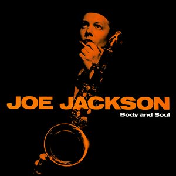

# Body and Soul

By **Joe Jackson**

## Album Data

- **Catalog:** Beets
- **Format:** Digital, Album
- **Album:** Body and Soul
- **Artist:** Joe Jackson
- **Albumartist:** Joe Jackson
- **Genre:** Sophisti-Pop
- **MusicBrainz Album Artist ID:** [07f6d469-38f3-46da-9cfa-2f532422b84e](https://musicbrainz.org/artist/07f6d469-38f3-46da-9cfa-2f532422b84e)
- **MusicBrainz Album ID:** [8d6c4084-3112-4807-aecc-63d91782f902](https://musicbrainz.org/release/8d6c4084-3112-4807-aecc-63d91782f902)
- **MusicBrainz Release Group ID:** [e2604e38-6088-3380-ae2a-a7eaf9631f16](https://musicbrainz.org/release-group/e2604e38-6088-3380-ae2a-a7eaf9631f16)
- **Year:** 1984
- **Catalog #:** SP-3187
- **Label:** A&M Records
- **Total Tracks:** 11

## Album Tracks

### Track 01 - One More Time

- **Artist:** Joe Jackson
- **Format:** AAC
- **Genre:** Power Pop
- **Length:** 3:19
- **MusicBrainz Track ID:** [ec2d77d6-66ce-4190-a1aa-c1c1c6d78f70](https://musicbrainz.org/recording/ec2d77d6-66ce-4190-a1aa-c1c1c6d78f70)
- **Title:** One More Time
- **Track:** 01
- **Year:** 1979

### Track 02 - Sunday Papers

- **Artist:** Joe Jackson
- **Format:** AAC
- **Genre:** Post-Punk
- **Length:** 4:23
- **MusicBrainz Track ID:** [29813cd6-ffaf-480b-be7b-c8b52aa1c3b7](https://musicbrainz.org/recording/29813cd6-ffaf-480b-be7b-c8b52aa1c3b7)
- **Title:** Sunday Papers
- **Track:** 02
- **Year:** 1979

### Track 03 - Is She Really Going Out With Him?

- **Artist:** Joe Jackson
- **Format:** AAC
- **Genre:** New Wave
- **Length:** 3:39
- **MusicBrainz Track ID:** [68754ec7-cf05-43da-98b9-6179ee741f15](https://musicbrainz.org/recording/68754ec7-cf05-43da-98b9-6179ee741f15)
- **Title:** Is She Really Going Out With Him?
- **Track:** 03
- **Year:** 1979

### Track 04 - Happy Loving Couples

- **Artist:** Joe Jackson
- **Format:** AAC
- **Genre:** Power Pop
- **Length:** 3:11
- **MusicBrainz Track ID:** [fe361104-e254-4d59-aa1d-40d50eabb177](https://musicbrainz.org/recording/fe361104-e254-4d59-aa1d-40d50eabb177)
- **Title:** Happy Loving Couples
- **Track:** 04
- **Year:** 1979

### Track 05 - Throw It Away

- **Artist:** Joe Jackson
- **Format:** AAC
- **Genre:** Uk Garage
- **Length:** 2:51
- **MusicBrainz Track ID:** [b37c2209-b206-43db-aa3b-1f8994f65860](https://musicbrainz.org/recording/b37c2209-b206-43db-aa3b-1f8994f65860)
- **Title:** Throw It Away
- **Track:** 05
- **Year:** 1979

### Track 06 - Baby Stick Around

- **Artist:** Joe Jackson
- **Format:** AAC
- **Genre:** Power Pop
- **Length:** 2:39
- **MusicBrainz Track ID:** [800fc293-32c8-45b7-80ca-f80a6cf47648](https://musicbrainz.org/recording/800fc293-32c8-45b7-80ca-f80a6cf47648)
- **Title:** Baby Stick Around
- **Track:** 06
- **Year:** 1979

### Track 07 - Look Sharp!

- **Artist:** Joe Jackson
- **Format:** AAC
- **Genre:** New Wave
- **Length:** 3:25
- **MusicBrainz Track ID:** [5dc163d6-3801-4b5f-b855-5037fd1e1cef](https://musicbrainz.org/recording/5dc163d6-3801-4b5f-b855-5037fd1e1cef)
- **Title:** Look Sharp!
- **Track:** 07
- **Year:** 1979

### Track 08 - Fools in Love

- **Artist:** Joe Jackson
- **Format:** AAC
- **Genre:** New Wave
- **Length:** 4:27
- **MusicBrainz Track ID:** [7e7cbbb6-77b3-4921-8f5a-3b41b2c5c730](https://musicbrainz.org/recording/7e7cbbb6-77b3-4921-8f5a-3b41b2c5c730)
- **Title:** Fools in Love
- **Track:** 08
- **Year:** 1979

### Track 09 - (Do the) Instant Mash

- **Artist:** Joe Jackson
- **Format:** AAC
- **Genre:** Post-Punk
- **Length:** 3:15
- **MusicBrainz Track ID:** [40f06357-8384-4a1c-b081-cb88ee5011f5](https://musicbrainz.org/recording/40f06357-8384-4a1c-b081-cb88ee5011f5)
- **Title:** (Do the) Instant Mash
- **Track:** 09
- **Year:** 1979

### Track 10 - Pretty Girls

- **Artist:** Joe Jackson
- **Format:** AAC
- **Genre:** Power Pop
- **Length:** 2:58
- **MusicBrainz Track ID:** [8d1ac195-c416-462d-ab6e-be773e794454](https://musicbrainz.org/recording/8d1ac195-c416-462d-ab6e-be773e794454)
- **Title:** Pretty Girls
- **Track:** 10
- **Year:** 1979

### Track 11 - Got the Time

- **Artist:** Joe Jackson
- **Format:** AAC
- **Genre:** Power Pop
- **Length:** 2:55
- **MusicBrainz Track ID:** [cf07d3ed-083f-4b10-bfcb-b67f672c3ee0](https://musicbrainz.org/recording/cf07d3ed-083f-4b10-bfcb-b67f672c3ee0)
- **Title:** Got the Time
- **Track:** 11
- **Year:** 1979

## See also

- [Look Sharp!](Look_Sharp!.md)
- [Roon: Big World (Live At The Roundabout Theatre, New York City/1986)](../../Roon/Joe_Jackson/Big_World_Live_At_The_Roundabout_Theatre__New_York_City-1986.md)
- [Roon: Body And Soul](../../Roon/Joe_Jackson/Body_And_Soul.md)
- [Roon: Fool](../../Roon/Joe_Jackson/Fool.md)
- [Roon: Look Sharp!](../../Roon/Joe_Jackson/Look_Sharp!.md)
- [Roon: Night And Day](../../Roon/Joe_Jackson/Night_And_Day.md)
- [Roon: State Theater New Jersey 2005 (Live)](../../Roon/Joe_Jackson/State_Theater_New_Jersey_2005_Live.md)
- [Vinyl: Body And Soul](../../Vinyl/Joe_Jackson/Body_And_Soul.md)
- [Vinyl: ](../../Vinyl/Joe_Jackson/Joe_Jackson.md)
