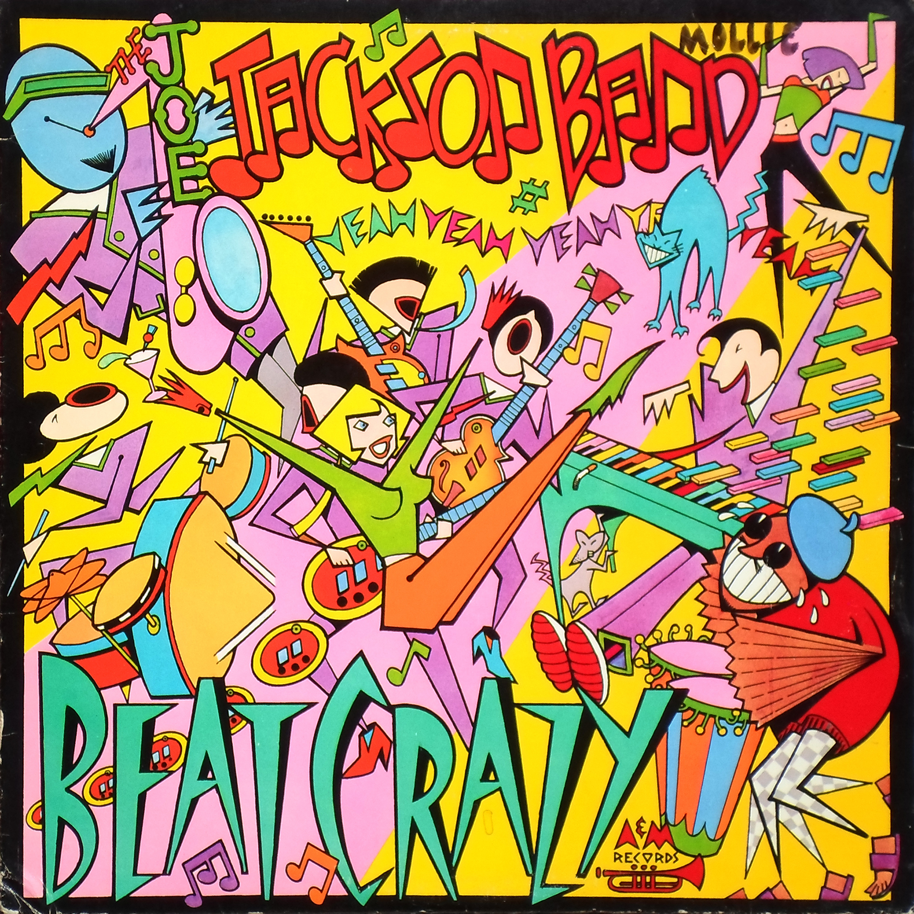

# Beat Crazy

By **Joe Jackson Band**

## Album Data

- **Catalog:** Beets
- **Format:** Digital, Album
- **Album:** Beat Crazy
- **Artist:** Joe Jackson Band
- **Albumartist:** Joe Jackson Band
- **Genre:** Power Pop
- **MusicBrainz Album Artist ID:** [e6fe63ef-5fb8-4f83-a59d-fc13d85d5454](https://musicbrainz.org/artist/e6fe63ef-5fb8-4f83-a59d-fc13d85d5454)
- **MusicBrainz Album ID:** [885cb69b-abde-3de8-99bf-2589660dd508](https://musicbrainz.org/release/885cb69b-abde-3de8-99bf-2589660dd508)
- **MusicBrainz Release Group ID:** [f695655a-c15b-3e3f-9351-4f29437c035a](https://musicbrainz.org/release-group/f695655a-c15b-3e3f-9351-4f29437c035a)
- **Year:** 1985
- **Catalog #:** 
- **Label:** 
- **Total Tracks:** 11

## Album Tracks

### Track 01 - Beat Crazy

- **Artist:** Joe Jackson Band
- **Format:** AAC
- **Genre:** Power Pop
- **Length:** 4:19
- **MusicBrainz Track ID:** [2f334930-9488-4cb6-ba27-ae5c05d9ddfa](https://musicbrainz.org/recording/2f334930-9488-4cb6-ba27-ae5c05d9ddfa)
- **Title:** Beat Crazy
- **Track:** 01
- **Year:** 1985

### Track 02 - One to One

- **Artist:** Joe Jackson Band
- **Format:** AAC
- **Genre:** Power Pop
- **Length:** 3:26
- **MusicBrainz Track ID:** [e35b32b2-22bf-4127-9c7f-e87c4a13ef49](https://musicbrainz.org/recording/e35b32b2-22bf-4127-9c7f-e87c4a13ef49)
- **Title:** One to One
- **Track:** 02
- **Year:** 1985

### Track 03 - In Every Dream Home (A Nightmare)

- **Artist:** Joe Jackson Band
- **Format:** AAC
- **Genre:** Power Pop
- **Length:** 4:35
- **MusicBrainz Track ID:** [e26f855a-e2f6-4a8d-83ae-908d49f23fdc](https://musicbrainz.org/recording/e26f855a-e2f6-4a8d-83ae-908d49f23fdc)
- **Title:** In Every Dream Home (A Nightmare)
- **Track:** 03
- **Year:** 1985

### Track 04 - The Evil Eye

- **Artist:** Joe Jackson Band
- **Format:** AAC
- **Genre:** Power Pop
- **Length:** 3:49
- **MusicBrainz Track ID:** [af179672-df92-439a-b8e1-689ca7fce159](https://musicbrainz.org/recording/af179672-df92-439a-b8e1-689ca7fce159)
- **Title:** The Evil Eye
- **Track:** 04
- **Year:** 1985

### Track 05 - Mad At You

- **Artist:** Joe Jackson Band
- **Format:** AAC
- **Genre:** Power Pop
- **Length:** 6:08
- **MusicBrainz Track ID:** [f0a5ee67-dd3a-4504-a665-b670692485ed](https://musicbrainz.org/recording/f0a5ee67-dd3a-4504-a665-b670692485ed)
- **Title:** Mad At You
- **Track:** 05
- **Year:** 1985

### Track 06 - Crime Don't Pay

- **Artist:** Joe Jackson Band
- **Format:** AAC
- **Genre:** Power Pop
- **Length:** 4:29
- **MusicBrainz Track ID:** [3ae61a24-8ee6-4fcf-88c3-fa7257e3e025](https://musicbrainz.org/recording/3ae61a24-8ee6-4fcf-88c3-fa7257e3e025)
- **Title:** Crime Don't Pay
- **Track:** 06
- **Year:** 1985

### Track 07 - Someone Up There

- **Artist:** Joe Jackson Band
- **Format:** AAC
- **Genre:** Power Pop
- **Length:** 3:53
- **MusicBrainz Track ID:** [56a0b259-da1c-4d29-84db-a280a4e146e9](https://musicbrainz.org/recording/56a0b259-da1c-4d29-84db-a280a4e146e9)
- **Title:** Someone Up There
- **Track:** 07
- **Year:** 1985

### Track 08 - Battleground

- **Artist:** Joe Jackson Band
- **Format:** AAC
- **Genre:** Power Pop
- **Length:** 2:35
- **MusicBrainz Track ID:** [a3160304-9a56-4a05-8b3d-285736ec0218](https://musicbrainz.org/recording/a3160304-9a56-4a05-8b3d-285736ec0218)
- **Title:** Battleground
- **Track:** 08
- **Year:** 1985

### Track 09 - Biology

- **Artist:** Joe Jackson Band
- **Format:** AAC
- **Genre:** Power Pop
- **Length:** 4:36
- **MusicBrainz Track ID:** [223ec477-8f89-4f42-9c5d-1ace652bb7f7](https://musicbrainz.org/recording/223ec477-8f89-4f42-9c5d-1ace652bb7f7)
- **Title:** Biology
- **Track:** 09
- **Year:** 1985

### Track 10 - Pretty Boys

- **Artist:** Joe Jackson Band
- **Format:** AAC
- **Genre:** Power Pop
- **Length:** 3:45
- **MusicBrainz Track ID:** [fcb8994c-ff06-4d0c-b098-eda0fc0fae7d](https://musicbrainz.org/recording/fcb8994c-ff06-4d0c-b098-eda0fc0fae7d)
- **Title:** Pretty Boys
- **Track:** 10
- **Year:** 1985

### Track 11 - Fit

- **Artist:** Joe Jackson Band
- **Format:** AAC
- **Genre:** Power Pop
- **Length:** 4:49
- **MusicBrainz Track ID:** [b318ae5d-7d34-48ff-b5ff-5e1044b23eb5](https://musicbrainz.org/recording/b318ae5d-7d34-48ff-b5ff-5e1044b23eb5)
- **Title:** Fit
- **Track:** 11
- **Year:** 1985

