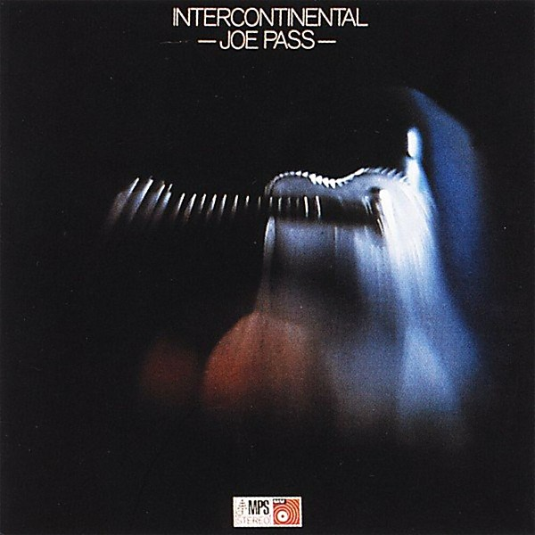

# Intercontinental

By **Joe Pass**

## Album Data

- **Catalog:** Beets
- **Format:** Digital, Album
- **Album:** Intercontinental
- **Artist:** Joe Pass
- **Albumartist:** Joe Pass
- **Genre:** Bebop
- **MusicBrainz Album Artist ID:** [2f43e416-f1bf-4f04-8853-a0019aa12441](https://musicbrainz.org/artist/2f43e416-f1bf-4f04-8853-a0019aa12441)
- **MusicBrainz Album ID:** [509c77fd-a9fa-4b11-845f-96e310d34478](https://musicbrainz.org/release/509c77fd-a9fa-4b11-845f-96e310d34478)
- **MusicBrainz Release Group ID:** [4fc9583e-756d-36af-856a-dd904c045435](https://musicbrainz.org/release-group/4fc9583e-756d-36af-856a-dd904c045435)
- **Year:** 2014
- **Catalog #:** OJCCD-684-2
- **Label:** Original Jazz Classics
- **Total Tracks:** 12

## Album Tracks

### Track 01 - Offbeat

- **Artist:** Joe Pass
- **Format:** AAC
- **Genre:** Bebop
- **Length:** 4:48
- **MusicBrainz Track ID:** [de6d3e1e-cfc4-4760-9c09-667d10f56580](https://musicbrainz.org/recording/de6d3e1e-cfc4-4760-9c09-667d10f56580)
- **Title:** Offbeat
- **Track:** 01
- **Year:** 1992

### Track 02 - Trinidad

- **Artist:** Joe Pass
- **Format:** AAC
- **Genre:** Jazz
- **Length:** 6:20
- **MusicBrainz Track ID:** [f114087b-3f68-485c-947f-faaefd7f4f5b](https://musicbrainz.org/recording/f114087b-3f68-485c-947f-faaefd7f4f5b)
- **Title:** Trinidad
- **Track:** 02
- **Year:** 1992

### Track 03 - Nina's Blues

- **Artist:** Joe Pass
- **Format:** AAC
- **Genre:** Bebop
- **Length:** 5:24
- **MusicBrainz Track ID:** [84ccbe03-a88e-4e6c-a837-d2a7eee8cf77](https://musicbrainz.org/recording/84ccbe03-a88e-4e6c-a837-d2a7eee8cf77)
- **Title:** Nina's Blues
- **Track:** 03
- **Year:** 1992

### Track 04 - Sevenths

- **Artist:** Joe Pass
- **Format:** AAC
- **Genre:** Jazz
- **Length:** 4:19
- **MusicBrainz Track ID:** [9c9638fa-128e-4d9a-ab3a-b1f7e635179b](https://musicbrainz.org/recording/9c9638fa-128e-4d9a-ab3a-b1f7e635179b)
- **Title:** Sevenths
- **Track:** 04
- **Year:** 1992

### Track 05 - Ninths

- **Artist:** Joe Pass
- **Format:** AAC
- **Genre:** Bebop
- **Length:** 5:31
- **MusicBrainz Track ID:** [d9b7ac6c-4f3d-4701-8144-259d1e386690](https://musicbrainz.org/recording/d9b7ac6c-4f3d-4701-8144-259d1e386690)
- **Title:** Ninths
- **Track:** 05
- **Year:** 1992

### Track 06 - Dissonance #1

- **Artist:** Joe Pass
- **Format:** AAC
- **Genre:** Bebop
- **Length:** 2:00
- **MusicBrainz Track ID:** [761338a2-30f2-46c3-b82e-301477145f91](https://musicbrainz.org/recording/761338a2-30f2-46c3-b82e-301477145f91)
- **Title:** Dissonance #1
- **Track:** 06
- **Year:** 1992

### Track 07 - Minor Detail

- **Artist:** Joe Pass
- **Format:** AAC
- **Genre:** Jazz
- **Length:** 6:11
- **MusicBrainz Track ID:** [93df4336-fab2-46c2-801e-2161d7e66091](https://musicbrainz.org/recording/93df4336-fab2-46c2-801e-2161d7e66091)
- **Title:** Minor Detail
- **Track:** 07
- **Year:** 1992

### Track 08 - Paco de Lucía

- **Artist:** Joe Pass
- **Format:** AAC
- **Genre:** Bebop
- **Length:** 6:02
- **MusicBrainz Track ID:** [d7c2116b-7cef-4644-b65a-f5b00cd556f5](https://musicbrainz.org/recording/d7c2116b-7cef-4644-b65a-f5b00cd556f5)
- **Title:** Paco de Lucía
- **Track:** 08
- **Year:** 1992

### Track 09 - Sultry

- **Artist:** Joe Pass
- **Format:** AAC
- **Genre:** Bebop
- **Length:** 4:38
- **MusicBrainz Track ID:** [df308469-9e6b-46f8-b449-1eb0db21d0a8](https://musicbrainz.org/recording/df308469-9e6b-46f8-b449-1eb0db21d0a8)
- **Title:** Sultry
- **Track:** 09
- **Year:** 1992

### Track 10 - Passanova

- **Artist:** Joe Pass
- **Format:** AAC
- **Genre:** Jazz
- **Length:** 4:37
- **MusicBrainz Track ID:** [be87d2d9-6a42-4ff3-a9c1-3ba14c1ba3b6](https://musicbrainz.org/recording/be87d2d9-6a42-4ff3-a9c1-3ba14c1ba3b6)
- **Title:** Passanova
- **Track:** 10
- **Year:** 1992

### Track 11 - Pasta Blues

- **Artist:** Joe Pass
- **Format:** AAC
- **Genre:** Jazz
- **Length:** 4:44
- **MusicBrainz Track ID:** [f4cd9843-6536-4841-9ce1-607fa377c7be](https://musicbrainz.org/recording/f4cd9843-6536-4841-9ce1-607fa377c7be)
- **Title:** Pasta Blues
- **Track:** 11
- **Year:** 1992

### Track 12 - Dissonance #2

- **Artist:** Joe Pass
- **Format:** AAC
- **Genre:** Bebop
- **Length:** 3:09
- **MusicBrainz Track ID:** [ccce33e6-182a-4392-89d2-2218d2057385](https://musicbrainz.org/recording/ccce33e6-182a-4392-89d2-2218d2057385)
- **Title:** Dissonance #2
- **Track:** 12
- **Year:** 1992

## See also

- [Virtuoso #3](Virtuoso_3.md)
- [Roon: Virtuoso (2010 Remaster)](../../Roon/Joe_Pass/Virtuoso_2010_Remaster.md)
- [Roon: Virtuoso #2](../../Roon/Joe_Pass/Virtuoso_2.md)
- [Roon: Virtuoso #3](../../Roon/Joe_Pass/Virtuoso_3.md)
- [Vinyl: Intercontinental](../../Vinyl/Joe_Pass/Intercontinental.md)
- [Vinyl: ](../../Vinyl/Joe_Pass/Joe_Pass.md)
