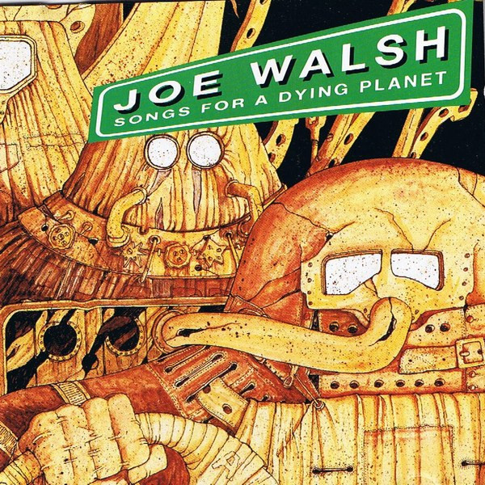

# Songs for a Dying Planet

By **Joe Walsh**

## Album Data

- **Catalog:** Beets
- **Format:** Digital, Album
- **Album:** Songs for a Dying Planet
- **Artist:** Joe Walsh
- **Albumartist:** Joe Walsh
- **Genre:** Southern Rock
- **MusicBrainz Album Artist ID:** [c6f5969f-1f65-465c-8603-ec2d1e31e39d](https://musicbrainz.org/artist/c6f5969f-1f65-465c-8603-ec2d1e31e39d)
- **MusicBrainz Album ID:** [7ebb088f-d66a-482f-af62-dcc617d4bb69](https://musicbrainz.org/release/7ebb088f-d66a-482f-af62-dcc617d4bb69)
- **MusicBrainz Release Group ID:** [336fb6b8-7129-3180-a57a-0d527f8f2b1e](https://musicbrainz.org/release-group/336fb6b8-7129-3180-a57a-0d527f8f2b1e)
- **Year:** 1992
- **Catalog #:** A 30407
- **Label:** Sony Music Special Products
- **Total Tracks:** 12

## Album Tracks

### Track 01 - Shut Up

- **Artist:** Joe Walsh
- **Format:** MP3
- **Genre:** Southern Rock
- **Length:** 3:19
- **MusicBrainz Track ID:** [1ffcea05-e2e9-4c46-9b6d-665765bfd0b4](https://musicbrainz.org/recording/1ffcea05-e2e9-4c46-9b6d-665765bfd0b4)
- **Title:** Shut Up
- **Track:** 01
- **Year:** 1992

### Track 02 - Fairbanks Alaska

- **Artist:** Joe Walsh
- **Format:** MP3
- **Genre:** Southern Rock
- **Length:** 3:26
- **MusicBrainz Track ID:** [305dc2d3-54d0-413e-a34b-280671b0649b](https://musicbrainz.org/recording/305dc2d3-54d0-413e-a34b-280671b0649b)
- **Title:** Fairbanks Alaska
- **Track:** 02
- **Year:** 1992

### Track 03 - Coyote Love

- **Artist:** Joe Walsh
- **Format:** MP3
- **Genre:** Southern Rock
- **Length:** 4:42
- **MusicBrainz Track ID:** [d4ec8d1b-0519-4215-9990-ac7c754b6660](https://musicbrainz.org/recording/d4ec8d1b-0519-4215-9990-ac7c754b6660)
- **Title:** Coyote Love
- **Track:** 03
- **Year:** 1992

### Track 04 - I Know

- **Artist:** Joe Walsh
- **Format:** MP3
- **Genre:** Southern Rock
- **Length:** 1:45
- **MusicBrainz Track ID:** [851564d1-32c1-4863-95db-6325158a6745](https://musicbrainz.org/recording/851564d1-32c1-4863-95db-6325158a6745)
- **Title:** I Know
- **Track:** 04
- **Year:** 1992

### Track 05 - Certain Situations

- **Artist:** Joe Walsh
- **Format:** MP3
- **Genre:** Southern Rock
- **Length:** 4:34
- **MusicBrainz Track ID:** [4ddc34e8-1229-47e9-b561-f5dc3d9c5c42](https://musicbrainz.org/recording/4ddc34e8-1229-47e9-b561-f5dc3d9c5c42)
- **Title:** Certain Situations
- **Track:** 05
- **Year:** 1992

### Track 06 - Vote for Me

- **Artist:** Joe Walsh
- **Format:** MP3
- **Genre:** Rock
- **Length:** 4:21
- **MusicBrainz Track ID:** [1764dae8-4b20-4a84-9cc1-b261df2931d2](https://musicbrainz.org/recording/1764dae8-4b20-4a84-9cc1-b261df2931d2)
- **Title:** Vote for Me
- **Track:** 06
- **Year:** 1992

### Track 07 - Theme From Baroque Weirdos

- **Artist:** Joe Walsh
- **Format:** MP3
- **Genre:** Southern Rock
- **Length:** 1:33
- **MusicBrainz Track ID:** [9f38cda5-4567-49d8-aa02-3a0c16bbad05](https://musicbrainz.org/recording/9f38cda5-4567-49d8-aa02-3a0c16bbad05)
- **Title:** Theme From Baroque Weirdos
- **Track:** 07
- **Year:** 1992

### Track 08 - The Friend Song

- **Artist:** Joe Walsh
- **Format:** MP3
- **Genre:** Southern Rock
- **Length:** 3:32
- **MusicBrainz Track ID:** [8abe7784-480f-4260-ac20-cf41a8eec2f9](https://musicbrainz.org/recording/8abe7784-480f-4260-ac20-cf41a8eec2f9)
- **Title:** The Friend Song
- **Track:** 08
- **Year:** 1992

### Track 09 - It’s All Right

- **Artist:** Joe Walsh
- **Format:** MP3
- **Genre:** Southern Rock
- **Length:** 3:25
- **MusicBrainz Track ID:** [668a177b-afb6-4f87-bea6-f4cba752d445](https://musicbrainz.org/recording/668a177b-afb6-4f87-bea6-f4cba752d445)
- **Title:** It’s All Right
- **Track:** 09
- **Year:** 1992

### Track 10 - Will You Still Love Me Tomorrow

- **Artist:** Joe Walsh
- **Format:** MP3
- **Genre:** Southern Rock
- **Length:** 3:58
- **MusicBrainz Track ID:** [d34fd9aa-e9be-424f-b564-61b8f56a859e](https://musicbrainz.org/recording/d34fd9aa-e9be-424f-b564-61b8f56a859e)
- **Title:** Will You Still Love Me Tomorrow
- **Track:** 10
- **Year:** 1992

### Track 11 - Decades

- **Artist:** Joe Walsh
- **Format:** MP3
- **Genre:** Southern Rock
- **Length:** 12:02
- **MusicBrainz Track ID:** [7bba73cc-b578-40d0-a5f9-e5a20ae2dd4e](https://musicbrainz.org/recording/7bba73cc-b578-40d0-a5f9-e5a20ae2dd4e)
- **Title:** Decades
- **Track:** 11
- **Year:** 1992

### Track 12 - Song for a Dying Planet

- **Artist:** Joe Walsh
- **Format:** MP3
- **Genre:** Rock
- **Length:** 2:00
- **MusicBrainz Track ID:** [584057fe-1212-4f77-8aa8-a531d85c5f55](https://musicbrainz.org/recording/584057fe-1212-4f77-8aa8-a531d85c5f55)
- **Title:** Song for a Dying Planet
- **Track:** 12
- **Year:** 1992

## See also

- [Roon: Barnstorm](../../Roon/Joe_Walsh/Barnstorm.md)
- [Roon: But Seriously, Folks...](../../Roon/Joe_Walsh/But_Seriously__Folks.md)
- [Roon: So What (Reissue)](../../Roon/Joe_Walsh/So_What_Reissue.md)
- [Roon: There Goes the Neighborhood](../../Roon/Joe_Walsh/There_Goes_the_Neighborhood.md)
- [Roon: The Smoker You Drink, The Player You Get](../../Roon/Joe_Walsh/The_Smoker_You_Drink__The_Player_You_Get.md)
