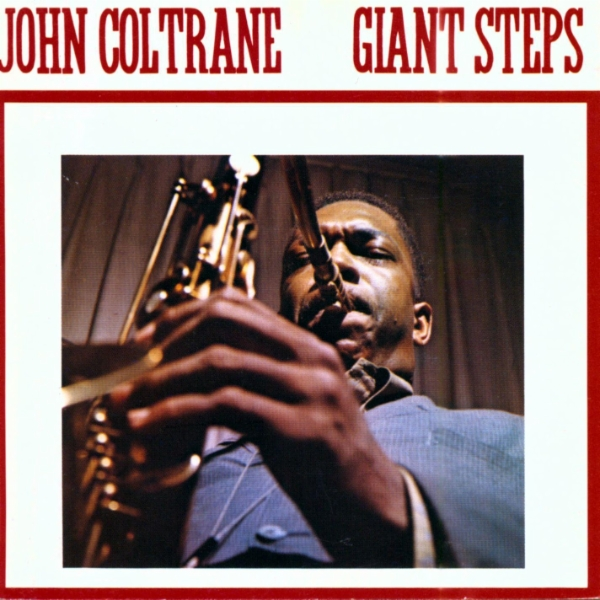

# Giant Steps

By **John Coltrane**

## Album Data

- **Catalog:** Beets
- **Format:** Digital, Album
- **Album:** Giant Steps
- **Artist:** John Coltrane
- **Albumartist:** John Coltrane
- **Genre:** Hard Bop
- **MusicBrainz Album Artist ID:** [b625448e-bf4a-41c3-a421-72ad46cdb831](https://musicbrainz.org/artist/b625448e-bf4a-41c3-a421-72ad46cdb831)
- **MusicBrainz Album ID:** [830ba33a-c6f9-4107-a618-ad8102f633bd](https://musicbrainz.org/release/830ba33a-c6f9-4107-a618-ad8102f633bd)
- **MusicBrainz Release Group ID:** [2cdca11d-3e45-3152-93e5-4d2a4ddb1bc6](https://musicbrainz.org/release-group/2cdca11d-3e45-3152-93e5-4d2a4ddb1bc6)
- **Year:** 1986
- **Catalog #:** 01311
- **Label:** Rhino
- **Total Tracks:** 12

## Album Tracks

### Track 01 - Giant Steps

- **Artist:** John Coltrane
- **Format:** ALAC
- **Genre:** Hard Bop
- **Length:** 4:46
- **MusicBrainz Track ID:** [2de1491b-7477-4676-b883-443aee5bbcbe](https://musicbrainz.org/recording/2de1491b-7477-4676-b883-443aee5bbcbe)
- **Title:** Giant Steps
- **Track:** 01
- **Year:** 1986

### Track 02 - Cousin Mary

- **Artist:** John Coltrane
- **Format:** ALAC
- **Genre:** Cool Jazz
- **Length:** 5:49
- **MusicBrainz Track ID:** [0bfaadc4-f1e2-4db1-a3ee-141422e3e361](https://musicbrainz.org/recording/0bfaadc4-f1e2-4db1-a3ee-141422e3e361)
- **Title:** Cousin Mary
- **Track:** 02
- **Year:** 1986

### Track 03 - Countdown

- **Artist:** John Coltrane
- **Format:** ALAC
- **Genre:** Hard Bop
- **Length:** 2:25
- **MusicBrainz Track ID:** [769b8430-fa92-4f0b-91df-55266dcfc9da](https://musicbrainz.org/recording/769b8430-fa92-4f0b-91df-55266dcfc9da)
- **Title:** Countdown
- **Track:** 03
- **Year:** 1986

### Track 04 - Spiral

- **Artist:** John Coltrane
- **Format:** ALAC
- **Genre:** Modal Jazz
- **Length:** 6:00
- **MusicBrainz Track ID:** [1edba6d9-7ee2-4582-a672-a46e74f52bfb](https://musicbrainz.org/recording/1edba6d9-7ee2-4582-a672-a46e74f52bfb)
- **Title:** Spiral
- **Track:** 04
- **Year:** 1986

### Track 05 - Syeeda’s Song Flute

- **Artist:** John Coltrane
- **Format:** ALAC
- **Genre:** Hard Bop
- **Length:** 7:05
- **MusicBrainz Track ID:** [b7bc955a-b8fd-43cd-8505-b2a1f37b8a1e](https://musicbrainz.org/recording/b7bc955a-b8fd-43cd-8505-b2a1f37b8a1e)
- **Title:** Syeeda’s Song Flute
- **Track:** 05
- **Year:** 1986

### Track 06 - Naima

- **Artist:** John Coltrane
- **Format:** ALAC
- **Genre:** Cool Jazz
- **Length:** 4:24
- **MusicBrainz Track ID:** [20465c83-4248-4cb1-9f65-58948053f084](https://musicbrainz.org/recording/20465c83-4248-4cb1-9f65-58948053f084)
- **Title:** Naima
- **Track:** 06
- **Year:** 1986

### Track 07 - Mr. P.C.

- **Artist:** John Coltrane
- **Format:** ALAC
- **Genre:** Free Jazz
- **Length:** 7:02
- **MusicBrainz Track ID:** [e34a693a-80cb-417b-a890-97a3b5dd05e9](https://musicbrainz.org/recording/e34a693a-80cb-417b-a890-97a3b5dd05e9)
- **Title:** Mr. P.C.
- **Track:** 07
- **Year:** 1986

### Track 08 - Giant Steps (alternate take)

- **Artist:** John Coltrane
- **Format:** ALAC
- **Genre:** Hard Bop
- **Length:** 3:44
- **MusicBrainz Track ID:** [f0346c7b-48de-446b-b7ed-a9bbc926a246](https://musicbrainz.org/recording/f0346c7b-48de-446b-b7ed-a9bbc926a246)
- **Title:** Giant Steps (alternate take)
- **Track:** 08
- **Year:** 1986

### Track 09 - Naima (alternate take)

- **Artist:** John Coltrane
- **Format:** ALAC
- **Genre:** Jazz
- **Length:** 4:31
- **MusicBrainz Track ID:** [52f618e2-d4ce-4937-8241-80b66657c3cc](https://musicbrainz.org/recording/52f618e2-d4ce-4937-8241-80b66657c3cc)
- **Title:** Naima (alternate take)
- **Track:** 09
- **Year:** 1986

### Track 10 - Cousin Mary (alternate take)

- **Artist:** John Coltrane
- **Format:** ALAC
- **Genre:** Hard Bop
- **Length:** 5:48
- **MusicBrainz Track ID:** [e3b650f0-3d46-4b37-9454-20ea27d6b363](https://musicbrainz.org/recording/e3b650f0-3d46-4b37-9454-20ea27d6b363)
- **Title:** Cousin Mary (alternate take)
- **Track:** 10
- **Year:** 1986

### Track 11 - Countdown (alternate take)

- **Artist:** John Coltrane
- **Format:** ALAC
- **Genre:** Free Jazz
- **Length:** 4:35
- **MusicBrainz Track ID:** [6e8145b3-4798-46d3-b5d6-b11c13af7351](https://musicbrainz.org/recording/6e8145b3-4798-46d3-b5d6-b11c13af7351)
- **Title:** Countdown (alternate take)
- **Track:** 11
- **Year:** 1986

### Track 12 - Syeeda’s Song Flute (alternate take)

- **Artist:** John Coltrane
- **Format:** ALAC
- **Genre:** Hard Bop
- **Length:** 7:03
- **MusicBrainz Track ID:** [a4513259-6b9e-4fdb-bbe2-b5f181307b83](https://musicbrainz.org/recording/a4513259-6b9e-4fdb-bbe2-b5f181307b83)
- **Title:** Syeeda’s Song Flute (alternate take)
- **Track:** 12
- **Year:** 1986

