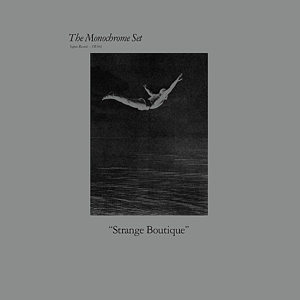

# Unknown Album

By **John Denver**

## Album Data

- **Catalog:** Beets
- **Format:** Digital, Album
- **Album:** Unknown Album
- **Artist:** John Denver
- **Albumartist:** John Denver
- **Genre:** Country
- **MusicBrainz Album Artist ID:** 
- **MusicBrainz Album ID:** 
- **MusicBrainz Release Group ID:** 
- **Year:** 1971
- **Catalog #:** 
- **Label:** 
- **Total Tracks:** 00

## Album Tracks

### Track 00 - Take Me Home Country Roads

- **Artist:** John Denver
- **Format:** AAC
- **Genre:** Classic Country
- **Length:** 3:09
- **MusicBrainz Track ID:** 
- **Title:** Take Me Home Country Roads
- **Track:** 00
- **Year:** 1971

## See also

- [The John Denver Collection, Vol. 4](The_John_Denver_Collection__Vol_4.md)
- [Vinyl: ](../../Vinyl/John_Denver/John_Denver.md)
- [Vinyl: Sunshine On My Shoulders](../../Vinyl/John_Denver/Sunshine_On_My_Shoulders.md)
