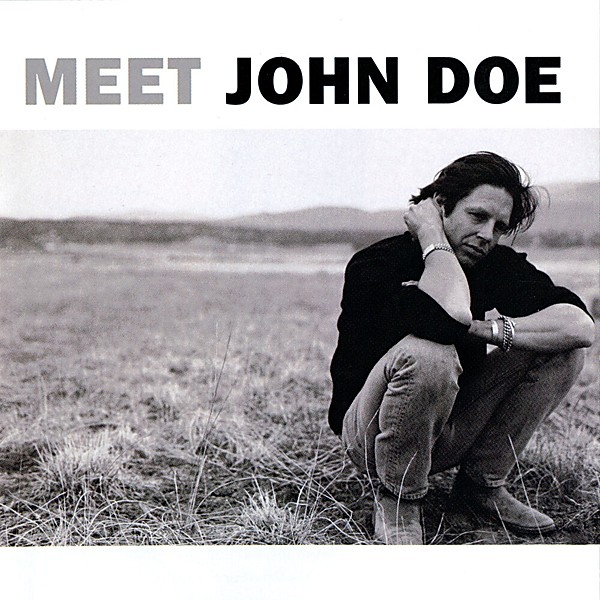

# Meet John Doe

By **John Doe**

## Album Data

- **Catalog:** Beets
- **Format:** Digital, Album
- **Album:** Meet John Doe
- **Artist:** John Doe
- **Albumartist:** John Doe
- **Genre:** Deathcore
- **MusicBrainz Album Artist ID:** [804adff4-9f7b-49d9-9585-6c73fb33e5aa](https://musicbrainz.org/artist/804adff4-9f7b-49d9-9585-6c73fb33e5aa)
- **MusicBrainz Album ID:** [b20b4170-4b5f-40ef-9013-2a142861731d](https://musicbrainz.org/release/b20b4170-4b5f-40ef-9013-2a142861731d)
- **MusicBrainz Release Group ID:** [0b71ae2a-031a-3bd6-ac6d-a0ee94b6c941](https://musicbrainz.org/release-group/0b71ae2a-031a-3bd6-ac6d-a0ee94b6c941)
- **Year:** 1990
- **Catalog #:** 
- **Label:** Yep Roc Records
- **Total Tracks:** 12

## Album Tracks

### Track 01 - The Wilderness

- **Artist:** John Doe
- **Format:** AAC
- **Genre:** Deathcore
- **Length:** 0:21
- **MusicBrainz Track ID:** [https](https://musicbrainz.org/recording/https)
- **Title:** The Wilderness
- **Track:** 01
- **Year:** 2007

### Track 02 - Hotel Ghost

- **Artist:** John Doe
- **Format:** AAC
- **Genre:** Indie Rock
- **Length:** 2:27
- **MusicBrainz Track ID:** [https](https://musicbrainz.org/recording/https)
- **Title:** Hotel Ghost
- **Track:** 02
- **Year:** 2007

### Track 03 - The Golden State

- **Artist:** John Doe
- **Format:** AAC
- **Genre:** Rock And Roll
- **Length:** 3:01
- **MusicBrainz Track ID:** [https](https://musicbrainz.org/recording/https)
- **Title:** The Golden State
- **Track:** 03
- **Year:** 2007

### Track 04 - Darling Undergdog

- **Artist:** John Doe
- **Format:** AAC
- **Genre:** Deathcore
- **Length:** 2:52
- **MusicBrainz Track ID:** [https](https://musicbrainz.org/recording/https)
- **Title:** Darling Undergdog
- **Track:** 04
- **Year:** 2007

### Track 05 - A Little More Time

- **Artist:** John Doe
- **Format:** AAC
- **Genre:** Indie Rock
- **Length:** 3:48
- **MusicBrainz Track ID:** [https](https://musicbrainz.org/recording/https)
- **Title:** A Little More Time
- **Track:** 05
- **Year:** 2007

### Track 06 - Unforgiven

- **Artist:** John Doe
- **Format:** MP3
- **Genre:** Deathcore
- **Length:** 2:59
- **MusicBrainz Track ID:** [https](https://musicbrainz.org/recording/https)
- **Title:** Unforgiven
- **Track:** 06
- **Year:** 2007

### Track 07 - There's A Hole

- **Artist:** John Doe
- **Format:** MP3
- **Genre:** Rock And Roll
- **Length:** 2:38
- **MusicBrainz Track ID:** [https](https://musicbrainz.org/recording/https)
- **Title:** There's A Hole
- **Track:** 07
- **Year:** 2007

### Track 08 - Lean Out Yr Window

- **Artist:** John Doe
- **Format:** MP3
- **Genre:** Rock
- **Length:** 2:30
- **MusicBrainz Track ID:** [https](https://musicbrainz.org/recording/https)
- **Title:** Lean Out Yr Window
- **Track:** 08
- **Year:** 2007

### Track 09 - Big Moon

- **Artist:** John Doe
- **Format:** AAC
- **Genre:** Deathcore
- **Length:** 3:24
- **MusicBrainz Track ID:** [https](https://musicbrainz.org/recording/https)
- **Title:** Big Moon
- **Track:** 09
- **Year:** 2007

### Track 10 - The Bridge

- **Artist:** John Doe
- **Format:** AAC
- **Genre:** Deathcore
- **Length:** 3:21
- **MusicBrainz Track ID:** [https](https://musicbrainz.org/recording/https)
- **Title:** The Bridge
- **Track:** 10
- **Year:** 2007

### Track 11 - Meanest Man In The World

- **Artist:** John Doe
- **Format:** AAC
- **Genre:** Americana
- **Length:** 3:48
- **MusicBrainz Track ID:** [https](https://musicbrainz.org/recording/https)
- **Title:** Meanest Man In The World
- **Track:** 11
- **Year:** 2007

### Track 12 - Grain Of Salt

- **Artist:** John Doe
- **Format:** AAC
- **Genre:** Rock
- **Length:** 4:29
- **MusicBrainz Track ID:** [https](https://musicbrainz.org/recording/https)
- **Title:** Grain Of Salt
- **Track:** 12
- **Year:** 2007

## See also

- [A Year In The Wilderness](A_Year_In_The_Wilderness.md)
- [Roon: A Year in the Wilderness](../../Roon/John_Doe/A_Year_in_the_Wilderness.md)
- [Roon: Meet John Doe](../../Roon/John_Doe/Meet_John_Doe.md)
