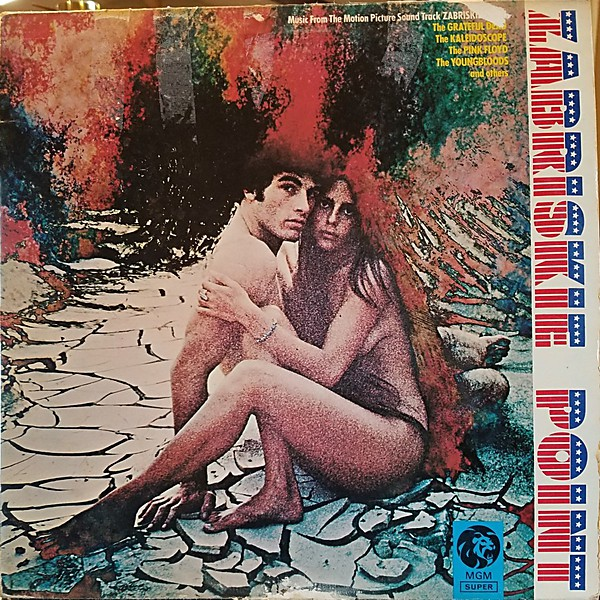

# Zabriskie Point

By **John Fahey**

## Album Data

- **Catalog:** Beets
- **Format:** Digital, Album
- **Album:** Zabriskie Point
- **Artist:** John Fahey
- **Albumartist:** John Fahey
- **Genre:** Americana
- **MusicBrainz Album Artist ID:** 
- **MusicBrainz Album ID:** 
- **MusicBrainz Release Group ID:** 
- **Year:** 0000
- **Catalog #:** 
- **Label:** 
- **Total Tracks:** 00

## Album Tracks

### Track 01 - Dance of Death

- **Artist:** John Fahey
- **Format:** AAC
- **Genre:** New Wave
- **Length:** 2:43
- **MusicBrainz Track ID:** 
- **Title:** Dance of Death
- **Track:** 01
- **Year:** 0000

