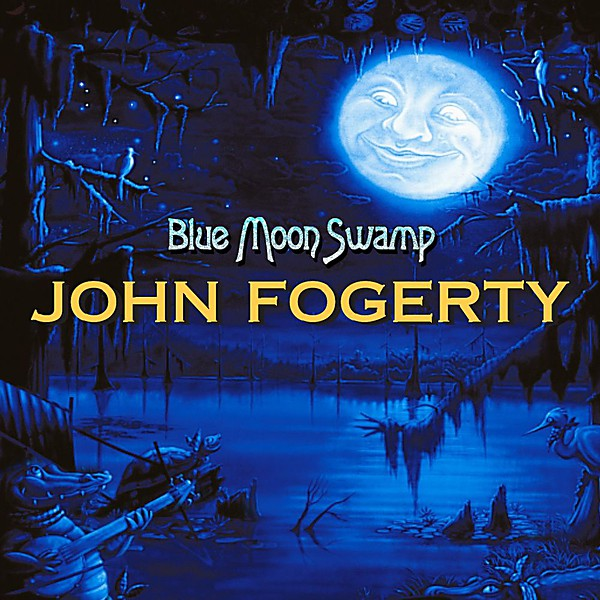

# Blue Moon Swamp

By **John Fogerty**

## Album Data

- **Catalog:** Beets
- **Format:** Digital, Album
- **Album:** Blue Moon Swamp
- **Artist:** John Fogerty
- **Albumartist:** John Fogerty
- **Genre:** Country Rock
- **MusicBrainz Album Artist ID:** [c3649208-0ebe-449b-b1d7-4bd6c560f109](https://musicbrainz.org/artist/c3649208-0ebe-449b-b1d7-4bd6c560f109)
- **MusicBrainz Album ID:** [4fbda6aa-c8c3-4541-b07d-8b52c9633de6](https://musicbrainz.org/release/4fbda6aa-c8c3-4541-b07d-8b52c9633de6)
- **MusicBrainz Release Group ID:** [d30c066e-e33f-369a-ab8d-7c40494648d7](https://musicbrainz.org/release-group/d30c066e-e33f-369a-ab8d-7c40494648d7)
- **Year:** 2004
- **Catalog #:** 
- **Label:** Geffen Records
- **Total Tracks:** 18

## Album Tracks

### Track 01 - Born on the Bayou

- **Artist:** John Fogerty
- **Format:** AAC
- **Genre:** Rock
- **Length:** 4:52
- **MusicBrainz Track ID:** [6c1effda-177d-4cac-9a2c-ee5f83267c60](https://musicbrainz.org/recording/6c1effda-177d-4cac-9a2c-ee5f83267c60)
- **Title:** Born on the Bayou
- **Track:** 01
- **Year:** 1998

### Track 02 - Green River

- **Artist:** John Fogerty
- **Format:** AAC
- **Genre:** Southern Rock
- **Length:** 3:38
- **MusicBrainz Track ID:** [30e35090-93e1-4036-a408-d1693679f108](https://musicbrainz.org/recording/30e35090-93e1-4036-a408-d1693679f108)
- **Title:** Green River
- **Track:** 02
- **Year:** 1998

### Track 03 - Susie Q.

- **Artist:** John Fogerty
- **Format:** AAC
- **Genre:** Rock
- **Length:** 6:03
- **MusicBrainz Track ID:** [8ed7d59c-56ee-494f-a540-fe44d95cdaca](https://musicbrainz.org/recording/8ed7d59c-56ee-494f-a540-fe44d95cdaca)
- **Title:** Susie Q.
- **Track:** 03
- **Year:** 1998

### Track 04 - I Put a Spell on You

- **Artist:** John Fogerty
- **Format:** AAC
- **Genre:** Rock
- **Length:** 5:02
- **MusicBrainz Track ID:** [1a3eccb5-9009-409e-ac5c-417203a09978](https://musicbrainz.org/recording/1a3eccb5-9009-409e-ac5c-417203a09978)
- **Title:** I Put a Spell on You
- **Track:** 04
- **Year:** 1998

### Track 05 - Who’ll Stop the Rain

- **Artist:** John Fogerty
- **Format:** AAC
- **Genre:** Rockabilly
- **Length:** 2:47
- **MusicBrainz Track ID:** [67766083-8e31-4280-81ca-31f705f0843a](https://musicbrainz.org/recording/67766083-8e31-4280-81ca-31f705f0843a)
- **Title:** Who’ll Stop the Rain
- **Track:** 05
- **Year:** 1998

### Track 06 - Premonition

- **Artist:** John Fogerty
- **Format:** AAC
- **Genre:** Rock
- **Length:** 3:19
- **MusicBrainz Track ID:** [b60b4df2-5efd-46ee-b22f-0fe50dc4d50b](https://musicbrainz.org/recording/b60b4df2-5efd-46ee-b22f-0fe50dc4d50b)
- **Title:** Premonition
- **Track:** 06
- **Year:** 1998

### Track 07 - Almost Saturday Night

- **Artist:** John Fogerty
- **Format:** AAC
- **Genre:** Southern Rock
- **Length:** 2:35
- **MusicBrainz Track ID:** [4dea3b44-5a1d-4c63-bf9b-bfb3247e0826](https://musicbrainz.org/recording/4dea3b44-5a1d-4c63-bf9b-bfb3247e0826)
- **Title:** Almost Saturday Night
- **Track:** 07
- **Year:** 1998

### Track 08 - Rockin’ All Over the World

- **Artist:** John Fogerty
- **Format:** AAC
- **Genre:** Rockabilly
- **Length:** 2:55
- **MusicBrainz Track ID:** [e9084fe7-babd-4709-a134-01b15db22d2c](https://musicbrainz.org/recording/e9084fe7-babd-4709-a134-01b15db22d2c)
- **Title:** Rockin’ All Over the World
- **Track:** 08
- **Year:** 1998

### Track 09 - Joy of My Life

- **Artist:** John Fogerty
- **Format:** AAC
- **Genre:** Rock
- **Length:** 4:28
- **MusicBrainz Track ID:** [ff0bd8f3-a024-4cd6-8253-e941e0f4d3f1](https://musicbrainz.org/recording/ff0bd8f3-a024-4cd6-8253-e941e0f4d3f1)
- **Title:** Joy of My Life
- **Track:** 09
- **Year:** 1998

### Track 10 - Down on the Corner

- **Artist:** John Fogerty
- **Format:** AAC
- **Genre:** Southern Rock
- **Length:** 2:57
- **MusicBrainz Track ID:** [8cc9a510-cd38-49b3-80f8-e4d9639efaad](https://musicbrainz.org/recording/8cc9a510-cd38-49b3-80f8-e4d9639efaad)
- **Title:** Down on the Corner
- **Track:** 10
- **Year:** 1998

### Track 11 - Centerfield

- **Artist:** John Fogerty
- **Format:** AAC
- **Genre:** Southern Rock
- **Length:** 3:54
- **MusicBrainz Track ID:** [9f90512e-18a3-4db2-bc74-93aea2463d41](https://musicbrainz.org/recording/9f90512e-18a3-4db2-bc74-93aea2463d41)
- **Title:** Centerfield
- **Track:** 11
- **Year:** 1998

### Track 12 - Swamp River Days

- **Artist:** John Fogerty
- **Format:** AAC
- **Genre:** Texas Blues
- **Length:** 4:25
- **MusicBrainz Track ID:** [4406a0b8-8bf9-447a-b684-e9428e313d0e](https://musicbrainz.org/recording/4406a0b8-8bf9-447a-b684-e9428e313d0e)
- **Title:** Swamp River Days
- **Track:** 12
- **Year:** 1998

### Track 13 - Hot Rod Heart

- **Artist:** John Fogerty
- **Format:** AAC
- **Genre:** Southern Rock
- **Length:** 3:41
- **MusicBrainz Track ID:** [d2ee3c05-0d61-455e-ad91-9290ecec9176](https://musicbrainz.org/recording/d2ee3c05-0d61-455e-ad91-9290ecec9176)
- **Title:** Hot Rod Heart
- **Track:** 13
- **Year:** 1998

### Track 14 - The Old Man Down the Road

- **Artist:** John Fogerty
- **Format:** AAC
- **Genre:** Southern Rock
- **Length:** 4:23
- **MusicBrainz Track ID:** [e721644c-6e7d-4561-9c14-b75be572ed53](https://musicbrainz.org/recording/e721644c-6e7d-4561-9c14-b75be572ed53)
- **Title:** The Old Man Down the Road
- **Track:** 14
- **Year:** 1998

### Track 15 - Bad Moon Rising

- **Artist:** John Fogerty
- **Format:** AAC
- **Genre:** Southern Rock
- **Length:** 2:18
- **MusicBrainz Track ID:** [776de3b0-455a-45ca-93ed-d5e0e84ea77e](https://musicbrainz.org/recording/776de3b0-455a-45ca-93ed-d5e0e84ea77e)
- **Title:** Bad Moon Rising
- **Track:** 15
- **Year:** 1998

### Track 16 - Fortunate Son

- **Artist:** John Fogerty
- **Format:** AAC
- **Genre:** Southern Rock
- **Length:** 4:11
- **MusicBrainz Track ID:** [11c3ce8c-3f3f-4ea9-b6ee-c2abec13f6a7](https://musicbrainz.org/recording/11c3ce8c-3f3f-4ea9-b6ee-c2abec13f6a7)
- **Title:** Fortunate Son
- **Track:** 16
- **Year:** 1998

### Track 17 - Proud Mary

- **Artist:** John Fogerty
- **Format:** AAC
- **Genre:** Southern Rock
- **Length:** 4:01
- **MusicBrainz Track ID:** [1baec13d-c5ad-49be-99be-bc769e33d899](https://musicbrainz.org/recording/1baec13d-c5ad-49be-99be-bc769e33d899)
- **Title:** Proud Mary
- **Track:** 17
- **Year:** 1998

### Track 18 - Travelin’ Band

- **Artist:** John Fogerty
- **Format:** AAC
- **Genre:** Rockabilly
- **Length:** 2:54
- **MusicBrainz Track ID:** [27b0e652-7d90-4cc6-88c6-45ad3daae867](https://musicbrainz.org/recording/27b0e652-7d90-4cc6-88c6-45ad3daae867)
- **Title:** Travelin’ Band
- **Track:** 18
- **Year:** 1998

## See also

- [Premonition](Premonition.md)
- [Roon: Blue Moon Swamp](../../Roon/John_Fogerty/Blue_Moon_Swamp.md)
- [Vinyl: Blue Moon Swamp](../../Vinyl/John_Fogerty/Blue_Moon_Swamp.md)
- [Vinyl: ](../../Vinyl/John_Fogerty/John_Fogerty.md)
