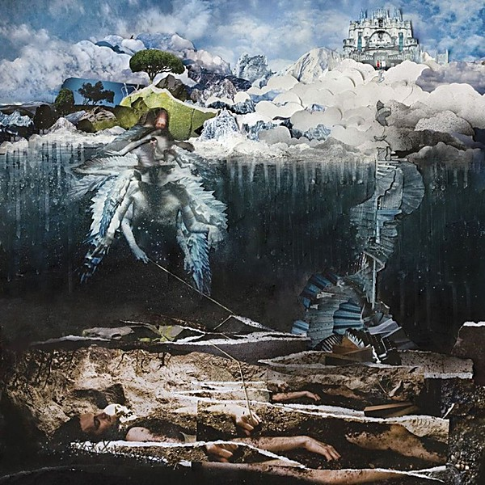

# The Empyrean

By **John Frusciante**

## Album Data

- **Catalog:** Beets
- **Format:** Digital, Album
- **Album:** The Empyrean
- **Artist:** John Frusciante
- **Albumartist:** John Frusciante
- **Genre:** Psychedelic Rock
- **MusicBrainz Album Artist ID:** [f1571db1-c672-4a54-a2cf-aaa329f26f0b](https://musicbrainz.org/artist/f1571db1-c672-4a54-a2cf-aaa329f26f0b)
- **MusicBrainz Album ID:** [83a2fbe2-b001-4235-a6bb-62611f7c6a5e](https://musicbrainz.org/release/83a2fbe2-b001-4235-a6bb-62611f7c6a5e)
- **MusicBrainz Release Group ID:** [31a5632f-6511-3de2-ba4f-e3c11d579ae3](https://musicbrainz.org/release-group/31a5632f-6511-3de2-ba4f-e3c11d579ae3)
- **Year:** 2009
- **Catalog #:** DDCB 12504
- **Label:** Record Collection
- **Total Tracks:** 12

## Album Tracks

### Track 01 - Before the Beginning

- **Artist:** John Frusciante
- **Format:** AAC
- **Genre:** Psychedelic Rock
- **Length:** 9:09
- **MusicBrainz Track ID:** [ffdaea92-4918-4f88-aa28-a3e42fc4cce4](https://musicbrainz.org/recording/ffdaea92-4918-4f88-aa28-a3e42fc4cce4)
- **Title:** Before the Beginning
- **Track:** 01
- **Year:** 2009

### Track 02 - Song to the Siren

- **Artist:** John Frusciante
- **Format:** AAC
- **Genre:** Soft Rock
- **Length:** 3:33
- **MusicBrainz Track ID:** [d9f84d8e-54d4-4f27-bb36-c43c65aff902](https://musicbrainz.org/recording/d9f84d8e-54d4-4f27-bb36-c43c65aff902)
- **Title:** Song to the Siren
- **Track:** 02
- **Year:** 2009

### Track 03 - Unreachable

- **Artist:** John Frusciante
- **Format:** AAC
- **Genre:** Neo-Psychedelia
- **Length:** 6:11
- **MusicBrainz Track ID:** [5dfb7d6e-9aa8-43ce-956c-1be4587123b4](https://musicbrainz.org/recording/5dfb7d6e-9aa8-43ce-956c-1be4587123b4)
- **Title:** Unreachable
- **Track:** 03
- **Year:** 2009

### Track 04 - God

- **Artist:** John Frusciante
- **Format:** AAC
- **Genre:** Psychedelic Rock
- **Length:** 3:23
- **MusicBrainz Track ID:** [b6573186-d13c-42b1-b2dc-2ea535a282db](https://musicbrainz.org/recording/b6573186-d13c-42b1-b2dc-2ea535a282db)
- **Title:** God
- **Track:** 04
- **Year:** 2009

### Track 05 - Dark/Light

- **Artist:** John Frusciante
- **Format:** AAC
- **Genre:** Neo-Psychedelia
- **Length:** 8:30
- **MusicBrainz Track ID:** [c8782916-b7c0-4061-8299-f333e62f4c01](https://musicbrainz.org/recording/c8782916-b7c0-4061-8299-f333e62f4c01)
- **Title:** Dark/Light
- **Track:** 05
- **Year:** 2009

### Track 06 - Heaven

- **Artist:** John Frusciante
- **Format:** AAC
- **Genre:** Indie Rock
- **Length:** 4:04
- **MusicBrainz Track ID:** [19549d5e-9406-473d-88bc-648c0448d4b8](https://musicbrainz.org/recording/19549d5e-9406-473d-88bc-648c0448d4b8)
- **Title:** Heaven
- **Track:** 06
- **Year:** 2009

### Track 07 - Enough of Me

- **Artist:** John Frusciante
- **Format:** AAC
- **Genre:** Alternative Rock
- **Length:** 4:16
- **MusicBrainz Track ID:** [620b2bbd-de03-48c7-a1bf-52dda9e91207](https://musicbrainz.org/recording/620b2bbd-de03-48c7-a1bf-52dda9e91207)
- **Title:** Enough of Me
- **Track:** 07
- **Year:** 2009

### Track 08 - Central

- **Artist:** John Frusciante
- **Format:** AAC
- **Genre:** Psychedelic Rock
- **Length:** 7:16
- **MusicBrainz Track ID:** [c605ef29-6955-4990-bb14-8a37e9c2afeb](https://musicbrainz.org/recording/c605ef29-6955-4990-bb14-8a37e9c2afeb)
- **Title:** Central
- **Track:** 08
- **Year:** 2009

### Track 09 - One More of Me

- **Artist:** John Frusciante
- **Format:** AAC
- **Genre:** Psychedelic Rock
- **Length:** 4:07
- **MusicBrainz Track ID:** [83eca772-733b-4981-ad12-2e6f501aedd5](https://musicbrainz.org/recording/83eca772-733b-4981-ad12-2e6f501aedd5)
- **Title:** One More of Me
- **Track:** 09
- **Year:** 2009

### Track 10 - After the Ending

- **Artist:** John Frusciante
- **Format:** MP3
- **Genre:** Neo-Psychedelia
- **Length:** 3:57
- **MusicBrainz Track ID:** [33dba9e9-5ef1-4591-87e9-8e4b991a9f6f](https://musicbrainz.org/recording/33dba9e9-5ef1-4591-87e9-8e4b991a9f6f)
- **Title:** After the Ending
- **Track:** 10
- **Year:** 2009

### Track 11 - Today

- **Artist:** John Frusciante
- **Format:** MP3
- **Genre:** Psychedelic Rock
- **Length:** 4:39
- **MusicBrainz Track ID:** [714922cb-5f8a-4e05-9bf1-e236f6896555](https://musicbrainz.org/recording/714922cb-5f8a-4e05-9bf1-e236f6896555)
- **Title:** Today
- **Track:** 11
- **Year:** 2009

### Track 12 - Ah Yom

- **Artist:** John Frusciante
- **Format:** MP3
- **Genre:** Experimental Rock
- **Length:** 3:18
- **MusicBrainz Track ID:** [9360dc18-608f-488d-925b-4cfd7951f0b5](https://musicbrainz.org/recording/9360dc18-608f-488d-925b-4cfd7951f0b5)
- **Title:** Ah Yom
- **Track:** 12
- **Year:** 2009

## See also

- [Roon: The Empyrean](../../Roon/John_Frusciante/The_Empyrean.md)
