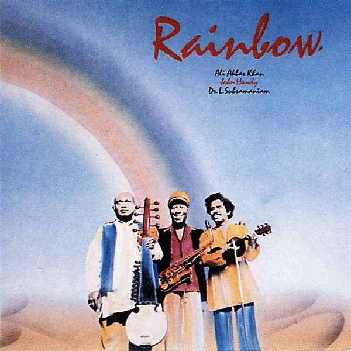

# Rainbow

By **John Handy and Ali Akbar Khan**

## Album Data

- **Catalog:** Beets
- **Format:** Digital, Album
- **Album:** Rainbow
- **Artist:** John Handy And Ali Akbar Khan
- **Albumartist:** John Handy and Ali Akbar Khan
- **Genre:** Jazz
- **MusicBrainz Album Artist ID:** 
- **MusicBrainz Album ID:** 
- **MusicBrainz Release Group ID:** 
- **Year:** 1981
- **Catalog #:** 
- **Label:** 
- **Total Tracks:** 00

## Album Tracks

### Track 01 - Rajashik - The Majesty Of Wisdom

- **Artist:** John Handy and Ali Akbar Khan
- **Format:** MP3
- **Genre:** Jazz
- **Length:** 8:09
- **MusicBrainz Track ID:** 
- **Title:** Rajashik - The Majesty Of Wisdom
- **Track:** 01
- **Year:** 1981

### Track 02 - Indian Boogie Shoes

- **Artist:** John Handy and Ali Akbar Khan
- **Format:** MP3
- **Genre:** Jazz
- **Length:** 8:53
- **MusicBrainz Track ID:** 
- **Title:** Indian Boogie Shoes
- **Track:** 02
- **Year:** 1981

### Track 03 - Rainbow Serenade

- **Artist:** John Handy and Ali Akbar Khan
- **Format:** MP3
- **Genre:** Jazz
- **Length:** 6:27
- **MusicBrainz Track ID:** 
- **Title:** Rainbow Serenade
- **Track:** 03
- **Year:** 1981

### Track 04 - Garland Of Flowers

- **Artist:** John Handy and Ali Akbar Khan
- **Format:** MP3
- **Genre:** Jazz
- **Length:** 9:46
- **MusicBrainz Track ID:** 
- **Title:** Garland Of Flowers
- **Track:** 04
- **Year:** 1981

### Track 05 - Kali Dance

- **Artist:** John Handy and Ali Akbar Khan
- **Format:** MP3
- **Genre:** Jazz
- **Length:** 12:56
- **MusicBrainz Track ID:** 
- **Title:** Kali Dance
- **Track:** 05
- **Year:** 1981

## See also

- [John Handy's Rainbow Band 1979](John_Handys_Rainbow_Band_1979.md)
- [Karuna Supreme](Karuna_Supreme.md)
