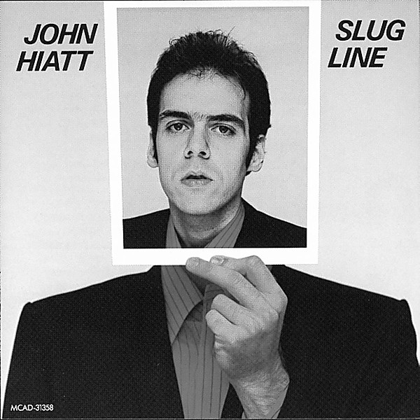

# Slug Line

By **John Hiatt**

## Album Data

- **Catalog:** Beets
- **Format:** Digital, Album
- **Album:** Slug Line
- **Artist:** John Hiatt
- **Albumartist:** John Hiatt
- **Genre:** Americana
- **MusicBrainz Album Artist ID:** [e78202c9-7717-435c-9aac-dd5ebc4e64d5](https://musicbrainz.org/artist/e78202c9-7717-435c-9aac-dd5ebc4e64d5)
- **MusicBrainz Album ID:** [5810d6ba-8a1a-3de8-a8d5-888a5019fee3](https://musicbrainz.org/release/5810d6ba-8a1a-3de8-a8d5-888a5019fee3)
- **MusicBrainz Release Group ID:** [36134b5b-69c6-313e-8bbf-dfec07a50548](https://musicbrainz.org/release-group/36134b5b-69c6-313e-8bbf-dfec07a50548)
- **Year:** 2002
- **Catalog #:** MCAD-31358
- **Label:** MCA Records
- **Total Tracks:** 12

## Album Tracks

### Track 01 - You Used to Kiss the Girls

- **Artist:** John Hiatt
- **Format:** ALAC
- **Genre:** Americana
- **Length:** 2:37
- **MusicBrainz Track ID:** [df3c33a5-9b49-48f4-a070-3f2283f59fff](https://musicbrainz.org/recording/df3c33a5-9b49-48f4-a070-3f2283f59fff)
- **Title:** You Used to Kiss the Girls
- **Track:** 01
- **Year:** 2002

### Track 02 - The Negroes Were Dancing

- **Artist:** John Hiatt
- **Format:** ALAC
- **Genre:** Americana
- **Length:** 2:46
- **MusicBrainz Track ID:** [d6758baa-7f78-4fc6-a707-fb0e0496c47f](https://musicbrainz.org/recording/d6758baa-7f78-4fc6-a707-fb0e0496c47f)
- **Title:** The Negroes Were Dancing
- **Track:** 02
- **Year:** 2002

### Track 03 - Slug Line

- **Artist:** John Hiatt
- **Format:** ALAC
- **Genre:** Americana
- **Length:** 3:02
- **MusicBrainz Track ID:** [62fb2da7-a20f-4e30-beb6-de022b389657](https://musicbrainz.org/recording/62fb2da7-a20f-4e30-beb6-de022b389657)
- **Title:** Slug Line
- **Track:** 03
- **Year:** 2002

### Track 04 - Madonna Road

- **Artist:** John Hiatt
- **Format:** ALAC
- **Genre:** Americana
- **Length:** 4:23
- **MusicBrainz Track ID:** [9be31475-99ec-4e02-bd67-c233ec2b4232](https://musicbrainz.org/recording/9be31475-99ec-4e02-bd67-c233ec2b4232)
- **Title:** Madonna Road
- **Track:** 04
- **Year:** 2002

### Track 05 - (No More) Dancin’ in the Street

- **Artist:** John Hiatt
- **Format:** ALAC
- **Genre:** Americana
- **Length:** 2:22
- **MusicBrainz Track ID:** [c10c5899-9ad3-4959-961e-273e6527ee2b](https://musicbrainz.org/recording/c10c5899-9ad3-4959-961e-273e6527ee2b)
- **Title:** (No More) Dancin’ in the Street
- **Track:** 05
- **Year:** 2002

### Track 06 - Long Night

- **Artist:** John Hiatt
- **Format:** ALAC
- **Genre:** Americana
- **Length:** 5:18
- **MusicBrainz Track ID:** [aed516f5-5606-40a8-9cca-9073ead4467d](https://musicbrainz.org/recording/aed516f5-5606-40a8-9cca-9073ead4467d)
- **Title:** Long Night
- **Track:** 06
- **Year:** 2002

### Track 07 - The Night That Kenny Died

- **Artist:** John Hiatt
- **Format:** ALAC
- **Genre:** Americana
- **Length:** 2:37
- **MusicBrainz Track ID:** [b8456047-dcf9-4d8b-8d22-09afd31ccff1](https://musicbrainz.org/recording/b8456047-dcf9-4d8b-8d22-09afd31ccff1)
- **Title:** The Night That Kenny Died
- **Track:** 07
- **Year:** 2002

### Track 08 - Radio Girl

- **Artist:** John Hiatt
- **Format:** ALAC
- **Genre:** Americana
- **Length:** 2:57
- **MusicBrainz Track ID:** [a4ec3a8b-1f53-493f-a9c8-a0f2fdc10988](https://musicbrainz.org/recording/a4ec3a8b-1f53-493f-a9c8-a0f2fdc10988)
- **Title:** Radio Girl
- **Track:** 08
- **Year:** 2002

### Track 09 - You’re My Love Interest

- **Artist:** John Hiatt
- **Format:** ALAC
- **Genre:** Americana
- **Length:** 3:19
- **MusicBrainz Track ID:** [577fba51-4e21-4557-a0c4-21825497e0ba](https://musicbrainz.org/recording/577fba51-4e21-4557-a0c4-21825497e0ba)
- **Title:** You’re My Love Interest
- **Track:** 09
- **Year:** 2002

### Track 10 - Take Off Your Uniform

- **Artist:** John Hiatt
- **Format:** ALAC
- **Genre:** Americana
- **Length:** 4:08
- **MusicBrainz Track ID:** [ff0e65d0-6bc0-4a85-9f9e-65ed5d710d9e](https://musicbrainz.org/recording/ff0e65d0-6bc0-4a85-9f9e-65ed5d710d9e)
- **Title:** Take Off Your Uniform
- **Track:** 10
- **Year:** 2002

### Track 11 - Sharon’s Got a Drugstore

- **Artist:** John Hiatt
- **Format:** ALAC
- **Genre:** Americana
- **Length:** 2:12
- **MusicBrainz Track ID:** [74dec8f4-4dd6-4394-bdb6-9399bfc38aeb](https://musicbrainz.org/recording/74dec8f4-4dd6-4394-bdb6-9399bfc38aeb)
- **Title:** Sharon’s Got a Drugstore
- **Track:** 11
- **Year:** 2002

### Track 12 - Washable Ink

- **Artist:** John Hiatt
- **Format:** ALAC
- **Genre:** Americana
- **Length:** 3:16
- **MusicBrainz Track ID:** [fe6d546f-924c-48dd-be25-590c4c0858f5](https://musicbrainz.org/recording/fe6d546f-924c-48dd-be25-590c4c0858f5)
- **Title:** Washable Ink
- **Track:** 12
- **Year:** 2002

## See also

- [Vinyl: ](../../Vinyl/John_Hiatt/John_Hiatt.md)
- [Vinyl: Slug Line](../../Vinyl/John_Hiatt/Slug_Line.md)
