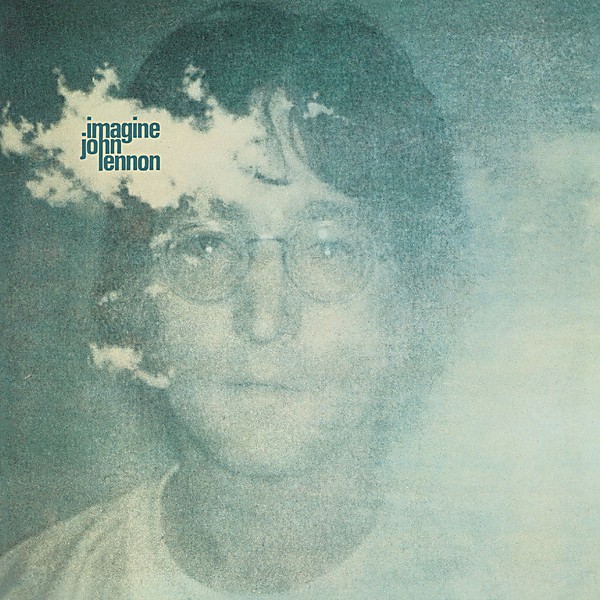

# Imagine

By **John Lennon**

## Album Data

- **Catalog:** Beets
- **Format:** Digital, Album
- **Album:** Imagine
- **Artist:** John Lennon
- **Albumartist:** John Lennon
- **Genre:** Soft Rock
- **MusicBrainz Album Artist ID:** [4d5447d7-c61c-4120-ba1b-d7f471d385b9](https://musicbrainz.org/artist/4d5447d7-c61c-4120-ba1b-d7f471d385b9)
- **MusicBrainz Album ID:** [ae1c2dcb-1034-38d0-9c34-a77ba91fbb9a](https://musicbrainz.org/release/ae1c2dcb-1034-38d0-9c34-a77ba91fbb9a)
- **MusicBrainz Release Group ID:** [f242f304-0f1f-33a5-81a2-7a965b30e3b5](https://musicbrainz.org/release-group/f242f304-0f1f-33a5-81a2-7a965b30e3b5)
- **Year:** 2000
- **Catalog #:** 
- **Label:** EMI
- **Total Tracks:** 11

## Album Tracks

### Track 01 - Mother

- **Artist:** John Lennon
- **Format:** ALAC
- **Genre:** Rock
- **Length:** 5:36
- **MusicBrainz Track ID:** [c42b2c36-b419-441c-8592-98cc549088e1](https://musicbrainz.org/recording/c42b2c36-b419-441c-8592-98cc549088e1)
- **Title:** Mother
- **Track:** 01
- **Year:** 2010

### Track 02 - Hold On

- **Artist:** John Lennon
- **Format:** ALAC
- **Genre:** Pop Rock
- **Length:** 1:52
- **MusicBrainz Track ID:** [c9b64abb-b96e-44d7-ae9b-fb195839cc04](https://musicbrainz.org/recording/c9b64abb-b96e-44d7-ae9b-fb195839cc04)
- **Title:** Hold On
- **Track:** 02
- **Year:** 2010

### Track 03 - I Found Out

- **Artist:** John Lennon
- **Format:** ALAC
- **Genre:** Pop Rock
- **Length:** 3:38
- **MusicBrainz Track ID:** [4b1b1def-d3b5-4f4c-a6f1-0f9ccbb2bee8](https://musicbrainz.org/recording/4b1b1def-d3b5-4f4c-a6f1-0f9ccbb2bee8)
- **Title:** I Found Out
- **Track:** 03
- **Year:** 2010

### Track 04 - Working Class Hero

- **Artist:** John Lennon
- **Format:** ALAC
- **Genre:** Rock
- **Length:** 3:47
- **MusicBrainz Track ID:** [8b0263ab-cca7-4c22-9214-668d5e871088](https://musicbrainz.org/recording/8b0263ab-cca7-4c22-9214-668d5e871088)
- **Title:** Working Class Hero
- **Track:** 04
- **Year:** 2010

### Track 05 - Isolation

- **Artist:** John Lennon
- **Format:** ALAC
- **Genre:** Pop Rock
- **Length:** 2:52
- **MusicBrainz Track ID:** [9f28e5a7-5cbe-4aad-bf03-0fbbc209f715](https://musicbrainz.org/recording/9f28e5a7-5cbe-4aad-bf03-0fbbc209f715)
- **Title:** Isolation
- **Track:** 05
- **Year:** 2010

### Track 06 - Remember

- **Artist:** John Lennon
- **Format:** ALAC
- **Genre:** Pop Rock
- **Length:** 4:32
- **MusicBrainz Track ID:** [992bb78c-42ae-47bf-9937-ac7ca415cec7](https://musicbrainz.org/recording/992bb78c-42ae-47bf-9937-ac7ca415cec7)
- **Title:** Remember
- **Track:** 06
- **Year:** 2010

### Track 07 - Love

- **Artist:** John Lennon
- **Format:** ALAC
- **Genre:** Rock
- **Length:** 3:22
- **MusicBrainz Track ID:** [8103826b-5bc4-45dc-a5fb-29dfb59626c0](https://musicbrainz.org/recording/8103826b-5bc4-45dc-a5fb-29dfb59626c0)
- **Title:** Love
- **Track:** 07
- **Year:** 2010

### Track 08 - Well Well Well

- **Artist:** John Lennon
- **Format:** ALAC
- **Genre:** Hard Rock
- **Length:** 5:57
- **MusicBrainz Track ID:** [acf77399-17d0-4d40-b2ac-569895d08a24](https://musicbrainz.org/recording/acf77399-17d0-4d40-b2ac-569895d08a24)
- **Title:** Well Well Well
- **Track:** 08
- **Year:** 2010

### Track 09 - Look at Me

- **Artist:** John Lennon
- **Format:** ALAC
- **Genre:** Funk
- **Length:** 2:53
- **MusicBrainz Track ID:** [95cca072-2396-4006-963d-ab59ca3eafd0](https://musicbrainz.org/recording/95cca072-2396-4006-963d-ab59ca3eafd0)
- **Title:** Look at Me
- **Track:** 09
- **Year:** 2010

### Track 10 - God

- **Artist:** John Lennon
- **Format:** ALAC
- **Genre:** Folk Rock
- **Length:** 4:12
- **MusicBrainz Track ID:** [4578104e-cb70-4260-b785-37151a768edd](https://musicbrainz.org/recording/4578104e-cb70-4260-b785-37151a768edd)
- **Title:** God
- **Track:** 10
- **Year:** 2010

### Track 11 - My Mummy’s Dead

- **Artist:** John Lennon
- **Format:** ALAC
- **Genre:** Hard Rock
- **Length:** 0:51
- **MusicBrainz Track ID:** [319196a1-436c-47e4-9d00-3ac662fd236f](https://musicbrainz.org/recording/319196a1-436c-47e4-9d00-3ac662fd236f)
- **Title:** My Mummy’s Dead
- **Track:** 11
- **Year:** 2010

## See also

- [John Lennon Box Set](John_Lennon_Box_Set.md)
- [John Lennon/Plastic Ono Band](John_Lennon-Plastic_Ono_Band.md)
- [Mind Games](Mind_Games.md)
- [Rock ’n’ Roll](Rock_’n’_Roll.md)
- [Some Time In New York City](Some_Time_In_New_York_City.md)
- [The John Lennon Collection](The_John_Lennon_Collection.md)
- [Walls and Bridges](Walls_and_Bridges.md)
- [CD: ](../../CD/John_Lennon/John_Lennon.md)
- [CD: Plastic Ono Band](../../CD/John_Lennon/Plastic_Ono_Band.md)
- [CD: The John Lennon Collection](../../CD/John_Lennon/The_John_Lennon_Collection.md)
- [Roon: Double Fantasy](../../Roon/John_Lennon/Double_Fantasy.md)
- [Roon: Double Fantasy Stripped Down (Stripped Down)](../../Roon/John_Lennon/Double_Fantasy_Stripped_Down_Stripped_Down.md)
- [Roon: GIMME SOME TRUTH. (Deluxe)](../../Roon/John_Lennon/GIMME_SOME_TRUTH_Deluxe.md)
- [Roon: HERO.](../../Roon/John_Lennon/HERO.md)
- [Roon: Imagine - The Ultimate Collection (The Ultimate Collection)](../../Roon/John_Lennon/Imagine_-_The_Ultimate_Collection_The_Ultimate_Collection.md)
- [Roon: Mind Games](../../Roon/John_Lennon/Mind_Games.md)
- [Roon: Plastic Ono Band (The Ultimate Collection)](../../Roon/John_Lennon/Plastic_Ono_Band_The_Ultimate_Collection.md)
- [Roon: Walls And Bridges](../../Roon/John_Lennon/Walls_And_Bridges.md)
- [Vinyl: Imagine](../../Vinyl/John_Lennon/Imagine.md)
- [Vinyl: ](../../Vinyl/John_Lennon/John_Lennon.md)
- [Vinyl: Walls And Bridges](../../Vinyl/John_Lennon/Walls_And_Bridges.md)
