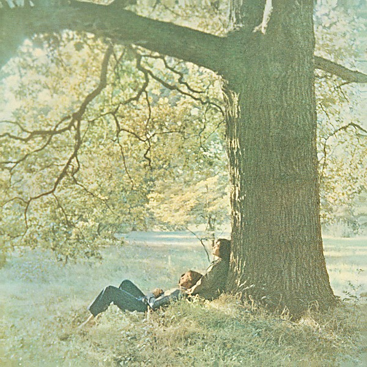

# John Lennon/Plastic Ono Band

By **John Lennon**

## Album Data

- **Catalog:** Beets
- **Format:** Digital, Album
- **Album:** John Lennon/Plastic Ono Band
- **Artist:** John Lennon
- **Albumartist:** John Lennon
- **Genre:** Hard Rock
- **MusicBrainz Album Artist ID:** [4d5447d7-c61c-4120-ba1b-d7f471d385b9](https://musicbrainz.org/artist/4d5447d7-c61c-4120-ba1b-d7f471d385b9)
- **MusicBrainz Album ID:** [291dfbfe-0e02-432f-88ad-4f05ad306def](https://musicbrainz.org/release/291dfbfe-0e02-432f-88ad-4f05ad306def)
- **MusicBrainz Release Group ID:** [8be83468-4917-390d-82b6-d890f058cd22](https://musicbrainz.org/release-group/8be83468-4917-390d-82b6-d890f058cd22)
- **Year:** 2010
- **Catalog #:** CDP 7 46769 2
- **Label:** Parlophone
- **Total Tracks:** 11

## Album Tracks

### Track 01 - Mind Games

- **Artist:** John Lennon
- **Format:** AAC
- **Genre:** Rock
- **Length:** 4:15
- **MusicBrainz Track ID:** [a00be5e8-b85a-46e0-b9d0-14f4cb57b1c1](https://musicbrainz.org/recording/a00be5e8-b85a-46e0-b9d0-14f4cb57b1c1)
- **Title:** Mind Games
- **Track:** 01
- **Year:** 1973

### Track 02 - Tight As

- **Artist:** John Lennon
- **Format:** AAC
- **Genre:** Country
- **Length:** 3:43
- **MusicBrainz Track ID:** [f8a7319f-5531-4595-bd52-6f84e19d3b61](https://musicbrainz.org/recording/f8a7319f-5531-4595-bd52-6f84e19d3b61)
- **Title:** Tight As
- **Track:** 02
- **Year:** 1973

### Track 03 - Aisumasen (I’m Sorry)

- **Artist:** John Lennon
- **Format:** AAC
- **Genre:** Rock
- **Length:** 4:52
- **MusicBrainz Track ID:** [3fd73cc1-099c-4c6d-b079-41c9fc86cc7f](https://musicbrainz.org/recording/3fd73cc1-099c-4c6d-b079-41c9fc86cc7f)
- **Title:** Aisumasen (I’m Sorry)
- **Track:** 03
- **Year:** 1973

### Track 04 - One Day (at a Time)

- **Artist:** John Lennon
- **Format:** AAC
- **Genre:** Rock
- **Length:** 3:14
- **MusicBrainz Track ID:** [50225853-25b2-41c6-92cf-5d9419f2e777](https://musicbrainz.org/recording/50225853-25b2-41c6-92cf-5d9419f2e777)
- **Title:** One Day (at a Time)
- **Track:** 04
- **Year:** 1973

### Track 05 - Bring On the Lucie (Freda Peeple)

- **Artist:** John Lennon
- **Format:** AAC
- **Genre:** Rock
- **Length:** 4:19
- **MusicBrainz Track ID:** [9391d99a-6861-4063-8ec7-ca4a31a02cea](https://musicbrainz.org/recording/9391d99a-6861-4063-8ec7-ca4a31a02cea)
- **Title:** Bring On the Lucie (Freda Peeple)
- **Track:** 05
- **Year:** 1973

### Track 06 - Intuition

- **Artist:** John Lennon
- **Format:** AAC
- **Genre:** Rock
- **Length:** 3:14
- **MusicBrainz Track ID:** [145fd134-2b46-4e22-ab4a-b8191d7de973](https://musicbrainz.org/recording/145fd134-2b46-4e22-ab4a-b8191d7de973)
- **Title:** Intuition
- **Track:** 06
- **Year:** 1973

### Track 07 - Out the Blue

- **Artist:** John Lennon
- **Format:** AAC
- **Genre:** Rock
- **Length:** 3:26
- **MusicBrainz Track ID:** [2de78211-e845-4cef-8493-d4399c04c54f](https://musicbrainz.org/recording/2de78211-e845-4cef-8493-d4399c04c54f)
- **Title:** Out the Blue
- **Track:** 07
- **Year:** 1973

### Track 08 - Only People

- **Artist:** John Lennon
- **Format:** AAC
- **Genre:** Rock
- **Length:** 3:32
- **MusicBrainz Track ID:** [6a5a5614-548b-47df-9334-4e6d25af237e](https://musicbrainz.org/recording/6a5a5614-548b-47df-9334-4e6d25af237e)
- **Title:** Only People
- **Track:** 08
- **Year:** 1973

### Track 09 - I Know (I Know)

- **Artist:** John Lennon
- **Format:** AAC
- **Genre:** Britpop
- **Length:** 3:55
- **MusicBrainz Track ID:** [ad95f349-bbc0-4bc3-95cf-3e81ec54ddf4](https://musicbrainz.org/recording/ad95f349-bbc0-4bc3-95cf-3e81ec54ddf4)
- **Title:** I Know (I Know)
- **Track:** 09
- **Year:** 1973

### Track 10 - You Are Here

- **Artist:** John Lennon
- **Format:** AAC
- **Genre:** Rock
- **Length:** 4:18
- **MusicBrainz Track ID:** [75009083-aa42-4c04-9bc8-879d834a2f8b](https://musicbrainz.org/recording/75009083-aa42-4c04-9bc8-879d834a2f8b)
- **Title:** You Are Here
- **Track:** 10
- **Year:** 1973

### Track 11 - Meat City

- **Artist:** John Lennon
- **Format:** AAC
- **Genre:** Rock
- **Length:** 2:56
- **MusicBrainz Track ID:** [63d3c044-a0a6-4994-9b43-6838b8a6bd9a](https://musicbrainz.org/recording/63d3c044-a0a6-4994-9b43-6838b8a6bd9a)
- **Title:** Meat City
- **Track:** 11
- **Year:** 1973

