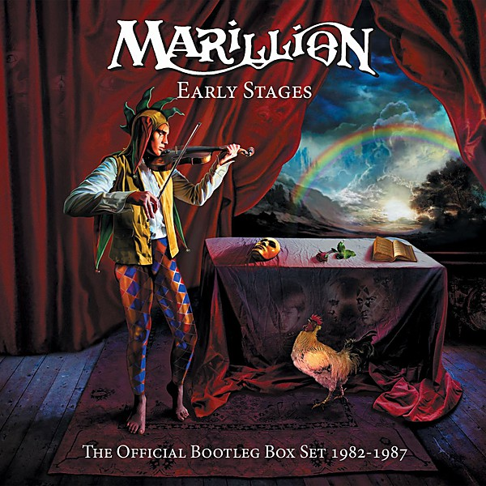

# John Lennon Box Set

By **John Lennon**

## Album Data

- **Catalog:** Beets
- **Format:** Digital, Album
- **Album:** John Lennon Box Set
- **Artist:** John Lennon
- **Albumartist:** John Lennon
- **Genre:** Rock
- **MusicBrainz Album Artist ID:** 
- **MusicBrainz Album ID:** 
- **MusicBrainz Release Group ID:** 
- **Year:** 0000
- **Catalog #:** 
- **Label:** 
- **Total Tracks:** 00

## Album Tracks

### Track 00 - John Sinclair

- **Artist:** John Lennon
- **Format:** AAC
- **Genre:** Rock
- **Length:** 3:31
- **MusicBrainz Track ID:** 
- **Title:** John Sinclair
- **Track:** 00
- **Year:** 1972

### Track 09 - Angela

- **Artist:** John Lennon
- **Format:** AAC
- **Genre:** Pop Rock
- **Length:** 4:09
- **MusicBrainz Track ID:** 
- **Title:** Angela
- **Track:** 09
- **Year:** 0000

## See also

- [Imagine](Imagine.md)
- [John Lennon/Plastic Ono Band](John_Lennon-Plastic_Ono_Band.md)
- [Mind Games](Mind_Games.md)
- [Rock ’n’ Roll](Rock_’n’_Roll.md)
- [Some Time In New York City](Some_Time_In_New_York_City.md)
- [The John Lennon Collection](The_John_Lennon_Collection.md)
- [Walls and Bridges](Walls_and_Bridges.md)
- [CD: ](../../CD/John_Lennon/John_Lennon.md)
- [CD: Plastic Ono Band](../../CD/John_Lennon/Plastic_Ono_Band.md)
- [CD: The John Lennon Collection](../../CD/John_Lennon/The_John_Lennon_Collection.md)
- [Roon: Double Fantasy](../../Roon/John_Lennon/Double_Fantasy.md)
- [Roon: Double Fantasy Stripped Down (Stripped Down)](../../Roon/John_Lennon/Double_Fantasy_Stripped_Down_Stripped_Down.md)
- [Roon: GIMME SOME TRUTH. (Deluxe)](../../Roon/John_Lennon/GIMME_SOME_TRUTH_Deluxe.md)
- [Roon: HERO.](../../Roon/John_Lennon/HERO.md)
- [Roon: Imagine - The Ultimate Collection (The Ultimate Collection)](../../Roon/John_Lennon/Imagine_-_The_Ultimate_Collection_The_Ultimate_Collection.md)
- [Roon: Mind Games](../../Roon/John_Lennon/Mind_Games.md)
- [Roon: Plastic Ono Band (The Ultimate Collection)](../../Roon/John_Lennon/Plastic_Ono_Band_The_Ultimate_Collection.md)
- [Roon: Walls And Bridges](../../Roon/John_Lennon/Walls_And_Bridges.md)
- [Vinyl: Imagine](../../Vinyl/John_Lennon/Imagine.md)
- [Vinyl: ](../../Vinyl/John_Lennon/John_Lennon.md)
- [Vinyl: Walls And Bridges](../../Vinyl/John_Lennon/Walls_And_Bridges.md)
