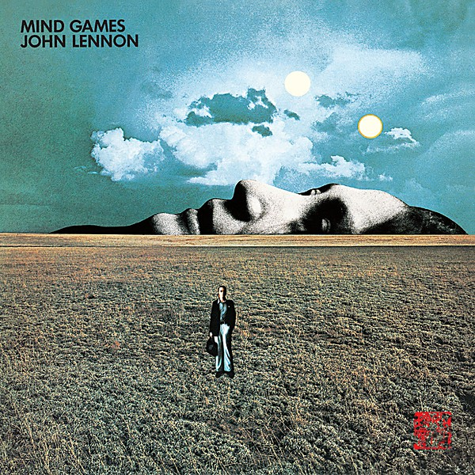

# Mind Games

By **John Lennon**

## Album Data

- **Catalog:** Beets
- **Format:** Digital, Album
- **Album:** Mind Games
- **Artist:** John Lennon
- **Albumartist:** John Lennon
- **Genre:** Rock
- **MusicBrainz Album Artist ID:** [4d5447d7-c61c-4120-ba1b-d7f471d385b9](https://musicbrainz.org/artist/4d5447d7-c61c-4120-ba1b-d7f471d385b9)
- **MusicBrainz Album ID:** [0d87c4a3-5840-3e14-9c6c-a2ffa2735892](https://musicbrainz.org/release/0d87c4a3-5840-3e14-9c6c-a2ffa2735892)
- **MusicBrainz Release Group ID:** [611a001d-dae3-390c-babf-bba33ee4ba31](https://musicbrainz.org/release-group/611a001d-dae3-390c-babf-bba33ee4ba31)
- **Year:** 1973
- **Catalog #:** 
- **Label:** Capitol Records
- **Total Tracks:** 13

## Album Tracks

### Track 01 - Be‐Bop‐A‐Lula

- **Artist:** John Lennon
- **Format:** ALAC
- **Genre:** Rockabilly
- **Length:** 2:37
- **MusicBrainz Track ID:** [81b36b94-2dcf-4e93-8a0d-27df6e0a76c3](https://musicbrainz.org/recording/81b36b94-2dcf-4e93-8a0d-27df6e0a76c3)
- **Title:** Be‐Bop‐A‐Lula
- **Track:** 01
- **Year:** 2010

### Track 02 - Stand by Me

- **Artist:** John Lennon
- **Format:** ALAC
- **Genre:** Rock
- **Length:** 3:29
- **MusicBrainz Track ID:** [64eb3be4-677a-4aff-86be-7957c8f37b04](https://musicbrainz.org/recording/64eb3be4-677a-4aff-86be-7957c8f37b04)
- **Title:** Stand by Me
- **Track:** 02
- **Year:** 2010

### Track 03 - Medley

- **Artist:** John Lennon
- **Format:** ALAC
- **Genre:** Rock
- **Length:** 1:34
- **MusicBrainz Track ID:** [faaf192d-afed-4c68-8b58-32750a407859](https://musicbrainz.org/recording/faaf192d-afed-4c68-8b58-32750a407859)
- **Title:** Medley
- **Track:** 03
- **Year:** 2010

### Track 04 - You Can’t Catch Me

- **Artist:** John Lennon
- **Format:** ALAC
- **Genre:** Rock
- **Length:** 4:52
- **MusicBrainz Track ID:** [86d0debf-d478-4351-b34b-feecb8513544](https://musicbrainz.org/recording/86d0debf-d478-4351-b34b-feecb8513544)
- **Title:** You Can’t Catch Me
- **Track:** 04
- **Year:** 2010

### Track 05 - Ain’t That a Shame

- **Artist:** John Lennon
- **Format:** ALAC
- **Genre:** Rock
- **Length:** 2:31
- **MusicBrainz Track ID:** [21278406-b629-4f88-ac01-720c217c4486](https://musicbrainz.org/recording/21278406-b629-4f88-ac01-720c217c4486)
- **Title:** Ain’t That a Shame
- **Track:** 05
- **Year:** 2010

### Track 06 - Do You Wanna Dance

- **Artist:** John Lennon
- **Format:** ALAC
- **Genre:** Rock
- **Length:** 2:53
- **MusicBrainz Track ID:** [273d27ac-a4be-416c-8c1d-cf7415065e19](https://musicbrainz.org/recording/273d27ac-a4be-416c-8c1d-cf7415065e19)
- **Title:** Do You Wanna Dance
- **Track:** 06
- **Year:** 2010

### Track 07 - Sweet Little Sixteen

- **Artist:** John Lennon
- **Format:** ALAC
- **Genre:** Soul
- **Length:** 3:01
- **MusicBrainz Track ID:** [0379a392-276c-4063-9cd4-c064d6c4320b](https://musicbrainz.org/recording/0379a392-276c-4063-9cd4-c064d6c4320b)
- **Title:** Sweet Little Sixteen
- **Track:** 07
- **Year:** 2010

### Track 08 - Slippin’ and Slidin’

- **Artist:** John Lennon
- **Format:** ALAC
- **Genre:** Rock
- **Length:** 2:17
- **MusicBrainz Track ID:** [ef0783ac-efd8-4dd8-a698-c8acde217fc1](https://musicbrainz.org/recording/ef0783ac-efd8-4dd8-a698-c8acde217fc1)
- **Title:** Slippin’ and Slidin’
- **Track:** 08
- **Year:** 2010

### Track 09 - Peggy Sue

- **Artist:** John Lennon
- **Format:** ALAC
- **Genre:** Rockabilly
- **Length:** 2:04
- **MusicBrainz Track ID:** [f819f289-6eba-4065-8069-aec74fbf8e28](https://musicbrainz.org/recording/f819f289-6eba-4065-8069-aec74fbf8e28)
- **Title:** Peggy Sue
- **Track:** 09
- **Year:** 2010

### Track 10 - Medley

- **Artist:** John Lennon
- **Format:** ALAC
- **Genre:** Rock
- **Length:** 3:42
- **MusicBrainz Track ID:** [3a0f1ab9-8f08-429e-8acd-8087448e8cca](https://musicbrainz.org/recording/3a0f1ab9-8f08-429e-8acd-8087448e8cca)
- **Title:** Medley
- **Track:** 10
- **Year:** 2010

### Track 11 - Bony Moronie

- **Artist:** John Lennon
- **Format:** ALAC
- **Genre:** Rock And Roll
- **Length:** 3:46
- **MusicBrainz Track ID:** [604cead7-bd59-48be-903f-b4b1cb0677a3](https://musicbrainz.org/recording/604cead7-bd59-48be-903f-b4b1cb0677a3)
- **Title:** Bony Moronie
- **Track:** 11
- **Year:** 2010

### Track 12 - Ya Ya

- **Artist:** John Lennon
- **Format:** ALAC
- **Genre:** Britpop
- **Length:** 2:18
- **MusicBrainz Track ID:** [d2ffd136-5aa9-46e6-8ef7-577ee9c361bb](https://musicbrainz.org/recording/d2ffd136-5aa9-46e6-8ef7-577ee9c361bb)
- **Title:** Ya Ya
- **Track:** 12
- **Year:** 2010

### Track 13 - Just Because

- **Artist:** John Lennon
- **Format:** ALAC
- **Genre:** Soul
- **Length:** 4:25
- **MusicBrainz Track ID:** [4244a4b6-9a4b-4a6c-8517-2959e4e205fe](https://musicbrainz.org/recording/4244a4b6-9a4b-4a6c-8517-2959e4e205fe)
- **Title:** Just Because
- **Track:** 13
- **Year:** 2010

## See also

- [Imagine](Imagine.md)
- [John Lennon Box Set](John_Lennon_Box_Set.md)
- [John Lennon/Plastic Ono Band](John_Lennon-Plastic_Ono_Band.md)
- [Rock ’n’ Roll](Rock_’n’_Roll.md)
- [Some Time In New York City](Some_Time_In_New_York_City.md)
- [The John Lennon Collection](The_John_Lennon_Collection.md)
- [Walls and Bridges](Walls_and_Bridges.md)
- [CD: ](../../CD/John_Lennon/John_Lennon.md)
- [CD: Plastic Ono Band](../../CD/John_Lennon/Plastic_Ono_Band.md)
- [CD: The John Lennon Collection](../../CD/John_Lennon/The_John_Lennon_Collection.md)
- [Roon: Double Fantasy](../../Roon/John_Lennon/Double_Fantasy.md)
- [Roon: Double Fantasy Stripped Down (Stripped Down)](../../Roon/John_Lennon/Double_Fantasy_Stripped_Down_Stripped_Down.md)
- [Roon: GIMME SOME TRUTH. (Deluxe)](../../Roon/John_Lennon/GIMME_SOME_TRUTH_Deluxe.md)
- [Roon: HERO.](../../Roon/John_Lennon/HERO.md)
- [Roon: Imagine - The Ultimate Collection (The Ultimate Collection)](../../Roon/John_Lennon/Imagine_-_The_Ultimate_Collection_The_Ultimate_Collection.md)
- [Roon: Mind Games](../../Roon/John_Lennon/Mind_Games.md)
- [Roon: Plastic Ono Band (The Ultimate Collection)](../../Roon/John_Lennon/Plastic_Ono_Band_The_Ultimate_Collection.md)
- [Roon: Walls And Bridges](../../Roon/John_Lennon/Walls_And_Bridges.md)
- [Vinyl: Imagine](../../Vinyl/John_Lennon/Imagine.md)
- [Vinyl: ](../../Vinyl/John_Lennon/John_Lennon.md)
- [Vinyl: Walls And Bridges](../../Vinyl/John_Lennon/Walls_And_Bridges.md)
