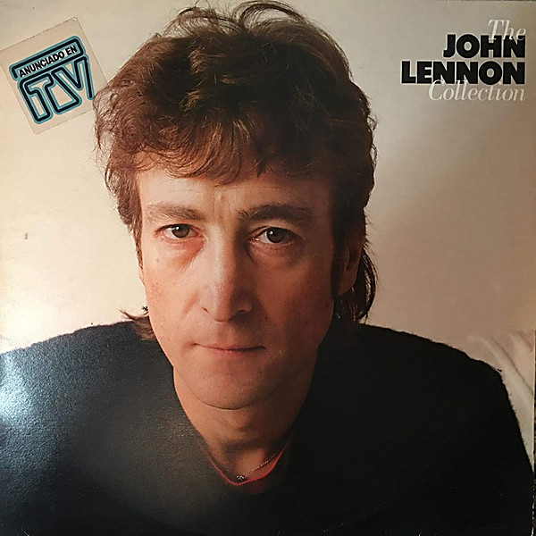

# The John Lennon Collection

By **John Lennon**

## Album Data

- **Catalog:** Beets
- **Format:** Digital, Album
- **Album:** The John Lennon Collection
- **Artist:** John Lennon
- **Albumartist:** John Lennon
- **Genre:** Rock
- **MusicBrainz Album Artist ID:** 
- **MusicBrainz Album ID:** 
- **MusicBrainz Release Group ID:** 
- **Year:** 1982
- **Catalog #:** 7243 5 24858 2 6
- **Label:** Parlophone
- **Total Tracks:** 10

## Album Tracks

### Track 01 - Imagine

- **Artist:** John Lennon
- **Format:** ALAC
- **Genre:** Rock
- **Length:** 3:07
- **MusicBrainz Track ID:** [ac54f329-895b-46db-917a-1445c08823a0](https://musicbrainz.org/recording/ac54f329-895b-46db-917a-1445c08823a0)
- **Title:** Imagine
- **Track:** 01
- **Year:** 2000

### Track 02 - Crippled Inside

- **Artist:** John Lennon
- **Format:** ALAC
- **Genre:** Rock
- **Length:** 3:52
- **MusicBrainz Track ID:** [d2a93e0d-55aa-4350-b0b4-9fa5eca9e191](https://musicbrainz.org/recording/d2a93e0d-55aa-4350-b0b4-9fa5eca9e191)
- **Title:** Crippled Inside
- **Track:** 02
- **Year:** 2000

### Track 03 - Jealous Guy

- **Artist:** John Lennon
- **Format:** ALAC
- **Genre:** Rock
- **Length:** 4:17
- **MusicBrainz Track ID:** [fca770c6-899a-4e0b-936f-401610aecc75](https://musicbrainz.org/recording/fca770c6-899a-4e0b-936f-401610aecc75)
- **Title:** Jealous Guy
- **Track:** 03
- **Year:** 2000

### Track 04 - It’s So Hard

- **Artist:** John Lennon
- **Format:** ALAC
- **Genre:** Soft Rock
- **Length:** 2:29
- **MusicBrainz Track ID:** [da3d0948-75ac-45ae-b368-626f94dadb78](https://musicbrainz.org/recording/da3d0948-75ac-45ae-b368-626f94dadb78)
- **Title:** It’s So Hard
- **Track:** 04
- **Year:** 2000

### Track 05 - I Don’t Wanna Be a Soldier Mama I Don’t Wanna Die

- **Artist:** John Lennon
- **Format:** ALAC
- **Genre:** Soft Rock
- **Length:** 6:08
- **MusicBrainz Track ID:** [c7a058f0-789b-48a3-85b8-f4ea05b9c0b0](https://musicbrainz.org/recording/c7a058f0-789b-48a3-85b8-f4ea05b9c0b0)
- **Title:** I Don’t Wanna Be a Soldier Mama I Don’t Wanna Die
- **Track:** 05
- **Year:** 2000

### Track 06 - Gimme Some Truth

- **Artist:** John Lennon
- **Format:** ALAC
- **Genre:** Rock
- **Length:** 3:17
- **MusicBrainz Track ID:** [0b9928a1-d751-49df-a3bf-0978353cd99e](https://musicbrainz.org/recording/0b9928a1-d751-49df-a3bf-0978353cd99e)
- **Title:** Gimme Some Truth
- **Track:** 06
- **Year:** 2000

### Track 07 - Oh My Love

- **Artist:** John Lennon
- **Format:** ALAC
- **Genre:** Rock
- **Length:** 2:48
- **MusicBrainz Track ID:** [7b5f96f2-d2a2-4794-9294-14d3350bec7f](https://musicbrainz.org/recording/7b5f96f2-d2a2-4794-9294-14d3350bec7f)
- **Title:** Oh My Love
- **Track:** 07
- **Year:** 2000

### Track 08 - How Do You Sleep?

- **Artist:** John Lennon
- **Format:** ALAC
- **Genre:** Rock
- **Length:** 5:39
- **MusicBrainz Track ID:** [d09af512-17d5-4a83-a55f-83678a26deb2](https://musicbrainz.org/recording/d09af512-17d5-4a83-a55f-83678a26deb2)
- **Title:** How Do You Sleep?
- **Track:** 08
- **Year:** 2000

### Track 09 - How?

- **Artist:** John Lennon
- **Format:** ALAC
- **Genre:** Soft Rock
- **Length:** 3:46
- **MusicBrainz Track ID:** [84ea2d60-93f6-466c-a3bd-459db1786af8](https://musicbrainz.org/recording/84ea2d60-93f6-466c-a3bd-459db1786af8)
- **Title:** How?
- **Track:** 09
- **Year:** 2000

### Track 10 - Oh Yoko!

- **Artist:** John Lennon
- **Format:** ALAC
- **Genre:** Pop Rock
- **Length:** 4:20
- **MusicBrainz Track ID:** [150a847f-3c02-4d43-9d5f-a3528a98a8f5](https://musicbrainz.org/recording/150a847f-3c02-4d43-9d5f-a3528a98a8f5)
- **Title:** Oh Yoko!
- **Track:** 10
- **Year:** 2000

## See also

- [Imagine](Imagine.md)
- [John Lennon Box Set](John_Lennon_Box_Set.md)
- [John Lennon/Plastic Ono Band](John_Lennon-Plastic_Ono_Band.md)
- [Mind Games](Mind_Games.md)
- [Rock ’n’ Roll](Rock_’n’_Roll.md)
- [Some Time In New York City](Some_Time_In_New_York_City.md)
- [Walls and Bridges](Walls_and_Bridges.md)
- [CD: ](../../CD/John_Lennon/John_Lennon.md)
- [CD: Plastic Ono Band](../../CD/John_Lennon/Plastic_Ono_Band.md)
- [CD: The John Lennon Collection](../../CD/John_Lennon/The_John_Lennon_Collection.md)
- [Roon: Double Fantasy](../../Roon/John_Lennon/Double_Fantasy.md)
- [Roon: Double Fantasy Stripped Down (Stripped Down)](../../Roon/John_Lennon/Double_Fantasy_Stripped_Down_Stripped_Down.md)
- [Roon: GIMME SOME TRUTH. (Deluxe)](../../Roon/John_Lennon/GIMME_SOME_TRUTH_Deluxe.md)
- [Roon: HERO.](../../Roon/John_Lennon/HERO.md)
- [Roon: Imagine - The Ultimate Collection (The Ultimate Collection)](../../Roon/John_Lennon/Imagine_-_The_Ultimate_Collection_The_Ultimate_Collection.md)
- [Roon: Mind Games](../../Roon/John_Lennon/Mind_Games.md)
- [Roon: Plastic Ono Band (The Ultimate Collection)](../../Roon/John_Lennon/Plastic_Ono_Band_The_Ultimate_Collection.md)
- [Roon: Walls And Bridges](../../Roon/John_Lennon/Walls_And_Bridges.md)
- [Vinyl: Imagine](../../Vinyl/John_Lennon/Imagine.md)
- [Vinyl: ](../../Vinyl/John_Lennon/John_Lennon.md)
- [Vinyl: Walls And Bridges](../../Vinyl/John_Lennon/Walls_And_Bridges.md)
