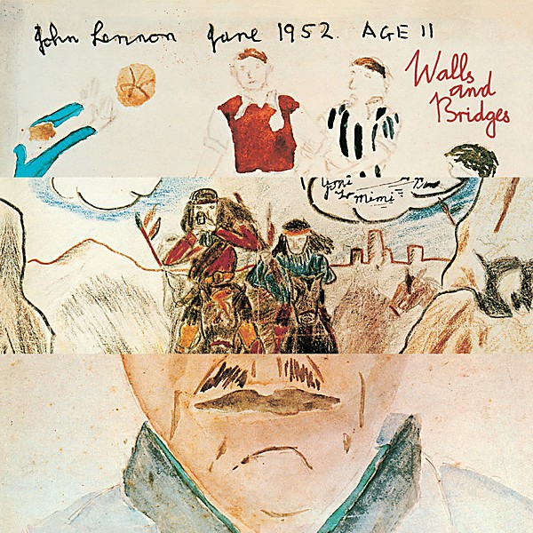

# Walls and Bridges

By **John Lennon**

## Album Data

- **Catalog:** Beets
- **Format:** Digital, Album
- **Album:** Walls and Bridges
- **Artist:** John Lennon
- **Albumartist:** John Lennon
- **Genre:** Pop Rock
- **MusicBrainz Album Artist ID:** [4d5447d7-c61c-4120-ba1b-d7f471d385b9](https://musicbrainz.org/artist/4d5447d7-c61c-4120-ba1b-d7f471d385b9)
- **MusicBrainz Album ID:** [8ff4e284-5c41-4979-b442-d3b3bb97f0cf](https://musicbrainz.org/release/8ff4e284-5c41-4979-b442-d3b3bb97f0cf)
- **MusicBrainz Release Group ID:** [cf90044e-b161-3cda-99c7-2390802023b9](https://musicbrainz.org/release-group/cf90044e-b161-3cda-99c7-2390802023b9)
- **Year:** 2014
- **Catalog #:** 
- **Label:** Apple Records
- **Total Tracks:** 12

## Album Tracks

### Track 01 - Going Down on Love

- **Artist:** John Lennon
- **Format:** AAC
- **Genre:** Rock
- **Length:** 3:58
- **MusicBrainz Track ID:** [5438ad55-6a21-48ac-8a92-c64ccfb7b38f](https://musicbrainz.org/recording/5438ad55-6a21-48ac-8a92-c64ccfb7b38f)
- **Title:** Going Down on Love
- **Track:** 01
- **Year:** 2014

### Track 02 - Whatever Gets You Thru the Night

- **Artist:** John Lennon
- **Format:** AAC
- **Genre:** Rock
- **Length:** 3:32
- **MusicBrainz Track ID:** [274cc945-808e-42d0-865f-9559d7b43220](https://musicbrainz.org/recording/274cc945-808e-42d0-865f-9559d7b43220)
- **Title:** Whatever Gets You Thru the Night
- **Track:** 02
- **Year:** 2014

### Track 03 - Old Dirt Road

- **Artist:** John Lennon
- **Format:** AAC
- **Genre:** Rock
- **Length:** 4:17
- **MusicBrainz Track ID:** [fcf0f541-b780-4702-bf71-6b4c452037a9](https://musicbrainz.org/recording/fcf0f541-b780-4702-bf71-6b4c452037a9)
- **Title:** Old Dirt Road
- **Track:** 03
- **Year:** 2014

### Track 04 - What You Got

- **Artist:** John Lennon
- **Format:** AAC
- **Genre:** Uk Garage
- **Length:** 3:15
- **MusicBrainz Track ID:** [8303a835-5660-455a-a92d-9cb0b6f68a3b](https://musicbrainz.org/recording/8303a835-5660-455a-a92d-9cb0b6f68a3b)
- **Title:** What You Got
- **Track:** 04
- **Year:** 2014

### Track 05 - Bless You

- **Artist:** John Lennon
- **Format:** AAC
- **Genre:** Soul
- **Length:** 4:45
- **MusicBrainz Track ID:** [428ea993-45fc-41b0-8650-88a34a9e334b](https://musicbrainz.org/recording/428ea993-45fc-41b0-8650-88a34a9e334b)
- **Title:** Bless You
- **Track:** 05
- **Year:** 2014

### Track 06 - Scared

- **Artist:** John Lennon
- **Format:** AAC
- **Genre:** Folk Rock
- **Length:** 4:44
- **MusicBrainz Track ID:** [1a2b6e16-3b20-4941-b4ce-78a0d1d80bb0](https://musicbrainz.org/recording/1a2b6e16-3b20-4941-b4ce-78a0d1d80bb0)
- **Title:** Scared
- **Track:** 06
- **Year:** 2014

### Track 07 - #9 Dream

- **Artist:** John Lennon
- **Format:** AAC
- **Genre:** Soft Rock
- **Length:** 4:51
- **MusicBrainz Track ID:** [c8cf5064-0ea7-4274-8478-1deba347b2b0](https://musicbrainz.org/recording/c8cf5064-0ea7-4274-8478-1deba347b2b0)
- **Title:** #9 Dream
- **Track:** 07
- **Year:** 2014

### Track 08 - Surprise, Surprise (Sweet Bird of Paradox)

- **Artist:** John Lennon
- **Format:** AAC
- **Genre:** Rock
- **Length:** 3:02
- **MusicBrainz Track ID:** [8316a59b-4af7-438b-bc18-80acf1762220](https://musicbrainz.org/recording/8316a59b-4af7-438b-bc18-80acf1762220)
- **Title:** Surprise, Surprise (Sweet Bird of Paradox)
- **Track:** 08
- **Year:** 2014

### Track 09 - Steel and Glass

- **Artist:** John Lennon
- **Format:** AAC
- **Genre:** Rock
- **Length:** 4:48
- **MusicBrainz Track ID:** [4e08cc42-31e2-4f89-bffd-2930abf8661f](https://musicbrainz.org/recording/4e08cc42-31e2-4f89-bffd-2930abf8661f)
- **Title:** Steel and Glass
- **Track:** 09
- **Year:** 2014

### Track 10 - Beef Jerky

- **Artist:** John Lennon
- **Format:** AAC
- **Genre:** Rock
- **Length:** 3:32
- **MusicBrainz Track ID:** [bebcde76-2ab3-4dfb-8414-84f6ad78704f](https://musicbrainz.org/recording/bebcde76-2ab3-4dfb-8414-84f6ad78704f)
- **Title:** Beef Jerky
- **Track:** 10
- **Year:** 2014

### Track 11 - Nobody Loves You (When You're Down and Out)

- **Artist:** John Lennon
- **Format:** AAC
- **Genre:** Rock
- **Length:** 5:19
- **MusicBrainz Track ID:** [71b8fd1f-6257-4420-a8cd-d855d5652831](https://musicbrainz.org/recording/71b8fd1f-6257-4420-a8cd-d855d5652831)
- **Title:** Nobody Loves You (When You're Down and Out)
- **Track:** 11
- **Year:** 2014

### Track 12 - Ya Ya

- **Artist:** John Lennon
- **Format:** AAC
- **Genre:** Britpop
- **Length:** 1:09
- **MusicBrainz Track ID:** [302984c3-a8a9-4eae-9c26-f0230f5cc622](https://musicbrainz.org/recording/302984c3-a8a9-4eae-9c26-f0230f5cc622)
- **Title:** Ya Ya
- **Track:** 12
- **Year:** 2014

## See also

- [Imagine](Imagine.md)
- [John Lennon Box Set](John_Lennon_Box_Set.md)
- [John Lennon/Plastic Ono Band](John_Lennon-Plastic_Ono_Band.md)
- [Mind Games](Mind_Games.md)
- [Rock ’n’ Roll](Rock_’n’_Roll.md)
- [Some Time In New York City](Some_Time_In_New_York_City.md)
- [The John Lennon Collection](The_John_Lennon_Collection.md)
- [CD: ](../../CD/John_Lennon/John_Lennon.md)
- [CD: Plastic Ono Band](../../CD/John_Lennon/Plastic_Ono_Band.md)
- [CD: The John Lennon Collection](../../CD/John_Lennon/The_John_Lennon_Collection.md)
- [Roon: Double Fantasy](../../Roon/John_Lennon/Double_Fantasy.md)
- [Roon: Double Fantasy Stripped Down (Stripped Down)](../../Roon/John_Lennon/Double_Fantasy_Stripped_Down_Stripped_Down.md)
- [Roon: GIMME SOME TRUTH. (Deluxe)](../../Roon/John_Lennon/GIMME_SOME_TRUTH_Deluxe.md)
- [Roon: HERO.](../../Roon/John_Lennon/HERO.md)
- [Roon: Imagine - The Ultimate Collection (The Ultimate Collection)](../../Roon/John_Lennon/Imagine_-_The_Ultimate_Collection_The_Ultimate_Collection.md)
- [Roon: Mind Games](../../Roon/John_Lennon/Mind_Games.md)
- [Roon: Plastic Ono Band (The Ultimate Collection)](../../Roon/John_Lennon/Plastic_Ono_Band_The_Ultimate_Collection.md)
- [Roon: Walls And Bridges](../../Roon/John_Lennon/Walls_And_Bridges.md)
- [Vinyl: Imagine](../../Vinyl/John_Lennon/Imagine.md)
- [Vinyl: ](../../Vinyl/John_Lennon/John_Lennon.md)
- [Vinyl: Walls And Bridges](../../Vinyl/John_Lennon/Walls_And_Bridges.md)
