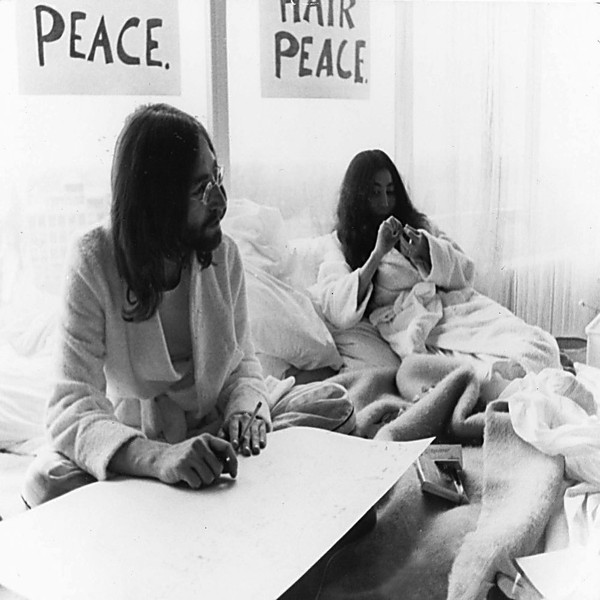

# Double Fantasy Stripped Down [Disc 2]

By **John Lennon & Yoko Ono**

## Album Data

- **Catalog:** Beets
- **Format:** Digital, Album
- **Album:** Double Fantasy Stripped Down [Disc 2]
- **Artist:** John Lennon & Yoko Ono
- **Albumartist:** John Lennon & Yoko Ono
- **Genre:** Rock
- **MusicBrainz Album Artist ID:** 
- **MusicBrainz Album ID:** 
- **MusicBrainz Release Group ID:** 
- **Year:** 1980
- **Catalog #:** 
- **Label:** 
- **Total Tracks:** 10

## Album Tracks

### Track 01 - Woman Is The Nigger Of The World

- **Artist:** John Lennon & Yoko Ono
- **Format:** ALAC
- **Genre:** Rock
- **Length:** 5:18
- **MusicBrainz Track ID:** 
- **Title:** Woman Is The Nigger Of The World
- **Track:** 01
- **Year:** 1972

### Track 02 - Sisters, O Sisters

- **Artist:** John Lennon & Yoko Ono
- **Format:** ALAC
- **Genre:** Rock
- **Length:** 3:49
- **MusicBrainz Track ID:** 
- **Title:** Sisters, O Sisters
- **Track:** 02
- **Year:** 1972

### Track 03 - Attica State

- **Artist:** John Lennon & Yoko Ono
- **Format:** ALAC
- **Genre:** Rock
- **Length:** 2:56
- **MusicBrainz Track ID:** 
- **Title:** Attica State
- **Track:** 03
- **Year:** 1972

### Track 04 - Born In A Prison

- **Artist:** John Lennon & Yoko Ono
- **Format:** ALAC
- **Genre:** Rock And Roll
- **Length:** 4:07
- **MusicBrainz Track ID:** 
- **Title:** Born In A Prison
- **Track:** 04
- **Year:** 1972

### Track 05 - New York City

- **Artist:** John Lennon & Yoko Ono
- **Format:** ALAC
- **Genre:** Rock And Roll
- **Length:** 4:34
- **MusicBrainz Track ID:** 
- **Title:** New York City
- **Track:** 05
- **Year:** 1972

### Track 06 - Sunday Bloody Sunday

- **Artist:** John Lennon & Yoko Ono
- **Format:** ALAC
- **Genre:** Rock
- **Length:** 5:03
- **MusicBrainz Track ID:** 
- **Title:** Sunday Bloody Sunday
- **Track:** 06
- **Year:** 1972

### Track 07 - The Luck Of The Irish

- **Artist:** John Lennon & Yoko Ono
- **Format:** ALAC
- **Genre:** Rock
- **Length:** 2:59
- **MusicBrainz Track ID:** 
- **Title:** The Luck Of The Irish
- **Track:** 07
- **Year:** 1972

### Track 08 - John Sinclair

- **Artist:** John Lennon & Yoko Ono
- **Format:** ALAC
- **Genre:** Americana
- **Length:** 3:31
- **MusicBrainz Track ID:** 
- **Title:** John Sinclair
- **Track:** 08
- **Year:** 1972

### Track 09 - Angela

- **Artist:** John Lennon & Yoko Ono
- **Format:** ALAC
- **Genre:** Rock
- **Length:** 4:09
- **MusicBrainz Track ID:** 
- **Title:** Angela
- **Track:** 09
- **Year:** 1972

### Track 10 - We're All Water

- **Artist:** John Lennon & Yoko Ono
- **Format:** ALAC
- **Genre:** Rock
- **Length:** 7:14
- **MusicBrainz Track ID:** 
- **Title:** We're All Water
- **Track:** 10
- **Year:** 1972

## See also

- [Double Fantasy Stripped Down [Disc 1]](Double_Fantasy_Stripped_Down_[Disc_1].md)
- [Some Time In New York City [Disc 1]](Some_Time_In_New_York_City_[Disc_1].md)
- [Some Time In New York City [Disc 2]](Some_Time_In_New_York_City_[Disc_2].md)
