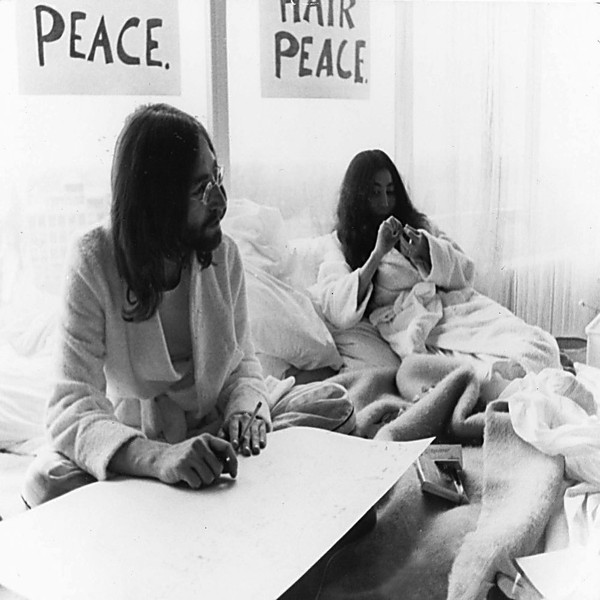

# Some Time In New York City [Disc 1]

By **John Lennon & Yoko Ono**

## Album Data

- **Catalog:** Beets
- **Format:** Digital, Album
- **Album:** Some Time In New York City [Disc 1]
- **Artist:** John Lennon & Yoko Ono
- **Albumartist:** John Lennon & Yoko Ono
- **Genre:** Rock
- **MusicBrainz Album Artist ID:** 
- **MusicBrainz Album ID:** 
- **MusicBrainz Release Group ID:** 
- **Year:** 1972
- **Catalog #:** 
- **Label:** 
- **Total Tracks:** 06

## Album Tracks

### Track 01 - Cold Turkey

- **Artist:** John Lennon & Yoko Ono
- **Format:** ALAC
- **Genre:** Rock
- **Length:** 8:35
- **MusicBrainz Track ID:** 
- **Title:** Cold Turkey
- **Track:** 01
- **Year:** 1972

### Track 02 - Don't Worry Kyoko

- **Artist:** John Lennon & Yoko Ono
- **Format:** ALAC
- **Genre:** Rock
- **Length:** 16:06
- **MusicBrainz Track ID:** 
- **Title:** Don't Worry Kyoko
- **Track:** 02
- **Year:** 1972

### Track 03 - Well (Baby Please Don't Go) [Live]

- **Artist:** John Lennon & Yoko Ono
- **Format:** ALAC
- **Genre:** Rock
- **Length:** 4:40
- **MusicBrainz Track ID:** 
- **Title:** Well (Baby Please Don't Go) [Live]
- **Track:** 03
- **Year:** 1972

### Track 04 - Jamrag [Live]

- **Artist:** John Lennon & Yoko Ono
- **Format:** ALAC
- **Genre:** Rock
- **Length:** 5:36
- **MusicBrainz Track ID:** 
- **Title:** Jamrag [Live]
- **Track:** 04
- **Year:** 1972

### Track 05 - Scumbag [Live]

- **Artist:** John Lennon & Yoko Ono
- **Format:** ALAC
- **Genre:** Rock
- **Length:** 4:27
- **MusicBrainz Track ID:** 
- **Title:** Scumbag [Live]
- **Track:** 05
- **Year:** 1972

### Track 06 - Au [Live]

- **Artist:** John Lennon & Yoko Ono
- **Format:** ALAC
- **Genre:** Rock
- **Length:** 8:10
- **MusicBrainz Track ID:** 
- **Title:** Au [Live]
- **Track:** 06
- **Year:** 1972

## See also

- [Double Fantasy Stripped Down [Disc 1]](Double_Fantasy_Stripped_Down_[Disc_1].md)
- [Double Fantasy Stripped Down [Disc 2]](Double_Fantasy_Stripped_Down_[Disc_2].md)
- [Some Time In New York City [Disc 2]](Some_Time_In_New_York_City_[Disc_2].md)
