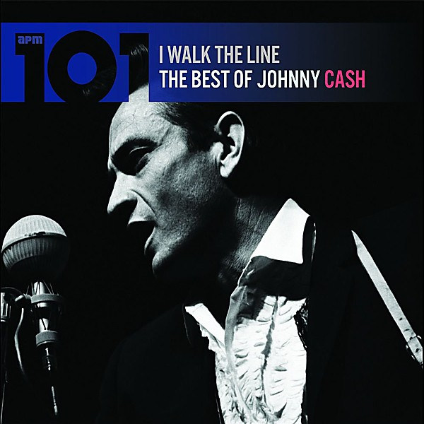

# The Best of Johnny Cash

By **Johnny Cash**

## Album Data

- **Catalog:** Beets
- **Format:** Digital, Album
- **Album:** The Best of Johnny Cash
- **Artist:** Johnny Cash
- **Albumartist:** Johnny Cash
- **Genre:** Country
- **MusicBrainz Album Artist ID:** [d43d12a1-2dc9-4257-a2fd-0a3bb1081b86](https://musicbrainz.org/artist/d43d12a1-2dc9-4257-a2fd-0a3bb1081b86)
- **MusicBrainz Album ID:** [3311138e-39b6-4271-9227-d7aa11f5b190](https://musicbrainz.org/release/3311138e-39b6-4271-9227-d7aa11f5b190)
- **MusicBrainz Release Group ID:** [efa3de49-b458-3096-9c4a-ce40c08dc9c7](https://musicbrainz.org/release-group/efa3de49-b458-3096-9c4a-ce40c08dc9c7)
- **Year:** 1991
- **Catalog #:** 9 43097-2
- **Label:** American Recordings
- **Total Tracks:** 14

## Album Tracks

### Track 01 - Rowboat

- **Artist:** Johnny Cash
- **Format:** ALAC
- **Genre:** Country
- **Length:** 3:43
- **MusicBrainz Track ID:** [16b3e687-a25b-49ac-8b6e-bf4e6f2eacdf](https://musicbrainz.org/recording/16b3e687-a25b-49ac-8b6e-bf4e6f2eacdf)
- **Title:** Rowboat
- **Track:** 01
- **Year:** 1996

### Track 02 - Sea of Heartbreak

- **Artist:** Johnny Cash
- **Format:** ALAC
- **Genre:** Classic Country
- **Length:** 2:42
- **MusicBrainz Track ID:** [2296b2eb-47ba-43e6-a16a-b24cb807aa9a](https://musicbrainz.org/recording/2296b2eb-47ba-43e6-a16a-b24cb807aa9a)
- **Title:** Sea of Heartbreak
- **Track:** 02
- **Year:** 1996

### Track 03 - Rusty Cage

- **Artist:** Johnny Cash
- **Format:** ALAC
- **Genre:** Rock
- **Length:** 2:49
- **MusicBrainz Track ID:** [ab8ad3c8-dd26-4d3e-955b-a69d38861a72](https://musicbrainz.org/recording/ab8ad3c8-dd26-4d3e-955b-a69d38861a72)
- **Title:** Rusty Cage
- **Track:** 03
- **Year:** 1996

### Track 04 - The One Rose (That’s Left in My Heart)

- **Artist:** Johnny Cash
- **Format:** ALAC
- **Genre:** Americana
- **Length:** 2:26
- **MusicBrainz Track ID:** [a3db0513-a27c-414c-9e72-4418e29d3a82](https://musicbrainz.org/recording/a3db0513-a27c-414c-9e72-4418e29d3a82)
- **Title:** The One Rose (That’s Left in My Heart)
- **Track:** 04
- **Year:** 1996

### Track 05 - Country Boy

- **Artist:** Johnny Cash
- **Format:** ALAC
- **Genre:** Rockabilly
- **Length:** 2:31
- **MusicBrainz Track ID:** [4c445b6a-3532-49a1-bd7a-3db408968c8d](https://musicbrainz.org/recording/4c445b6a-3532-49a1-bd7a-3db408968c8d)
- **Title:** Country Boy
- **Track:** 05
- **Year:** 1996

### Track 06 - Memories Are Made of This

- **Artist:** Johnny Cash
- **Format:** ALAC
- **Genre:** Rock
- **Length:** 2:19
- **MusicBrainz Track ID:** [7de3c600-9ed7-45b1-b35d-7257c27f4937](https://musicbrainz.org/recording/7de3c600-9ed7-45b1-b35d-7257c27f4937)
- **Title:** Memories Are Made of This
- **Track:** 06
- **Year:** 1996

### Track 07 - Spiritual

- **Artist:** Johnny Cash
- **Format:** ALAC
- **Genre:** Rock
- **Length:** 5:07
- **MusicBrainz Track ID:** [14935e4a-0d32-4c67-906b-96b585aa5176](https://musicbrainz.org/recording/14935e4a-0d32-4c67-906b-96b585aa5176)
- **Title:** Spiritual
- **Track:** 07
- **Year:** 1996

### Track 08 - The Kneeling Drunkard’s Plea

- **Artist:** Johnny Cash
- **Format:** ALAC
- **Genre:** Americana
- **Length:** 2:32
- **MusicBrainz Track ID:** [f50655a1-c0ef-4c2c-9be1-ecaa9585483d](https://musicbrainz.org/recording/f50655a1-c0ef-4c2c-9be1-ecaa9585483d)
- **Title:** The Kneeling Drunkard’s Plea
- **Track:** 08
- **Year:** 1996

### Track 09 - Southern Accents

- **Artist:** Johnny Cash
- **Format:** ALAC
- **Genre:** Downtempo
- **Length:** 4:41
- **MusicBrainz Track ID:** [27fa7be3-8480-4aa1-8c65-8f59e67d3092](https://musicbrainz.org/recording/27fa7be3-8480-4aa1-8c65-8f59e67d3092)
- **Title:** Southern Accents
- **Track:** 09
- **Year:** 1996

### Track 10 - Mean Eyed Cat

- **Artist:** Johnny Cash
- **Format:** ALAC
- **Genre:** Rock
- **Length:** 2:33
- **MusicBrainz Track ID:** [fce207c9-c234-4b2f-bb30-08c75a00e0dc](https://musicbrainz.org/recording/fce207c9-c234-4b2f-bb30-08c75a00e0dc)
- **Title:** Mean Eyed Cat
- **Track:** 10
- **Year:** 1996

### Track 11 - Meet Me in Heaven

- **Artist:** Johnny Cash
- **Format:** ALAC
- **Genre:** Rock
- **Length:** 3:21
- **MusicBrainz Track ID:** [b001e183-f8e2-4cb4-bf13-74d626dd4515](https://musicbrainz.org/recording/b001e183-f8e2-4cb4-bf13-74d626dd4515)
- **Title:** Meet Me in Heaven
- **Track:** 11
- **Year:** 1996

### Track 12 - I Never Picked Cotton

- **Artist:** Johnny Cash
- **Format:** ALAC
- **Genre:** Outlaw Country
- **Length:** 2:39
- **MusicBrainz Track ID:** [22b66b76-b480-4517-99d0-51aa5bb29df6](https://musicbrainz.org/recording/22b66b76-b480-4517-99d0-51aa5bb29df6)
- **Title:** I Never Picked Cotton
- **Track:** 12
- **Year:** 1996

### Track 13 - Unchained

- **Artist:** Johnny Cash
- **Format:** ALAC
- **Genre:** Rock
- **Length:** 2:51
- **MusicBrainz Track ID:** [832251ba-db9b-4766-a255-f8a1b86e31c5](https://musicbrainz.org/recording/832251ba-db9b-4766-a255-f8a1b86e31c5)
- **Title:** Unchained
- **Track:** 13
- **Year:** 1996

### Track 14 - I’ve Been Everywhere

- **Artist:** Johnny Cash
- **Format:** ALAC
- **Genre:** Americana
- **Length:** 3:17
- **MusicBrainz Track ID:** [b930f210-5172-4f9b-836f-0805f69a7978](https://musicbrainz.org/recording/b930f210-5172-4f9b-836f-0805f69a7978)
- **Title:** I’ve Been Everywhere
- **Track:** 14
- **Year:** 1996

## See also

- [Unchained](Unchained.md)
- [Unknown Album](Unknown_Album.md)
- [Walk The Line (disc 1)](Walk_The_Line_disc_1.md)
- [Walk The Line (disc 2)](Walk_The_Line_disc_2.md)
- [Roon: American II](../../Roon/Johnny_Cash/American_II-_Unchained.md)
- [Roon: Bear's Sonic Journals](../../Roon/Johnny_Cash/Bears_Sonic_Journals-_Live_At_The_Carousel_Ballroom__April_24_1968.md)
- [Vinyl: Big River](../../Vinyl/Johnny_Cash/Big_River.md)
- [Vinyl: ](../../Vinyl/Johnny_Cash/Johnny_Cash.md)
