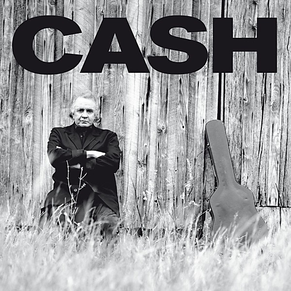

# Unchained

By **Johnny Cash**

## Album Data

- **Catalog:** Beets
- **Format:** Digital, Album
- **Album:** Unchained
- **Artist:** Johnny Cash
- **Albumartist:** Johnny Cash
- **Genre:** Americana
- **MusicBrainz Album Artist ID:** [d43d12a1-2dc9-4257-a2fd-0a3bb1081b86](https://musicbrainz.org/artist/d43d12a1-2dc9-4257-a2fd-0a3bb1081b86)
- **MusicBrainz Album ID:** [3f97d3ea-3b33-417a-bbb1-ed810c7ae2be](https://musicbrainz.org/release/3f97d3ea-3b33-417a-bbb1-ed810c7ae2be)
- **MusicBrainz Release Group ID:** [9a8b2078-54db-34f2-bf5d-8dc42df3d896](https://musicbrainz.org/release-group/9a8b2078-54db-34f2-bf5d-8dc42df3d896)
- **Year:** 1996
- **Catalog #:** 
- **Label:** 
- **Total Tracks:** 00

## Album Tracks

### Track 00 - Boy Named Sue

- **Artist:** Johnny Cash
- **Format:** AAC
- **Genre:** Rockabilly
- **Length:** 3:47
- **MusicBrainz Track ID:** 
- **Title:** Boy Named Sue
- **Track:** 00
- **Year:** 1969

### Track 00 - Don't Think Twice, It's Alright

- **Artist:** Johnny Cash
- **Format:** MP3
- **Genre:** Country
- **Length:** 2:58
- **MusicBrainz Track ID:** 
- **Title:** Don't Think Twice, It's Alright
- **Track:** 00
- **Year:** 0000

## See also

- [The Best of Johnny Cash](The_Best_of_Johnny_Cash.md)
- [Unknown Album](Unknown_Album.md)
- [Walk The Line (disc 1)](Walk_The_Line_disc_1.md)
- [Walk The Line (disc 2)](Walk_The_Line_disc_2.md)
- [Roon: American II](../../Roon/Johnny_Cash/American_II-_Unchained.md)
- [Roon: Bear's Sonic Journals](../../Roon/Johnny_Cash/Bears_Sonic_Journals-_Live_At_The_Carousel_Ballroom__April_24_1968.md)
- [Vinyl: Big River](../../Vinyl/Johnny_Cash/Big_River.md)
- [Vinyl: ](../../Vinyl/Johnny_Cash/Johnny_Cash.md)
