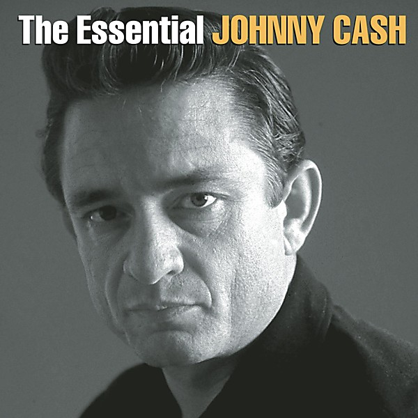

# Walk The Line (disc 1)

By **Johnny Cash**

## Album Data

- **Catalog:** Beets
- **Format:** Digital, Album
- **Album:** Walk The Line (disc 1)
- **Artist:** Johnny Cash
- **Albumartist:** Johnny Cash
- **Genre:** Rock
- **MusicBrainz Album Artist ID:** 
- **MusicBrainz Album ID:** 
- **MusicBrainz Release Group ID:** 
- **Year:** 2011
- **Catalog #:** 
- **Label:** 
- **Total Tracks:** 00

## Album Tracks

### Track 01 - Rock Island Line

- **Artist:** Johnny Cash
- **Format:** MP3
- **Genre:** Rockabilly
- **Length:** 2:07
- **MusicBrainz Track ID:** 
- **Title:** Rock Island Line
- **Track:** 01
- **Year:** 2011

### Track 02 - Oh, Lonesome Me

- **Artist:** Johnny Cash
- **Format:** MP3
- **Genre:** Rockabilly
- **Length:** 2:25
- **MusicBrainz Track ID:** 
- **Title:** Oh, Lonesome Me
- **Track:** 02
- **Year:** 2011

### Track 03 - Hey! Porter

- **Artist:** Johnny Cash
- **Format:** MP3
- **Genre:** Rockabilly
- **Length:** 2:09
- **MusicBrainz Track ID:** 
- **Title:** Hey! Porter
- **Track:** 03
- **Year:** 2011

### Track 04 - The Wreck of The Old 97

- **Artist:** Johnny Cash
- **Format:** MP3
- **Genre:** Country
- **Length:** 1:45
- **MusicBrainz Track ID:** 
- **Title:** The Wreck of The Old 97
- **Track:** 04
- **Year:** 2011

### Track 05 - Belshazzar

- **Artist:** Johnny Cash
- **Format:** MP3
- **Genre:** Rockabilly
- **Length:** 2:22
- **MusicBrainz Track ID:** 
- **Title:** Belshazzar
- **Track:** 05
- **Year:** 2011

### Track 06 - Country Boy

- **Artist:** Johnny Cash
- **Format:** MP3
- **Genre:** Rockabilly
- **Length:** 1:49
- **MusicBrainz Track ID:** 
- **Title:** Country Boy
- **Track:** 06
- **Year:** 2011

### Track 07 - Doin' My Time

- **Artist:** Johnny Cash
- **Format:** MP3
- **Genre:** Rockabilly
- **Length:** 2:33
- **MusicBrainz Track ID:** 
- **Title:** Doin' My Time
- **Track:** 07
- **Year:** 2011

### Track 08 - If The Good Lord's Willing

- **Artist:** Johnny Cash
- **Format:** MP3
- **Genre:** Rockabilly
- **Length:** 1:39
- **MusicBrainz Track ID:** 
- **Title:** If The Good Lord's Willing
- **Track:** 08
- **Year:** 2011

### Track 09 - I Heard That Lonesome Whistle Blow

- **Artist:** Johnny Cash
- **Format:** MP3
- **Genre:** Classic Country
- **Length:** 2:22
- **MusicBrainz Track ID:** 
- **Title:** I Heard That Lonesome Whistle Blow
- **Track:** 09
- **Year:** 2011

### Track 10 - Remember Me (I'm The One Who Loves You)

- **Artist:** Johnny Cash
- **Format:** MP3
- **Genre:** Country
- **Length:** 1:57
- **MusicBrainz Track ID:** 
- **Title:** Remember Me (I'm The One Who Loves You)
- **Track:** 10
- **Year:** 2011

### Track 11 - I Was There When It Happened

- **Artist:** Johnny Cash
- **Format:** MP3
- **Genre:** Rockabilly
- **Length:** 2:13
- **MusicBrainz Track ID:** 
- **Title:** I Was There When It Happened
- **Track:** 11
- **Year:** 2011

### Track 12 - Born To Lose

- **Artist:** Johnny Cash
- **Format:** MP3
- **Genre:** Country
- **Length:** 2:07
- **MusicBrainz Track ID:** 
- **Title:** Born To Lose
- **Track:** 12
- **Year:** 2011

### Track 13 - Life Goes On

- **Artist:** Johnny Cash
- **Format:** MP3
- **Genre:** Country
- **Length:** 1:56
- **MusicBrainz Track ID:** 
- **Title:** Life Goes On
- **Track:** 13
- **Year:** 2011

### Track 14 - Blue Train

- **Artist:** Johnny Cash
- **Format:** MP3
- **Genre:** Rockabilly
- **Length:** 1:59
- **MusicBrainz Track ID:** 
- **Title:** Blue Train
- **Track:** 14
- **Year:** 2011

### Track 15 - Goodnight Irene

- **Artist:** Johnny Cash
- **Format:** MP3
- **Genre:** Rockabilly
- **Length:** 2:38
- **MusicBrainz Track ID:** 
- **Title:** Goodnight Irene
- **Track:** 15
- **Year:** 2011

### Track 16 - Fool's Hall of Fame

- **Artist:** Johnny Cash
- **Format:** MP3
- **Genre:** Rock
- **Length:** 2:20
- **MusicBrainz Track ID:** 
- **Title:** Fool's Hall of Fame
- **Track:** 16
- **Year:** 2011

### Track 17 - I Couldn't Keep From Crying

- **Artist:** Johnny Cash
- **Format:** MP3
- **Genre:** Rock
- **Length:** 1:59
- **MusicBrainz Track ID:** 
- **Title:** I Couldn't Keep From Crying
- **Track:** 17
- **Year:** 2011

### Track 18 - I Forgot to Remember to Forget

- **Artist:** Johnny Cash
- **Format:** MP3
- **Genre:** Country
- **Length:** 1:51
- **MusicBrainz Track ID:** 
- **Title:** I Forgot to Remember to Forget
- **Track:** 18
- **Year:** 2011

### Track 19 - I Can't Help It (If I'm Still In Love With You)

- **Artist:** Johnny Cash
- **Format:** MP3
- **Genre:** Soul
- **Length:** 1:43
- **MusicBrainz Track ID:** 
- **Title:** I Can't Help It (If I'm Still In Love With You)
- **Track:** 19
- **Year:** 2011

### Track 20 - Always Alone

- **Artist:** Johnny Cash
- **Format:** MP3
- **Genre:** Country
- **Length:** 1:47
- **MusicBrainz Track ID:** 
- **Title:** Always Alone
- **Track:** 20
- **Year:** 2011

### Track 21 - I Could Never Be Ashamed Of You

- **Artist:** Johnny Cash
- **Format:** MP3
- **Genre:** Soul
- **Length:** 2:10
- **MusicBrainz Track ID:** 
- **Title:** I Could Never Be Ashamed Of You
- **Track:** 21
- **Year:** 2011

### Track 22 - The Story of A Broken Heart

- **Artist:** Johnny Cash
- **Format:** MP3
- **Genre:** Country
- **Length:** 2:09
- **MusicBrainz Track ID:** 
- **Title:** The Story of A Broken Heart
- **Track:** 22
- **Year:** 2011

### Track 23 - Down the Street to 301

- **Artist:** Johnny Cash
- **Format:** MP3
- **Genre:** Soul
- **Length:** 2:01
- **MusicBrainz Track ID:** 
- **Title:** Down the Street to 301
- **Track:** 23
- **Year:** 2011

### Track 24 - Port of Lonely Hearts

- **Artist:** Johnny Cash
- **Format:** MP3
- **Genre:** Country
- **Length:** 2:32
- **MusicBrainz Track ID:** 
- **Title:** Port of Lonely Hearts
- **Track:** 24
- **Year:** 2011

### Track 25 - I Just Thought You'd Like To Know

- **Artist:** Johnny Cash
- **Format:** MP3
- **Genre:** Soul
- **Length:** 2:21
- **MusicBrainz Track ID:** 
- **Title:** I Just Thought You'd Like To Know
- **Track:** 25
- **Year:** 2011

### Track 26 - You Win Again

- **Artist:** Johnny Cash
- **Format:** MP3
- **Genre:** Soul
- **Length:** 2:14
- **MusicBrainz Track ID:** 
- **Title:** You Win Again
- **Track:** 26
- **Year:** 2011

### Track 27 - Leave That Junk Alone (demo)

- **Artist:** Johnny Cash
- **Format:** MP3
- **Genre:** Country
- **Length:** 1:28
- **MusicBrainz Track ID:** 
- **Title:** Leave That Junk Alone (demo)
- **Track:** 27
- **Year:** 2011

### Track 28 - I Walk The Line (alternate version)

- **Artist:** Johnny Cash
- **Format:** MP3
- **Genre:** Country
- **Length:** 2:37
- **MusicBrainz Track ID:** 
- **Title:** I Walk The Line (alternate version)
- **Track:** 28
- **Year:** 2011

## See also

- [The Best of Johnny Cash](The_Best_of_Johnny_Cash.md)
- [Unchained](Unchained.md)
- [Unknown Album](Unknown_Album.md)
- [Walk The Line (disc 2)](Walk_The_Line_disc_2.md)
- [Roon: American II](../../Roon/Johnny_Cash/American_II-_Unchained.md)
- [Roon: Bear's Sonic Journals](../../Roon/Johnny_Cash/Bears_Sonic_Journals-_Live_At_The_Carousel_Ballroom__April_24_1968.md)
- [Vinyl: Big River](../../Vinyl/Johnny_Cash/Big_River.md)
- [Vinyl: ](../../Vinyl/Johnny_Cash/Johnny_Cash.md)
