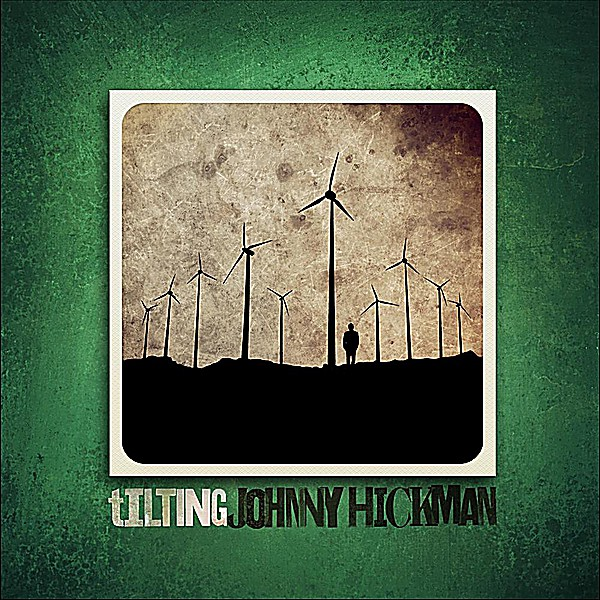

# Tilting

By **Johnny Hickman**

## Album Data

- **Catalog:** Beets
- **Format:** Digital, Album
- **Album:** Tilting
- **Artist:** Johnny Hickman
- **Albumartist:** Johnny Hickman
- **Genre:** Rockabilly
- **MusicBrainz Album Artist ID:** [https](https://musicbrainz.org/artist/https)
- **MusicBrainz Album ID:** [https](https://musicbrainz.org/release/https)
- **MusicBrainz Release Group ID:** 
- **Year:** 2012
- **Catalog #:** 
- **Label:** Johnny Hickman
- **Total Tracks:** 12

## Album Tracks

### Track 01 - Measure of a Man

- **Artist:** Johnny Hickman
- **Format:** ALAC
- **Genre:** Rockabilly
- **Length:** 4:28
- **MusicBrainz Track ID:** [https](https://musicbrainz.org/recording/https)
- **Title:** Measure of a Man
- **Track:** 01
- **Year:** 2012

### Track 02 - Destiny Misspent

- **Artist:** Johnny Hickman
- **Format:** ALAC
- **Genre:** Rockabilly
- **Length:** 6:01
- **MusicBrainz Track ID:** [https](https://musicbrainz.org/recording/https)
- **Title:** Destiny Misspent
- **Track:** 02
- **Year:** 2012

### Track 03 - Not Enough

- **Artist:** Johnny Hickman
- **Format:** ALAC
- **Genre:** Rockabilly
- **Length:** 2:56
- **MusicBrainz Track ID:** [https](https://musicbrainz.org/recording/https)
- **Title:** Not Enough
- **Track:** 03
- **Year:** 2012

### Track 04 - Dream Along With Me

- **Artist:** Johnny Hickman
- **Format:** ALAC
- **Genre:** Rockabilly
- **Length:** 3:58
- **MusicBrainz Track ID:** [https](https://musicbrainz.org/recording/https)
- **Title:** Dream Along With Me
- **Track:** 04
- **Year:** 2012

### Track 05 - Sick Cynthia Thing

- **Artist:** Johnny Hickman
- **Format:** ALAC
- **Genre:** Rockabilly
- **Length:** 3:52
- **MusicBrainz Track ID:** [https](https://musicbrainz.org/recording/https)
- **Title:** Sick Cynthia Thing
- **Track:** 05
- **Year:** 2012

### Track 06 - Whittled Down

- **Artist:** Johnny Hickman
- **Format:** ALAC
- **Genre:** Rockabilly
- **Length:** 5:00
- **MusicBrainz Track ID:** [https](https://musicbrainz.org/recording/https)
- **Title:** Whittled Down
- **Track:** 06
- **Year:** 2012

### Track 07 - Our Little Movie

- **Artist:** Johnny Hickman
- **Format:** ALAC
- **Genre:** Rockabilly
- **Length:** 3:48
- **MusicBrainz Track ID:** [https](https://musicbrainz.org/recording/https)
- **Title:** Our Little Movie
- **Track:** 07
- **Year:** 2012

### Track 08 - Papa Johnny's Arms

- **Artist:** Johnny Hickman
- **Format:** ALAC
- **Genre:** Rockabilly
- **Length:** 4:17
- **MusicBrainz Track ID:** [https](https://musicbrainz.org/recording/https)
- **Title:** Papa Johnny's Arms
- **Track:** 08
- **Year:** 2012

### Track 09 - Takin' Me Back

- **Artist:** Johnny Hickman
- **Format:** ALAC
- **Genre:** Rockabilly
- **Length:** 2:19
- **MusicBrainz Track ID:** [https](https://musicbrainz.org/recording/https)
- **Title:** Takin' Me Back
- **Track:** 09
- **Year:** 2012

### Track 10 - Resurrection Train

- **Artist:** Johnny Hickman
- **Format:** ALAC
- **Genre:** Rockabilly
- **Length:** 4:08
- **MusicBrainz Track ID:** [https](https://musicbrainz.org/recording/https)
- **Title:** Resurrection Train
- **Track:** 10
- **Year:** 2012

### Track 11 - Drunkard's Epiphany

- **Artist:** Johnny Hickman
- **Format:** ALAC
- **Genre:** Rockabilly
- **Length:** 4:21
- **MusicBrainz Track ID:** [https](https://musicbrainz.org/recording/https)
- **Title:** Drunkard's Epiphany
- **Track:** 11
- **Year:** 2012

### Track 12 - Another Road

- **Artist:** Johnny Hickman
- **Format:** ALAC
- **Genre:** Rockabilly
- **Length:** 4:02
- **MusicBrainz Track ID:** [https](https://musicbrainz.org/recording/https)
- **Title:** Another Road
- **Track:** 12
- **Year:** 2012

## See also

- [Palmhenge](Palmhenge.md)
