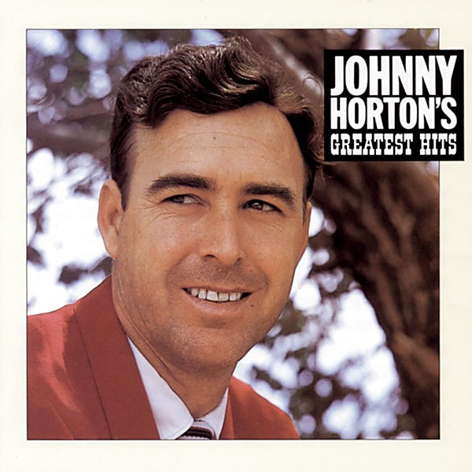

# Greatest Hits

By **Johnny Horton**

## Album Data

- **Catalog:** Beets
- **Format:** Digital, Album
- **Album:** Greatest Hits
- **Artist:** Johnny Horton
- **Albumartist:** Johnny Horton
- **Genre:** Country
- **MusicBrainz Album Artist ID:** 
- **MusicBrainz Album ID:** 
- **MusicBrainz Release Group ID:** 
- **Year:** 0000
- **Catalog #:** 
- **Label:** 
- **Total Tracks:** 00

## Album Tracks

### Track 01 - North to Alaska

- **Artist:** Johnny Horton
- **Format:** AAC
- **Genre:** Classic Country
- **Length:** 2:49
- **MusicBrainz Track ID:** 
- **Title:** North to Alaska
- **Track:** 01
- **Year:** 0000

### Track 02 - Battle Of New Orleans

- **Artist:** Johnny Horton
- **Format:** AAC
- **Genre:** Classic Country
- **Length:** 2:34
- **MusicBrainz Track ID:** 
- **Title:** Battle Of New Orleans
- **Track:** 02
- **Year:** 0000

## See also

- [The Spectacular Johnny Horton](The_Spectacular_Johnny_Horton.md)
