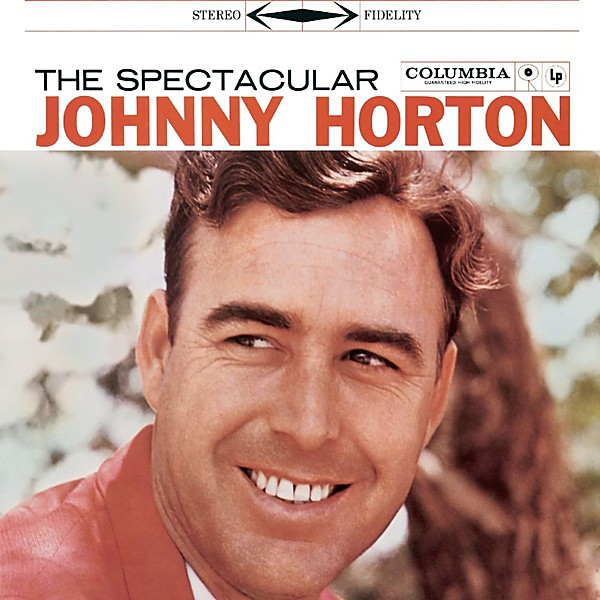

# The Spectacular Johnny Horton

By **Johnny Horton**

## Album Data

- **Catalog:** Beets
- **Format:** Digital, Album
- **Album:** The Spectacular Johnny Horton
- **Artist:** Johnny Horton
- **Albumartist:** Johnny Horton
- **Genre:** Rock
- **MusicBrainz Album Artist ID:** [8736f41f-365e-42c7-a733-36c22e74c97e](https://musicbrainz.org/artist/8736f41f-365e-42c7-a733-36c22e74c97e)
- **MusicBrainz Album ID:** [ad787098-f461-4517-a954-94d22d976f44](https://musicbrainz.org/release/ad787098-f461-4517-a954-94d22d976f44)
- **MusicBrainz Release Group ID:** [3343c13c-6e81-31b3-93fd-a8ee088ea09b](https://musicbrainz.org/release-group/3343c13c-6e81-31b3-93fd-a8ee088ea09b)
- **Year:** 1959
- **Catalog #:** 
- **Label:** 
- **Total Tracks:** 00

## Album Tracks

### Track 01 - North to Alaska

- **Artist:** Johnny Horton
- **Format:** AAC
- **Genre:** Classic Country
- **Length:** 2:49
- **MusicBrainz Track ID:** 
- **Title:** North to Alaska
- **Track:** 01
- **Year:** 0000

### Track 02 - Battle Of New Orleans

- **Artist:** Johnny Horton
- **Format:** AAC
- **Genre:** Classic Country
- **Length:** 2:34
- **MusicBrainz Track ID:** 
- **Title:** Battle Of New Orleans
- **Track:** 02
- **Year:** 0000

## See also

- [Greatest Hits](Greatest_Hits.md)
