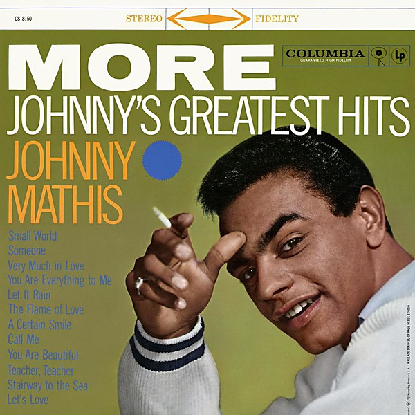

# Johnny's Greatest Hits

By **Johnny Mathis**

## Album Data

- **Catalog:** Beets
- **Format:** Digital, Album
- **Album:** Johnny's Greatest Hits
- **Artist:** Johnny Mathis
- **Albumartist:** Johnny Mathis
- **Genre:** Pop
- **MusicBrainz Album Artist ID:** 
- **MusicBrainz Album ID:** 
- **MusicBrainz Release Group ID:** 
- **Year:** 1962
- **Catalog #:** 
- **Label:** 
- **Total Tracks:** 00

## Album Tracks

### Track 00 - Chances Are

- **Artist:** Johnny Mathis
- **Format:** AAC
- **Genre:** Pop
- **Length:** 3:04
- **MusicBrainz Track ID:** 
- **Title:** Chances Are
- **Track:** 00
- **Year:** 1962

### Track 00 - The Twelfth Of Never

- **Artist:** Johnny Mathis
- **Format:** AAC
- **Genre:** Pop
- **Length:** 2:29
- **MusicBrainz Track ID:** 
- **Title:** The Twelfth Of Never
- **Track:** 00
- **Year:** 0000

### Track 00 - Too much, too little, too late

- **Artist:** Johnny Mathis
- **Format:** AAC
- **Genre:** Pop
- **Length:** 2:56
- **MusicBrainz Track ID:** 
- **Title:** Too much, too little, too late
- **Track:** 00
- **Year:** 1978

### Track 07 - It's Not for Me to Say

- **Artist:** Johnny Mathis/Ray Conniff
- **Format:** AAC
- **Genre:** Pop
- **Length:** 3:05
- **MusicBrainz Track ID:** 
- **Title:** It's Not for Me to Say
- **Track:** 07
- **Year:** 1958

## See also

- [Roon: Heavenly](../../Roon/Johnny_Mathis/Heavenly.md)
- [Roon: Johnny](../../Roon/Johnny_Mathis/Johnny.md)
- [Roon: More](../../Roon/Johnny_Mathis/More-_Johnnys_Greatest_Hits.md)
- [Roon: Open Fire, Two Guitars](../../Roon/Johnny_Mathis/Open_Fire__Two_Guitars.md)
- [Roon: Rapture](../../Roon/Johnny_Mathis/Rapture.md)
- [Roon: Warm](../../Roon/Johnny_Mathis/Warm.md)
- [Roon: Wonderful, Wonderful](../../Roon/Johnny_Mathis/Wonderful__Wonderful.md)
- [Vinyl: ](../../Vinyl/Johnny_Mathis/Johnny_Mathis.md)
- [Vinyl: Johnny's Greatest Hits](../../Vinyl/Johnny_Mathis/Johnnys_Greatest_Hits.md)
