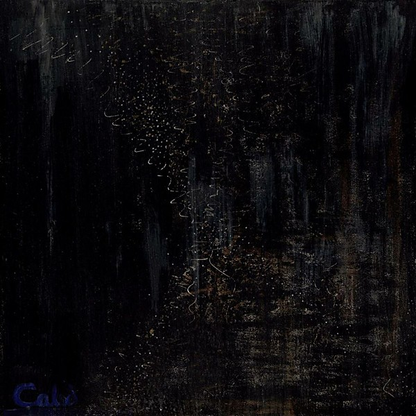

# Black Art Of Blue

By **Joie Calio**

## Album Data

- **Catalog:** Beets
- **Format:** Digital, Album
- **Album:** Black Art Of Blue
- **Artist:** Joie Calio
- **Albumartist:** Joie Calio
- **Genre:** Pop
- **MusicBrainz Album Artist ID:** 
- **MusicBrainz Album ID:** 
- **MusicBrainz Release Group ID:** 
- **Year:** 2011
- **Catalog #:** 
- **Label:** 
- **Total Tracks:** 10

## Album Tracks

### Track 01 - Bad Luck Charm

- **Artist:** Joie Calio
- **Format:** ALAC
- **Genre:** Pop
- **Length:** 4:42
- **MusicBrainz Track ID:** 
- **Title:** Bad Luck Charm
- **Track:** 01
- **Year:** 2011

### Track 02 - Bette Davis Kills

- **Artist:** Joie Calio
- **Format:** ALAC
- **Genre:** Pop
- **Length:** 3:15
- **MusicBrainz Track ID:** 
- **Title:** Bette Davis Kills
- **Track:** 02
- **Year:** 2011

### Track 03 - Sunset Blvd.

- **Artist:** Joie Calio
- **Format:** ALAC
- **Genre:** Pop
- **Length:** 5:26
- **MusicBrainz Track ID:** 
- **Title:** Sunset Blvd.
- **Track:** 03
- **Year:** 2011

### Track 04 - Good Morning

- **Artist:** Joie Calio
- **Format:** ALAC
- **Genre:** Pop
- **Length:** 4:23
- **MusicBrainz Track ID:** 
- **Title:** Good Morning
- **Track:** 04
- **Year:** 2011

### Track 05 - Devil's Wine

- **Artist:** Joie Calio
- **Format:** ALAC
- **Genre:** Pop
- **Length:** 2:56
- **MusicBrainz Track ID:** 
- **Title:** Devil's Wine
- **Track:** 05
- **Year:** 2011

### Track 06 - Wolf Toast Blues

- **Artist:** Joie Calio
- **Format:** ALAC
- **Genre:** Pop
- **Length:** 2:25
- **MusicBrainz Track ID:** 
- **Title:** Wolf Toast Blues
- **Track:** 06
- **Year:** 2011

### Track 07 - Fire Burns

- **Artist:** Joie Calio
- **Format:** ALAC
- **Genre:** Pop
- **Length:** 3:30
- **MusicBrainz Track ID:** 
- **Title:** Fire Burns
- **Track:** 07
- **Year:** 2011

### Track 08 - Just Don't Fade Away

- **Artist:** Joie Calio
- **Format:** ALAC
- **Genre:** Pop
- **Length:** 3:19
- **MusicBrainz Track ID:** 
- **Title:** Just Don't Fade Away
- **Track:** 08
- **Year:** 2011

### Track 09 - Your Smile

- **Artist:** Joie Calio
- **Format:** ALAC
- **Genre:** Pop
- **Length:** 5:20
- **MusicBrainz Track ID:** 
- **Title:** Your Smile
- **Track:** 09
- **Year:** 2011

### Track 10 - Wish You Well

- **Artist:** Joie Calio
- **Format:** ALAC
- **Genre:** Pop
- **Length:** 5:53
- **MusicBrainz Track ID:** 
- **Title:** Wish You Well
- **Track:** 10
- **Year:** 2011

## See also

- [The Complications of Glitter](The_Complications_of_Glitter.md)
