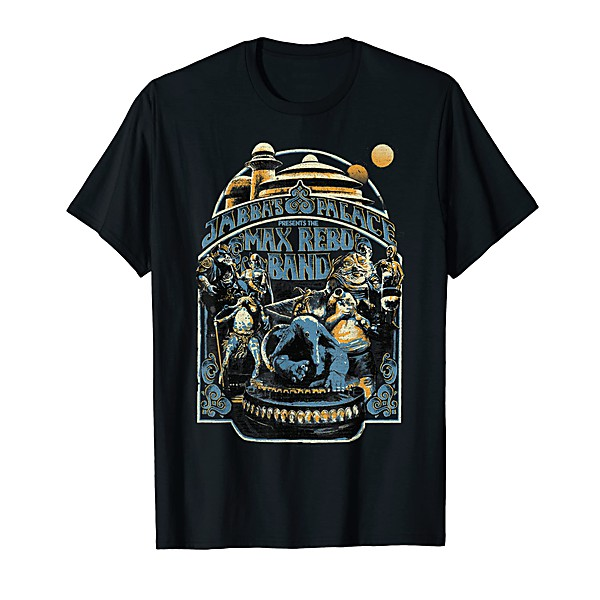

# 2014-09-12 - Pappy & Harriet's Pioneertown Palace

By **Jonathan Segel**

## Album Data

- **Catalog:** Beets
- **Format:** Digital, Album
- **Album:** 2014-09-12 - Pappy & Harriet's Pioneertown Palace
- **Artist:** Jonathan Segel
- **Albumartist:** Jonathan Segel
- **Genre:** Indie Rock
- **MusicBrainz Album Artist ID:** 
- **MusicBrainz Album ID:** 
- **MusicBrainz Release Group ID:** 
- **Year:** 0000
- **Catalog #:** 
- **Label:** Jonathan Segel
- **Total Tracks:** 32

## Album Tracks

### Track 01 - Your New Boyfriend

- **Artist:** Jonathan Segel
- **Format:** ALAC
- **Genre:** Indie Rock
- **Length:** 3:05
- **MusicBrainz Track ID:** [https](https://musicbrainz.org/recording/https)
- **Title:** Your New Boyfriend
- **Track:** 01
- **Year:** 2013

### Track 01 - Your New Boyfriend

- **Artist:** Jonathan Segel
- **Format:** MP3
- **Genre:** Indie Rock
- **Length:** 3:05
- **MusicBrainz Track ID:** [https](https://musicbrainz.org/recording/https)
- **Title:** Your New Boyfriend
- **Track:** 01
- **Year:** 2013

### Track 02 - Always (edit)

- **Artist:** Jonathan Segel
- **Format:** ALAC
- **Genre:** Indie Rock
- **Length:** 3:21
- **MusicBrainz Track ID:** [https](https://musicbrainz.org/recording/https)
- **Title:** Always (edit)
- **Track:** 02
- **Year:** 2013

### Track 02 - Always (edit)

- **Artist:** Jonathan Segel
- **Format:** MP3
- **Genre:** Indie Rock
- **Length:** 3:21
- **MusicBrainz Track ID:** [https](https://musicbrainz.org/recording/https)
- **Title:** Always (edit)
- **Track:** 02
- **Year:** 2013

### Track 03 - Love The Witch

- **Artist:** Jonathan Segel
- **Format:** ALAC
- **Genre:** Indie Rock
- **Length:** 2:42
- **MusicBrainz Track ID:** [https](https://musicbrainz.org/recording/https)
- **Title:** Love The Witch
- **Track:** 03
- **Year:** 2013

### Track 03 - Love The Witch

- **Artist:** Jonathan Segel
- **Format:** MP3
- **Genre:** Indie Rock
- **Length:** 2:42
- **MusicBrainz Track ID:** [https](https://musicbrainz.org/recording/https)
- **Title:** Love The Witch
- **Track:** 03
- **Year:** 2013

### Track 04 - Can't Help It

- **Artist:** Jonathan Segel
- **Format:** ALAC
- **Genre:** Indie Rock
- **Length:** 3:49
- **MusicBrainz Track ID:** [https](https://musicbrainz.org/recording/https)
- **Title:** Can't Help It
- **Track:** 04
- **Year:** 2013

### Track 04 - Can't Help It

- **Artist:** Jonathan Segel
- **Format:** MP3
- **Genre:** Indie Rock
- **Length:** 3:49
- **MusicBrainz Track ID:** [https](https://musicbrainz.org/recording/https)
- **Title:** Can't Help It
- **Track:** 04
- **Year:** 2013

### Track 05 - Here Come the Warm Milk

- **Artist:** Jonathan Segel
- **Format:** ALAC
- **Genre:** Indie Rock
- **Length:** 2:00
- **MusicBrainz Track ID:** [https](https://musicbrainz.org/recording/https)
- **Title:** Here Come the Warm Milk
- **Track:** 05
- **Year:** 2013

### Track 05 - Here Come the Warm Milk

- **Artist:** Jonathan Segel
- **Format:** MP3
- **Genre:** Indie Rock
- **Length:** 2:00
- **MusicBrainz Track ID:** [https](https://musicbrainz.org/recording/https)
- **Title:** Here Come the Warm Milk
- **Track:** 05
- **Year:** 2013

### Track 06 - Nancy Experiences the Pulse

- **Artist:** Jonathan Segel
- **Format:** ALAC
- **Genre:** Indie Rock
- **Length:** 3:36
- **MusicBrainz Track ID:** [https](https://musicbrainz.org/recording/https)
- **Title:** Nancy Experiences the Pulse
- **Track:** 06
- **Year:** 2013

### Track 06 - Nancy Experiences the Pulse

- **Artist:** Jonathan Segel
- **Format:** MP3
- **Genre:** Indie Rock
- **Length:** 3:36
- **MusicBrainz Track ID:** [https](https://musicbrainz.org/recording/https)
- **Title:** Nancy Experiences the Pulse
- **Track:** 06
- **Year:** 2013

### Track 07 - I've Seen a Goat

- **Artist:** Jonathan Segel
- **Format:** ALAC
- **Genre:** Indie Rock
- **Length:** 5:07
- **MusicBrainz Track ID:** [https](https://musicbrainz.org/recording/https)
- **Title:** I've Seen a Goat
- **Track:** 07
- **Year:** 2013

### Track 07 - I've Seen a Goat

- **Artist:** Jonathan Segel
- **Format:** MP3
- **Genre:** Indie Rock
- **Length:** 5:07
- **MusicBrainz Track ID:** [https](https://musicbrainz.org/recording/https)
- **Title:** I've Seen a Goat
- **Track:** 07
- **Year:** 2013

### Track 08 - Sky of Mind

- **Artist:** Jonathan Segel
- **Format:** ALAC
- **Genre:** Indie Rock
- **Length:** 4:31
- **MusicBrainz Track ID:** [https](https://musicbrainz.org/recording/https)
- **Title:** Sky of Mind
- **Track:** 08
- **Year:** 2013

### Track 08 - Sky of Mind

- **Artist:** Jonathan Segel
- **Format:** MP3
- **Genre:** Indie Rock
- **Length:** 4:31
- **MusicBrainz Track ID:** [https](https://musicbrainz.org/recording/https)
- **Title:** Sky of Mind
- **Track:** 08
- **Year:** 2013

### Track 09 - Keen to the Stress Queen

- **Artist:** Jonathan Segel
- **Format:** ALAC
- **Genre:** Indie Rock
- **Length:** 3:17
- **MusicBrainz Track ID:** [https](https://musicbrainz.org/recording/https)
- **Title:** Keen to the Stress Queen
- **Track:** 09
- **Year:** 2013

### Track 09 - Keen to the Stress Queen

- **Artist:** Jonathan Segel
- **Format:** MP3
- **Genre:** Indie Rock
- **Length:** 3:17
- **MusicBrainz Track ID:** [https](https://musicbrainz.org/recording/https)
- **Title:** Keen to the Stress Queen
- **Track:** 09
- **Year:** 2013

### Track 10 - Singularity

- **Artist:** Jonathan Segel
- **Format:** ALAC
- **Genre:** Indie Rock
- **Length:** 5:04
- **MusicBrainz Track ID:** [https](https://musicbrainz.org/recording/https)
- **Title:** Singularity
- **Track:** 10
- **Year:** 2013

### Track 10 - Singularity

- **Artist:** Jonathan Segel
- **Format:** MP3
- **Genre:** Indie Rock
- **Length:** 5:04
- **MusicBrainz Track ID:** [https](https://musicbrainz.org/recording/https)
- **Title:** Singularity
- **Track:** 10
- **Year:** 2013

### Track 11 - Little Blue Fish (edit)

- **Artist:** Jonathan Segel
- **Format:** ALAC
- **Genre:** Indie Rock
- **Length:** 6:32
- **MusicBrainz Track ID:** [https](https://musicbrainz.org/recording/https)
- **Title:** Little Blue Fish (edit)
- **Track:** 11
- **Year:** 2013

### Track 11 - Little Blue Fish (edit)

- **Artist:** Jonathan Segel
- **Format:** MP3
- **Genre:** Indie Rock
- **Length:** 6:32
- **MusicBrainz Track ID:** [https](https://musicbrainz.org/recording/https)
- **Title:** Little Blue Fish (edit)
- **Track:** 11
- **Year:** 2013

### Track 12 - Hey Joy

- **Artist:** Jonathan Segel
- **Format:** ALAC
- **Genre:** Indie Rock
- **Length:** 3:17
- **MusicBrainz Track ID:** [https](https://musicbrainz.org/recording/https)
- **Title:** Hey Joy
- **Track:** 12
- **Year:** 2013

### Track 12 - Hey Joy

- **Artist:** Jonathan Segel
- **Format:** MP3
- **Genre:** Indie Rock
- **Length:** 3:17
- **MusicBrainz Track ID:** [https](https://musicbrainz.org/recording/https)
- **Title:** Hey Joy
- **Track:** 12
- **Year:** 2013

### Track 13 - Now I Know

- **Artist:** Jonathan Segel
- **Format:** ALAC
- **Genre:** Indie Rock
- **Length:** 3:56
- **MusicBrainz Track ID:** [https](https://musicbrainz.org/recording/https)
- **Title:** Now I Know
- **Track:** 13
- **Year:** 2013

### Track 13 - Now I Know

- **Artist:** Jonathan Segel
- **Format:** MP3
- **Genre:** Indie Rock
- **Length:** 3:56
- **MusicBrainz Track ID:** [https](https://musicbrainz.org/recording/https)
- **Title:** Now I Know
- **Track:** 13
- **Year:** 2013

### Track 14 - Perfect Ears

- **Artist:** Jonathan Segel
- **Format:** ALAC
- **Genre:** Indie Rock
- **Length:** 5:55
- **MusicBrainz Track ID:** [https](https://musicbrainz.org/recording/https)
- **Title:** Perfect Ears
- **Track:** 14
- **Year:** 2013

### Track 14 - Perfect Ears

- **Artist:** Jonathan Segel
- **Format:** MP3
- **Genre:** Indie Rock
- **Length:** 5:55
- **MusicBrainz Track ID:** [https](https://musicbrainz.org/recording/https)
- **Title:** Perfect Ears
- **Track:** 14
- **Year:** 2013

### Track 15 - Love's Not Lost

- **Artist:** Jonathan Segel
- **Format:** ALAC
- **Genre:** Indie Rock
- **Length:** 4:12
- **MusicBrainz Track ID:** [https](https://musicbrainz.org/recording/https)
- **Title:** Love's Not Lost
- **Track:** 15
- **Year:** 2013

### Track 15 - Love's Not Lost

- **Artist:** Jonathan Segel
- **Format:** MP3
- **Genre:** Indie Rock
- **Length:** 4:12
- **MusicBrainz Track ID:** [https](https://musicbrainz.org/recording/https)
- **Title:** Love's Not Lost
- **Track:** 15
- **Year:** 2013

### Track 16 - Scars

- **Artist:** Jonathan Segel
- **Format:** ALAC
- **Genre:** Indie Rock
- **Length:** 8:07
- **MusicBrainz Track ID:** [https](https://musicbrainz.org/recording/https)
- **Title:** Scars
- **Track:** 16
- **Year:** 2013

### Track 16 - Scars

- **Artist:** Jonathan Segel
- **Format:** MP3
- **Genre:** Indie Rock
- **Length:** 8:07
- **MusicBrainz Track ID:** [https](https://musicbrainz.org/recording/https)
- **Title:** Scars
- **Track:** 16
- **Year:** 2013

### Track 17 - Your Penny Silver

- **Artist:** Jonathan Segel
- **Format:** ALAC
- **Genre:** Indie Rock
- **Length:** 5:04
- **MusicBrainz Track ID:** [https](https://musicbrainz.org/recording/https)
- **Title:** Your Penny Silver
- **Track:** 17
- **Year:** 2013

### Track 17 - Your Penny Silver

- **Artist:** Jonathan Segel
- **Format:** MP3
- **Genre:** Indie Rock
- **Length:** 5:04
- **MusicBrainz Track ID:** [https](https://musicbrainz.org/recording/https)
- **Title:** Your Penny Silver
- **Track:** 17
- **Year:** 2013

### Track 18 - Pushing the Norton

- **Artist:** Jonathan Segel
- **Format:** ALAC
- **Genre:** Indie Rock
- **Length:** 3:55
- **MusicBrainz Track ID:** [https](https://musicbrainz.org/recording/https)
- **Title:** Pushing the Norton
- **Track:** 18
- **Year:** 2013

### Track 18 - Pushing the Norton

- **Artist:** Jonathan Segel
- **Format:** MP3
- **Genre:** Indie Rock
- **Length:** 3:55
- **MusicBrainz Track ID:** [https](https://musicbrainz.org/recording/https)
- **Title:** Pushing the Norton
- **Track:** 18
- **Year:** 2013

### Track 19 - Turnaround

- **Artist:** Jonathan Segel
- **Format:** ALAC
- **Genre:** Indie Rock
- **Length:** 3:24
- **MusicBrainz Track ID:** [https](https://musicbrainz.org/recording/https)
- **Title:** Turnaround
- **Track:** 19
- **Year:** 2013

### Track 19 - Turnaround

- **Artist:** Jonathan Segel
- **Format:** MP3
- **Genre:** Indie Rock
- **Length:** 3:24
- **MusicBrainz Track ID:** [https](https://musicbrainz.org/recording/https)
- **Title:** Turnaround
- **Track:** 19
- **Year:** 2013

### Track 20 - Mirror Colored Thing

- **Artist:** Jonathan Segel
- **Format:** ALAC
- **Genre:** Indie Rock
- **Length:** 3:31
- **MusicBrainz Track ID:** [https](https://musicbrainz.org/recording/https)
- **Title:** Mirror Colored Thing
- **Track:** 20
- **Year:** 2013

### Track 20 - Mirror Colored Thing

- **Artist:** Jonathan Segel
- **Format:** MP3
- **Genre:** Indie Rock
- **Length:** 3:31
- **MusicBrainz Track ID:** [https](https://musicbrainz.org/recording/https)
- **Title:** Mirror Colored Thing
- **Track:** 20
- **Year:** 2013

### Track 21 - I'm An Idiot

- **Artist:** Jonathan Segel
- **Format:** ALAC
- **Genre:** Indie Rock
- **Length:** 2:41
- **MusicBrainz Track ID:** [https](https://musicbrainz.org/recording/https)
- **Title:** I'm An Idiot
- **Track:** 21
- **Year:** 2013

### Track 21 - I'm An Idiot

- **Artist:** Jonathan Segel
- **Format:** MP3
- **Genre:** Indie Rock
- **Length:** 2:41
- **MusicBrainz Track ID:** [https](https://musicbrainz.org/recording/https)
- **Title:** I'm An Idiot
- **Track:** 21
- **Year:** 2013

### Track 22 - I Remember

- **Artist:** Jonathan Segel
- **Format:** ALAC
- **Genre:** Indie Rock
- **Length:** 4:21
- **MusicBrainz Track ID:** [https](https://musicbrainz.org/recording/https)
- **Title:** I Remember
- **Track:** 22
- **Year:** 2013

### Track 22 - I Remember

- **Artist:** Jonathan Segel
- **Format:** MP3
- **Genre:** Indie Rock
- **Length:** 4:21
- **MusicBrainz Track ID:** [https](https://musicbrainz.org/recording/https)
- **Title:** I Remember
- **Track:** 22
- **Year:** 2013

### Track 23 - Little Earthquake

- **Artist:** Jonathan Segel
- **Format:** ALAC
- **Genre:** Indie Rock
- **Length:** 3:15
- **MusicBrainz Track ID:** [https](https://musicbrainz.org/recording/https)
- **Title:** Little Earthquake
- **Track:** 23
- **Year:** 2013

### Track 23 - Little Earthquake

- **Artist:** Jonathan Segel
- **Format:** MP3
- **Genre:** Indie Rock
- **Length:** 3:15
- **MusicBrainz Track ID:** [https](https://musicbrainz.org/recording/https)
- **Title:** Little Earthquake
- **Track:** 23
- **Year:** 2013

### Track 24 - One Here and One Gone

- **Artist:** Jonathan Segel
- **Format:** ALAC
- **Genre:** Indie Rock
- **Length:** 2:25
- **MusicBrainz Track ID:** [https](https://musicbrainz.org/recording/https)
- **Title:** One Here and One Gone
- **Track:** 24
- **Year:** 2013

### Track 24 - One Here and One Gone

- **Artist:** Jonathan Segel
- **Format:** MP3
- **Genre:** Indie Rock
- **Length:** 2:25
- **MusicBrainz Track ID:** [https](https://musicbrainz.org/recording/https)
- **Title:** One Here and One Gone
- **Track:** 24
- **Year:** 2013

### Track 25 - Relax

- **Artist:** Jonathan Segel
- **Format:** ALAC
- **Genre:** Indie Rock
- **Length:** 6:18
- **MusicBrainz Track ID:** [https](https://musicbrainz.org/recording/https)
- **Title:** Relax
- **Track:** 25
- **Year:** 2013

### Track 25 - Relax

- **Artist:** Jonathan Segel
- **Format:** MP3
- **Genre:** Indie Rock
- **Length:** 6:18
- **MusicBrainz Track ID:** [https](https://musicbrainz.org/recording/https)
- **Title:** Relax
- **Track:** 25
- **Year:** 2013

### Track 26 - You Shine (edit)

- **Artist:** Jonathan Segel
- **Format:** ALAC
- **Genre:** Indie Rock
- **Length:** 3:53
- **MusicBrainz Track ID:** [https](https://musicbrainz.org/recording/https)
- **Title:** You Shine (edit)
- **Track:** 26
- **Year:** 2013

### Track 26 - You Shine (edit)

- **Artist:** Jonathan Segel
- **Format:** MP3
- **Genre:** Indie Rock
- **Length:** 3:53
- **MusicBrainz Track ID:** [https](https://musicbrainz.org/recording/https)
- **Title:** You Shine (edit)
- **Track:** 26
- **Year:** 2013

### Track 27 - Barnswallow

- **Artist:** Jonathan Segel
- **Format:** ALAC
- **Genre:** Indie Rock
- **Length:** 3:19
- **MusicBrainz Track ID:** [https](https://musicbrainz.org/recording/https)
- **Title:** Barnswallow
- **Track:** 27
- **Year:** 2013

### Track 27 - Barnswallow

- **Artist:** Jonathan Segel
- **Format:** MP3
- **Genre:** Indie Rock
- **Length:** 3:19
- **MusicBrainz Track ID:** [https](https://musicbrainz.org/recording/https)
- **Title:** Barnswallow
- **Track:** 27
- **Year:** 2013

### Track 28 - Listen

- **Artist:** Jonathan Segel
- **Format:** ALAC
- **Genre:** Indie Rock
- **Length:** 5:31
- **MusicBrainz Track ID:** [https](https://musicbrainz.org/recording/https)
- **Title:** Listen
- **Track:** 28
- **Year:** 2013

### Track 28 - Listen

- **Artist:** Jonathan Segel
- **Format:** MP3
- **Genre:** Indie Rock
- **Length:** 5:31
- **MusicBrainz Track ID:** [https](https://musicbrainz.org/recording/https)
- **Title:** Listen
- **Track:** 28
- **Year:** 2013

### Track 29 - I Heart My Doghead

- **Artist:** Jonathan Segel
- **Format:** ALAC
- **Genre:** Indie Rock
- **Length:** 8:00
- **MusicBrainz Track ID:** [https](https://musicbrainz.org/recording/https)
- **Title:** I Heart My Doghead
- **Track:** 29
- **Year:** 2013

### Track 29 - I Heart My Doghead

- **Artist:** Jonathan Segel
- **Format:** MP3
- **Genre:** Indie Rock
- **Length:** 8:00
- **MusicBrainz Track ID:** [https](https://musicbrainz.org/recording/https)
- **Title:** I Heart My Doghead
- **Track:** 29
- **Year:** 2013

### Track 30 - Before You Could

- **Artist:** Jonathan Segel
- **Format:** ALAC
- **Genre:** Indie Rock
- **Length:** 2:34
- **MusicBrainz Track ID:** [https](https://musicbrainz.org/recording/https)
- **Title:** Before You Could
- **Track:** 30
- **Year:** 2013

### Track 30 - Before You Could

- **Artist:** Jonathan Segel
- **Format:** MP3
- **Genre:** Indie Rock
- **Length:** 2:34
- **MusicBrainz Track ID:** [https](https://musicbrainz.org/recording/https)
- **Title:** Before You Could
- **Track:** 30
- **Year:** 2013

### Track 31 - Into The Lapping Waves

- **Artist:** Jonathan Segel
- **Format:** ALAC
- **Genre:** Indie Rock
- **Length:** 5:27
- **MusicBrainz Track ID:** [https](https://musicbrainz.org/recording/https)
- **Title:** Into The Lapping Waves
- **Track:** 31
- **Year:** 2013

### Track 31 - Into The Lapping Waves

- **Artist:** Jonathan Segel
- **Format:** MP3
- **Genre:** Indie Rock
- **Length:** 5:27
- **MusicBrainz Track ID:** [https](https://musicbrainz.org/recording/https)
- **Title:** Into The Lapping Waves
- **Track:** 31
- **Year:** 2013

### Track 32 - I Know You Know Me (Hey You)

- **Artist:** Jonathan Segel
- **Format:** ALAC
- **Genre:** Indie Rock
- **Length:** 12:47
- **MusicBrainz Track ID:** [https](https://musicbrainz.org/recording/https)
- **Title:** I Know You Know Me (Hey You)
- **Track:** 32
- **Year:** 2013

### Track 32 - I Know You Know Me (Hey You)

- **Artist:** Jonathan Segel
- **Format:** MP3
- **Genre:** Indie Rock
- **Length:** 12:47
- **MusicBrainz Track ID:** [https](https://musicbrainz.org/recording/https)
- **Title:** I Know You Know Me (Hey You)
- **Track:** 32
- **Year:** 2013

## See also

- [Horseshoes & Hand Grenades](Horseshoes_and_Hand_Grenades.md)
- [Superfluity](Superfluity.md)
- [Roon: Edgy Not Antsy](../../Roon/Jonathan_Segel/Edgy_Not_Antsy.md)
- [Roon: Superfluity](../../Roon/Jonathan_Segel/Superfluity.md)
