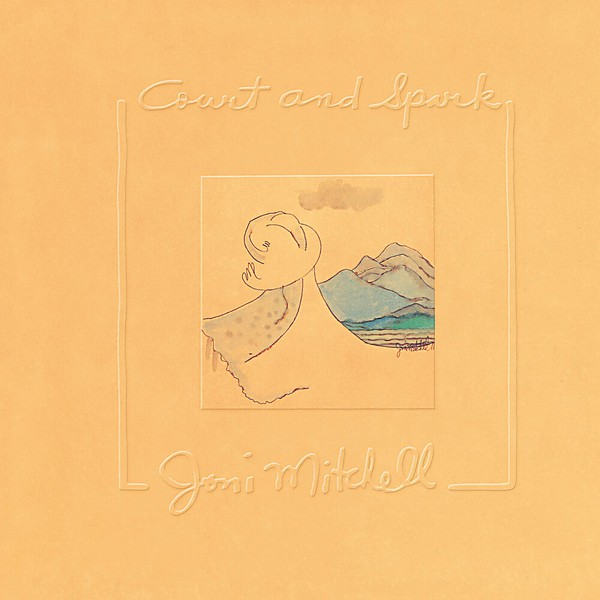

# Court and Spark

By **Joni Mitchell**

## Album Data

- **Catalog:** Beets
- **Format:** Digital, Album
- **Album:** Court and Spark
- **Artist:** Joni Mitchell
- **Albumartist:** Joni Mitchell
- **Genre:** Folk Rock
- **MusicBrainz Album Artist ID:** [a6de8ef9-b1a1-4756-97aa-481bbb8a4069](https://musicbrainz.org/artist/a6de8ef9-b1a1-4756-97aa-481bbb8a4069)
- **MusicBrainz Album ID:** [4a59e5da-a754-3f16-8899-81c774baa9e1](https://musicbrainz.org/release/4a59e5da-a754-3f16-8899-81c774baa9e1)
- **MusicBrainz Release Group ID:** [3bd19e28-698e-3b7e-a8ec-f872bf001651](https://musicbrainz.org/release-group/3bd19e28-698e-3b7e-a8ec-f872bf001651)
- **Year:** 2000
- **Catalog #:** 5057-2
- **Label:** Asylum Records
- **Total Tracks:** 12

## Album Tracks

### Track 01 - Banquet

- **Artist:** Joni Mitchell
- **Format:** MP3
- **Genre:** Jazz
- **Length:** 2:58
- **MusicBrainz Track ID:** [d4f37123-0108-473f-b039-01ad896d1491](https://musicbrainz.org/recording/d4f37123-0108-473f-b039-01ad896d1491)
- **Title:** Banquet
- **Track:** 01
- **Year:** 1990

### Track 02 - Cold Blue Steel and Sweet Fire

- **Artist:** Joni Mitchell
- **Format:** MP3
- **Genre:** Soft Rock
- **Length:** 4:19
- **MusicBrainz Track ID:** [90a32d2d-1227-49b7-95e8-fae0f10b2064](https://musicbrainz.org/recording/90a32d2d-1227-49b7-95e8-fae0f10b2064)
- **Title:** Cold Blue Steel and Sweet Fire
- **Track:** 02
- **Year:** 1990

### Track 03 - Barangrill

- **Artist:** Joni Mitchell
- **Format:** MP3
- **Genre:** Soft Rock
- **Length:** 2:50
- **MusicBrainz Track ID:** [a630e682-ee93-415f-90e8-555e8980737d](https://musicbrainz.org/recording/a630e682-ee93-415f-90e8-555e8980737d)
- **Title:** Barangrill
- **Track:** 03
- **Year:** 1990

### Track 04 - Lesson in Survival

- **Artist:** Joni Mitchell
- **Format:** MP3
- **Genre:** Soft Rock
- **Length:** 3:12
- **MusicBrainz Track ID:** [8b5a10da-bc8f-4f7f-8d5f-88ae46aa0182](https://musicbrainz.org/recording/8b5a10da-bc8f-4f7f-8d5f-88ae46aa0182)
- **Title:** Lesson in Survival
- **Track:** 04
- **Year:** 1990

### Track 05 - Let the Wind Carry Me

- **Artist:** Joni Mitchell
- **Format:** MP3
- **Genre:** Rock
- **Length:** 3:55
- **MusicBrainz Track ID:** [9bd9d1f7-5624-4b0c-baa9-133ca0a16a23](https://musicbrainz.org/recording/9bd9d1f7-5624-4b0c-baa9-133ca0a16a23)
- **Title:** Let the Wind Carry Me
- **Track:** 05
- **Year:** 1990

### Track 06 - For the Roses

- **Artist:** Joni Mitchell
- **Format:** MP3
- **Genre:** Rock
- **Length:** 3:44
- **MusicBrainz Track ID:** [83bc5045-ba6b-4dc2-9976-b7faa3fd5114](https://musicbrainz.org/recording/83bc5045-ba6b-4dc2-9976-b7faa3fd5114)
- **Title:** For the Roses
- **Track:** 06
- **Year:** 1990

### Track 07 - See You Sometime

- **Artist:** Joni Mitchell
- **Format:** MP3
- **Genre:** Pop
- **Length:** 2:55
- **MusicBrainz Track ID:** [a899a317-c68b-46d8-b1a5-647488b93e95](https://musicbrainz.org/recording/a899a317-c68b-46d8-b1a5-647488b93e95)
- **Title:** See You Sometime
- **Track:** 07
- **Year:** 1990

### Track 08 - Electricity

- **Artist:** Joni Mitchell
- **Format:** MP3
- **Genre:** Americana
- **Length:** 3:01
- **MusicBrainz Track ID:** [58014e88-764c-47e9-83c0-ba4ff96fbd13](https://musicbrainz.org/recording/58014e88-764c-47e9-83c0-ba4ff96fbd13)
- **Title:** Electricity
- **Track:** 08
- **Year:** 1990

### Track 09 - You Turn Me On I'm a Radio

- **Artist:** Joni Mitchell
- **Format:** MP3
- **Genre:** Rock
- **Length:** 2:39
- **MusicBrainz Track ID:** [b7eceb5d-771b-43fc-a011-d72d344e195d](https://musicbrainz.org/recording/b7eceb5d-771b-43fc-a011-d72d344e195d)
- **Title:** You Turn Me On I'm a Radio
- **Track:** 09
- **Year:** 1990

### Track 10 - Blonde in the Bleachers

- **Artist:** Joni Mitchell
- **Format:** MP3
- **Genre:** Rock
- **Length:** 2:43
- **MusicBrainz Track ID:** [13187e09-0418-4b44-89cf-9ed58b62d581](https://musicbrainz.org/recording/13187e09-0418-4b44-89cf-9ed58b62d581)
- **Title:** Blonde in the Bleachers
- **Track:** 10
- **Year:** 1990

### Track 11 - Woman of Heart and Mind

- **Artist:** Joni Mitchell
- **Format:** MP3
- **Genre:** Pop
- **Length:** 2:38
- **MusicBrainz Track ID:** [b62ba43b-8d6c-43ab-b4cf-02d9e896af42](https://musicbrainz.org/recording/b62ba43b-8d6c-43ab-b4cf-02d9e896af42)
- **Title:** Woman of Heart and Mind
- **Track:** 11
- **Year:** 1990

### Track 12 - Judgement of the Moon and Stars (Ludwig's Tune)

- **Artist:** Joni Mitchell
- **Format:** MP3
- **Genre:** Pop
- **Length:** 5:20
- **MusicBrainz Track ID:** [447da3bd-694d-48d4-b85f-a270cc86813e](https://musicbrainz.org/recording/447da3bd-694d-48d4-b85f-a270cc86813e)
- **Title:** Judgement of the Moon and Stars (Ludwig's Tune)
- **Track:** 12
- **Year:** 1990

## See also

- [Blue](Blue.md)
- [Clouds](Clouds.md)
- [For the Roses](For_the_Roses.md)
- [Hejira](Hejira.md)
- [Hits](Hits.md)
- [Ladies of the Canyon](Ladies_of_the_Canyon.md)
- [The Hissing of Summer Lawns](The_Hissing_of_Summer_Lawns.md)
- [Turbulent Indigo](Turbulent_Indigo.md)
- [Roon: Blue](../../Roon/Joni_Mitchell/Blue.md)
- [Roon: Clouds](../../Roon/Joni_Mitchell/Clouds.md)
- [Roon: Court And Spark](../../Roon/Joni_Mitchell/Court_And_Spark.md)
- [Roon: For the Roses](../../Roon/Joni_Mitchell/For_the_Roses.md)
- [Roon: Ladies Of The Canyon](../../Roon/Joni_Mitchell/Ladies_Of_The_Canyon.md)
- [Roon: The Hissing of Summer Lawns](../../Roon/Joni_Mitchell/The_Hissing_of_Summer_Lawns.md)
- [Roon: The Reprise Albums (1968-1971) (2021 Remaster)](../../Roon/Joni_Mitchell/The_Reprise_Albums_1968-1971_2021_Remaster.md)
- [Roon: Turbulent Indigo](../../Roon/Joni_Mitchell/Turbulent_Indigo.md)
- [Vinyl: Blue](../../Vinyl/Joni_Mitchell/Blue.md)
- [Vinyl: Court And Spark](../../Vinyl/Joni_Mitchell/Court_And_Spark.md)
- [Vinyl: ](../../Vinyl/Joni_Mitchell/Joni_Mitchell.md)
- [Vinyl: The Hissing Of Summer Lawns](../../Vinyl/Joni_Mitchell/The_Hissing_Of_Summer_Lawns.md)
