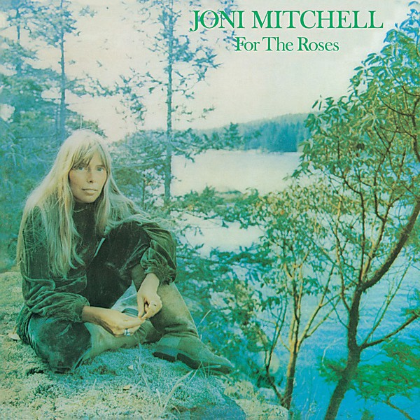

# For the Roses

By **Joni Mitchell**

## Album Data

- **Catalog:** Beets
- **Format:** Digital, Album
- **Album:** For the Roses
- **Artist:** Joni Mitchell
- **Albumartist:** Joni Mitchell
- **Genre:** Soft Rock
- **MusicBrainz Album Artist ID:** [a6de8ef9-b1a1-4756-97aa-481bbb8a4069](https://musicbrainz.org/artist/a6de8ef9-b1a1-4756-97aa-481bbb8a4069)
- **MusicBrainz Album ID:** [09e9ab88-7579-41ac-b318-ff3792f51d24](https://musicbrainz.org/release/09e9ab88-7579-41ac-b318-ff3792f51d24)
- **MusicBrainz Release Group ID:** [a5b7d474-4a69-31fc-86c9-c14eb6a1f963](https://musicbrainz.org/release-group/a5b7d474-4a69-31fc-86c9-c14eb6a1f963)
- **Year:** 1990
- **Catalog #:** 7E-1087
- **Label:** Asylum Records
- **Total Tracks:** 09

## Album Tracks

### Track 01 - Coyote

- **Artist:** Joni Mitchell
- **Format:** MP3
- **Genre:** Folk Rock
- **Length:** 5:00
- **MusicBrainz Track ID:** [d86f4b62-b0df-48c9-ba9f-17f9bc84a570](https://musicbrainz.org/recording/d86f4b62-b0df-48c9-ba9f-17f9bc84a570)
- **Title:** Coyote
- **Track:** 01
- **Year:** 1976

### Track 02 - Amelia

- **Artist:** Joni Mitchell
- **Format:** MP3
- **Genre:** Rock
- **Length:** 6:01
- **MusicBrainz Track ID:** [b14e0b94-9de7-4815-9b7d-8181f4c95fe9](https://musicbrainz.org/recording/b14e0b94-9de7-4815-9b7d-8181f4c95fe9)
- **Title:** Amelia
- **Track:** 02
- **Year:** 1976

### Track 03 - Furry Sings the Blues

- **Artist:** Joni Mitchell
- **Format:** MP3
- **Genre:** Pop
- **Length:** 5:06
- **MusicBrainz Track ID:** [c1506faf-c9df-4633-b633-71d7480f46ed](https://musicbrainz.org/recording/c1506faf-c9df-4633-b633-71d7480f46ed)
- **Title:** Furry Sings the Blues
- **Track:** 03
- **Year:** 1976

### Track 04 - A Strange Boy

- **Artist:** Joni Mitchell
- **Format:** MP3
- **Genre:** Soft Rock
- **Length:** 4:18
- **MusicBrainz Track ID:** [fd61b723-d078-4389-92bd-6304860de37e](https://musicbrainz.org/recording/fd61b723-d078-4389-92bd-6304860de37e)
- **Title:** A Strange Boy
- **Track:** 04
- **Year:** 1976

### Track 05 - Hejira

- **Artist:** Joni Mitchell
- **Format:** MP3
- **Genre:** Orchestra
- **Length:** 6:41
- **MusicBrainz Track ID:** [b28dc1b5-4699-4d61-a90d-ab4e94db50bd](https://musicbrainz.org/recording/b28dc1b5-4699-4d61-a90d-ab4e94db50bd)
- **Title:** Hejira
- **Track:** 05
- **Year:** 1976

### Track 06 - Song for Sharon

- **Artist:** Joni Mitchell
- **Format:** MP3
- **Genre:** Soft Rock
- **Length:** 8:36
- **MusicBrainz Track ID:** [7b73efcb-ce68-4931-ad43-47ecafe7e5af](https://musicbrainz.org/recording/7b73efcb-ce68-4931-ad43-47ecafe7e5af)
- **Title:** Song for Sharon
- **Track:** 06
- **Year:** 1976

### Track 07 - Black Crow

- **Artist:** Joni Mitchell
- **Format:** MP3
- **Genre:** Uk Garage
- **Length:** 4:24
- **MusicBrainz Track ID:** [7ff393f4-900f-49ef-8054-90cf73aa3f22](https://musicbrainz.org/recording/7ff393f4-900f-49ef-8054-90cf73aa3f22)
- **Title:** Black Crow
- **Track:** 07
- **Year:** 1976

### Track 08 - Blue Motel Room

- **Artist:** Joni Mitchell
- **Format:** MP3
- **Genre:** Pop
- **Length:** 5:04
- **MusicBrainz Track ID:** [29be078d-8e94-4326-8502-cf359eca46f6](https://musicbrainz.org/recording/29be078d-8e94-4326-8502-cf359eca46f6)
- **Title:** Blue Motel Room
- **Track:** 08
- **Year:** 1976

### Track 09 - Refuge of the Roads

- **Artist:** Joni Mitchell
- **Format:** MP3
- **Genre:** Folk Rock
- **Length:** 6:38
- **MusicBrainz Track ID:** [9654e394-9d36-41c0-9705-725c56161a66](https://musicbrainz.org/recording/9654e394-9d36-41c0-9705-725c56161a66)
- **Title:** Refuge of the Roads
- **Track:** 09
- **Year:** 1976

