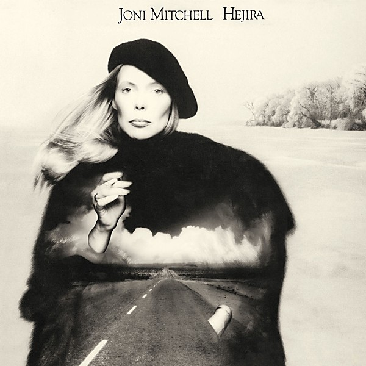

# Hejira

By **Joni Mitchell**

## Album Data

- **Catalog:** Beets
- **Format:** Digital, Album
- **Album:** Hejira
- **Artist:** Joni Mitchell
- **Albumartist:** Joni Mitchell
- **Genre:** Jazz Fusion
- **MusicBrainz Album Artist ID:** [a6de8ef9-b1a1-4756-97aa-481bbb8a4069](https://musicbrainz.org/artist/a6de8ef9-b1a1-4756-97aa-481bbb8a4069)
- **MusicBrainz Album ID:** [866d4044-7a79-40ff-ba3c-a25dbc42317f](https://musicbrainz.org/release/866d4044-7a79-40ff-ba3c-a25dbc42317f)
- **MusicBrainz Release Group ID:** [039f2ae4-36dd-3608-9103-67ce7f6c9288](https://musicbrainz.org/release-group/039f2ae4-36dd-3608-9103-67ce7f6c9288)
- **Year:** 1976
- **Catalog #:** 6376-2
- **Label:** Reprise Records
- **Total Tracks:** 12

## Album Tracks

### Track 01 - Morning Morgantown

- **Artist:** Joni Mitchell
- **Format:** MP3
- **Genre:** Folk Rock
- **Length:** 3:12
- **MusicBrainz Track ID:** [e035fd52-e4d1-4f47-8984-1f4670800046](https://musicbrainz.org/recording/e035fd52-e4d1-4f47-8984-1f4670800046)
- **Title:** Morning Morgantown
- **Track:** 01
- **Year:** 1987

### Track 02 - For Free

- **Artist:** Joni Mitchell
- **Format:** MP3
- **Genre:** Rock
- **Length:** 4:29
- **MusicBrainz Track ID:** [2a166be6-bb81-48c8-81ad-26ff4dd17d5d](https://musicbrainz.org/recording/2a166be6-bb81-48c8-81ad-26ff4dd17d5d)
- **Title:** For Free
- **Track:** 02
- **Year:** 1987

### Track 03 - Conversation

- **Artist:** Joni Mitchell
- **Format:** MP3
- **Genre:** Rock
- **Length:** 4:23
- **MusicBrainz Track ID:** [36406fae-7976-48d5-92a3-64d97c24943d](https://musicbrainz.org/recording/36406fae-7976-48d5-92a3-64d97c24943d)
- **Title:** Conversation
- **Track:** 03
- **Year:** 1987

### Track 04 - Ladies of the Canyon

- **Artist:** Joni Mitchell
- **Format:** MP3
- **Genre:** Rock
- **Length:** 3:31
- **MusicBrainz Track ID:** [b0491eb8-37eb-44c5-9908-151a29073dba](https://musicbrainz.org/recording/b0491eb8-37eb-44c5-9908-151a29073dba)
- **Title:** Ladies of the Canyon
- **Track:** 04
- **Year:** 1987

### Track 05 - Willy

- **Artist:** Joni Mitchell
- **Format:** MP3
- **Genre:** Rock
- **Length:** 3:00
- **MusicBrainz Track ID:** [c8c46465-8f0b-4629-85ed-d3fc41d6ceeb](https://musicbrainz.org/recording/c8c46465-8f0b-4629-85ed-d3fc41d6ceeb)
- **Title:** Willy
- **Track:** 05
- **Year:** 1987

### Track 06 - The Arrangement

- **Artist:** Joni Mitchell
- **Format:** MP3
- **Genre:** Pop
- **Length:** 3:31
- **MusicBrainz Track ID:** [d6a723f0-fff6-4868-bec5-18dcc11ffdfe](https://musicbrainz.org/recording/d6a723f0-fff6-4868-bec5-18dcc11ffdfe)
- **Title:** The Arrangement
- **Track:** 06
- **Year:** 1987

### Track 07 - Rainy Night House

- **Artist:** Joni Mitchell
- **Format:** MP3
- **Genre:** Rock
- **Length:** 3:21
- **MusicBrainz Track ID:** [8dbe8ca6-1e28-4244-b4c1-f9beeb4daee2](https://musicbrainz.org/recording/8dbe8ca6-1e28-4244-b4c1-f9beeb4daee2)
- **Title:** Rainy Night House
- **Track:** 07
- **Year:** 1987

### Track 08 - The Priest

- **Artist:** Joni Mitchell
- **Format:** MP3
- **Genre:** Folk Rock
- **Length:** 3:38
- **MusicBrainz Track ID:** [ee7e1bc8-17c8-4f5c-845d-79a0b4c9c0ca](https://musicbrainz.org/recording/ee7e1bc8-17c8-4f5c-845d-79a0b4c9c0ca)
- **Title:** The Priest
- **Track:** 08
- **Year:** 1987

### Track 09 - Blue Boy

- **Artist:** Joni Mitchell
- **Format:** MP3
- **Genre:** Rock
- **Length:** 2:52
- **MusicBrainz Track ID:** [82791a75-d8eb-4178-8fe7-26167105ea91](https://musicbrainz.org/recording/82791a75-d8eb-4178-8fe7-26167105ea91)
- **Title:** Blue Boy
- **Track:** 09
- **Year:** 1987

### Track 10 - Big Yellow Taxi

- **Artist:** Joni Mitchell
- **Format:** MP3
- **Genre:** Folk Rock
- **Length:** 2:14
- **MusicBrainz Track ID:** [d84a716c-1377-46a3-b2dc-5a8268e9ed00](https://musicbrainz.org/recording/d84a716c-1377-46a3-b2dc-5a8268e9ed00)
- **Title:** Big Yellow Taxi
- **Track:** 10
- **Year:** 1987

### Track 11 - Woodstock

- **Artist:** Joni Mitchell
- **Format:** MP3
- **Genre:** Folk Rock
- **Length:** 5:26
- **MusicBrainz Track ID:** [74749777-1af0-4a8f-aed5-1b1336d02ef4](https://musicbrainz.org/recording/74749777-1af0-4a8f-aed5-1b1336d02ef4)
- **Title:** Woodstock
- **Track:** 11
- **Year:** 1987

### Track 12 - The Circle Game

- **Artist:** Joni Mitchell
- **Format:** MP3
- **Genre:** Rock
- **Length:** 4:44
- **MusicBrainz Track ID:** [db4344f8-4342-4914-948c-0732a9a864f2](https://musicbrainz.org/recording/db4344f8-4342-4914-948c-0732a9a864f2)
- **Title:** The Circle Game
- **Track:** 12
- **Year:** 1987

## See also

- [Blue](Blue.md)
- [Clouds](Clouds.md)
- [Court and Spark](Court_and_Spark.md)
- [For the Roses](For_the_Roses.md)
- [Hits](Hits.md)
- [Ladies of the Canyon](Ladies_of_the_Canyon.md)
- [The Hissing of Summer Lawns](The_Hissing_of_Summer_Lawns.md)
- [Turbulent Indigo](Turbulent_Indigo.md)
- [Roon: Blue](../../Roon/Joni_Mitchell/Blue.md)
- [Roon: Clouds](../../Roon/Joni_Mitchell/Clouds.md)
- [Roon: Court And Spark](../../Roon/Joni_Mitchell/Court_And_Spark.md)
- [Roon: For the Roses](../../Roon/Joni_Mitchell/For_the_Roses.md)
- [Roon: Ladies Of The Canyon](../../Roon/Joni_Mitchell/Ladies_Of_The_Canyon.md)
- [Roon: The Hissing of Summer Lawns](../../Roon/Joni_Mitchell/The_Hissing_of_Summer_Lawns.md)
- [Roon: The Reprise Albums (1968-1971) (2021 Remaster)](../../Roon/Joni_Mitchell/The_Reprise_Albums_1968-1971_2021_Remaster.md)
- [Roon: Turbulent Indigo](../../Roon/Joni_Mitchell/Turbulent_Indigo.md)
- [Vinyl: Blue](../../Vinyl/Joni_Mitchell/Blue.md)
- [Vinyl: Court And Spark](../../Vinyl/Joni_Mitchell/Court_And_Spark.md)
- [Vinyl: ](../../Vinyl/Joni_Mitchell/Joni_Mitchell.md)
- [Vinyl: The Hissing Of Summer Lawns](../../Vinyl/Joni_Mitchell/The_Hissing_Of_Summer_Lawns.md)
