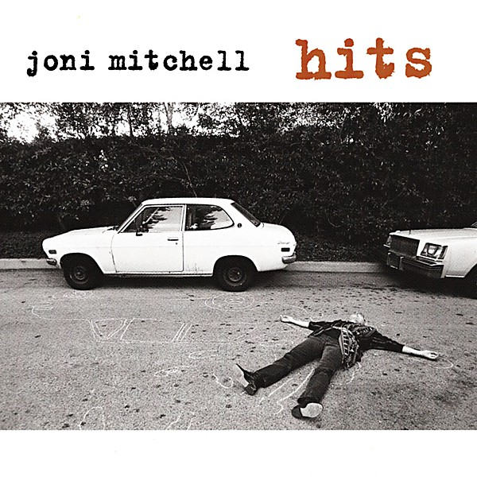

# Hits

By **Joni Mitchell**

## Album Data

- **Catalog:** Beets
- **Format:** Digital, Album
- **Album:** Hits
- **Artist:** Joni Mitchell
- **Albumartist:** Joni Mitchell
- **Genre:** Folk Rock
- **MusicBrainz Album Artist ID:** 
- **MusicBrainz Album ID:** 
- **MusicBrainz Release Group ID:** 
- **Year:** 0000
- **Catalog #:** RS 6341
- **Label:** Reprise Records
- **Total Tracks:** 10

## Album Tracks

### Track 01 - Tin Angel

- **Artist:** Joni Mitchell
- **Format:** MP3
- **Genre:** Pop
- **Length:** 4:07
- **MusicBrainz Track ID:** [6599cda6-5626-4fcb-a195-f29a04d7cb04](https://musicbrainz.org/recording/6599cda6-5626-4fcb-a195-f29a04d7cb04)
- **Title:** Tin Angel
- **Track:** 01
- **Year:** 1969

### Track 02 - Chelsea Morning

- **Artist:** Joni Mitchell
- **Format:** MP3
- **Genre:** Pop
- **Length:** 2:33
- **MusicBrainz Track ID:** [e27591d6-c0d1-4539-89de-0544c26c53c4](https://musicbrainz.org/recording/e27591d6-c0d1-4539-89de-0544c26c53c4)
- **Title:** Chelsea Morning
- **Track:** 02
- **Year:** 1969

### Track 03 - I Don't Know Where I Stand

- **Artist:** Joni Mitchell
- **Format:** MP3
- **Genre:** Rock
- **Length:** 3:12
- **MusicBrainz Track ID:** [52afbe52-a825-469d-9c64-018b8e032394](https://musicbrainz.org/recording/52afbe52-a825-469d-9c64-018b8e032394)
- **Title:** I Don't Know Where I Stand
- **Track:** 03
- **Year:** 1969

### Track 04 - That Song About the Midway

- **Artist:** Joni Mitchell
- **Format:** MP3
- **Genre:** Folk Rock
- **Length:** 4:38
- **MusicBrainz Track ID:** [94c36ea2-3cc9-4d80-ba25-86592345517a](https://musicbrainz.org/recording/94c36ea2-3cc9-4d80-ba25-86592345517a)
- **Title:** That Song About the Midway
- **Track:** 04
- **Year:** 1969

### Track 05 - Roses Blue

- **Artist:** Joni Mitchell
- **Format:** MP3
- **Genre:** Pop Rock
- **Length:** 3:51
- **MusicBrainz Track ID:** [c701652d-e4af-489b-a2fe-68a42555cac3](https://musicbrainz.org/recording/c701652d-e4af-489b-a2fe-68a42555cac3)
- **Title:** Roses Blue
- **Track:** 05
- **Year:** 1969

### Track 06 - The Gallery

- **Artist:** Joni Mitchell
- **Format:** MP3
- **Genre:** Pop
- **Length:** 4:12
- **MusicBrainz Track ID:** [f1b664e1-c722-4576-a1ab-0a8fcfad49d8](https://musicbrainz.org/recording/f1b664e1-c722-4576-a1ab-0a8fcfad49d8)
- **Title:** The Gallery
- **Track:** 06
- **Year:** 1969

### Track 07 - I Think I Understand

- **Artist:** Joni Mitchell
- **Format:** MP3
- **Genre:** Pop
- **Length:** 4:20
- **MusicBrainz Track ID:** [d10a370e-69de-441e-bc4f-232dbe7b0486](https://musicbrainz.org/recording/d10a370e-69de-441e-bc4f-232dbe7b0486)
- **Title:** I Think I Understand
- **Track:** 07
- **Year:** 1969

### Track 08 - Songs to Aging Children Come

- **Artist:** Joni Mitchell
- **Format:** MP3
- **Genre:** Art Rock
- **Length:** 3:10
- **MusicBrainz Track ID:** [8b3b119d-5801-4c59-aa8b-ee27ae7dca0c](https://musicbrainz.org/recording/8b3b119d-5801-4c59-aa8b-ee27ae7dca0c)
- **Title:** Songs to Aging Children Come
- **Track:** 08
- **Year:** 1969

### Track 09 - The Fiddle and the Drum

- **Artist:** Joni Mitchell
- **Format:** MP3
- **Genre:** Pop
- **Length:** 2:49
- **MusicBrainz Track ID:** [069a113d-e29b-47a4-b8d5-60a17b4cb0f4](https://musicbrainz.org/recording/069a113d-e29b-47a4-b8d5-60a17b4cb0f4)
- **Title:** The Fiddle and the Drum
- **Track:** 09
- **Year:** 1969

### Track 10 - Both Sides, Now

- **Artist:** Joni Mitchell
- **Format:** MP3
- **Genre:** Folk Rock
- **Length:** 4:34
- **MusicBrainz Track ID:** [2d99fbc8-d2a0-43cb-976f-7358a3c35cfd](https://musicbrainz.org/recording/2d99fbc8-d2a0-43cb-976f-7358a3c35cfd)
- **Title:** Both Sides, Now
- **Track:** 10
- **Year:** 1969

## See also

- [Blue](Blue.md)
- [Clouds](Clouds.md)
- [Court and Spark](Court_and_Spark.md)
- [For the Roses](For_the_Roses.md)
- [Hejira](Hejira.md)
- [Ladies of the Canyon](Ladies_of_the_Canyon.md)
- [The Hissing of Summer Lawns](The_Hissing_of_Summer_Lawns.md)
- [Turbulent Indigo](Turbulent_Indigo.md)
- [Roon: Blue](../../Roon/Joni_Mitchell/Blue.md)
- [Roon: Clouds](../../Roon/Joni_Mitchell/Clouds.md)
- [Roon: Court And Spark](../../Roon/Joni_Mitchell/Court_And_Spark.md)
- [Roon: For the Roses](../../Roon/Joni_Mitchell/For_the_Roses.md)
- [Roon: Ladies Of The Canyon](../../Roon/Joni_Mitchell/Ladies_Of_The_Canyon.md)
- [Roon: The Hissing of Summer Lawns](../../Roon/Joni_Mitchell/The_Hissing_of_Summer_Lawns.md)
- [Roon: The Reprise Albums (1968-1971) (2021 Remaster)](../../Roon/Joni_Mitchell/The_Reprise_Albums_1968-1971_2021_Remaster.md)
- [Roon: Turbulent Indigo](../../Roon/Joni_Mitchell/Turbulent_Indigo.md)
- [Vinyl: Blue](../../Vinyl/Joni_Mitchell/Blue.md)
- [Vinyl: Court And Spark](../../Vinyl/Joni_Mitchell/Court_And_Spark.md)
- [Vinyl: ](../../Vinyl/Joni_Mitchell/Joni_Mitchell.md)
- [Vinyl: The Hissing Of Summer Lawns](../../Vinyl/Joni_Mitchell/The_Hissing_Of_Summer_Lawns.md)
