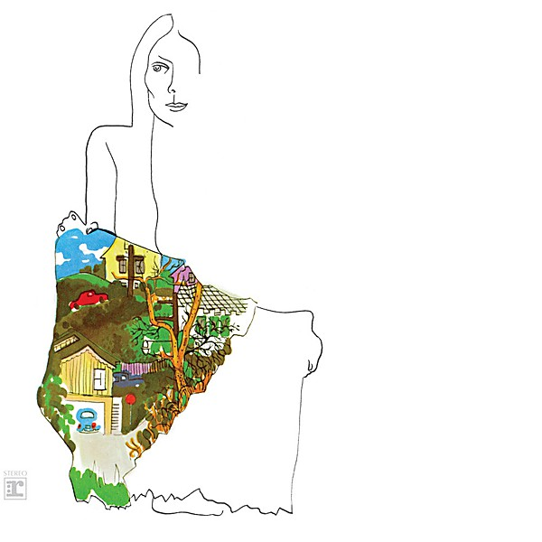

# Ladies of the Canyon

By **Joni Mitchell**

## Album Data

- **Catalog:** Beets
- **Format:** Digital, Album
- **Album:** Ladies of the Canyon
- **Artist:** Joni Mitchell
- **Albumartist:** Joni Mitchell
- **Genre:** Folk Rock
- **MusicBrainz Album Artist ID:** [a6de8ef9-b1a1-4756-97aa-481bbb8a4069](https://musicbrainz.org/artist/a6de8ef9-b1a1-4756-97aa-481bbb8a4069)
- **MusicBrainz Album ID:** [4cc0f84c-bbb4-384d-b0e8-c4ec68e1875b](https://musicbrainz.org/release/4cc0f84c-bbb4-384d-b0e8-c4ec68e1875b)
- **MusicBrainz Release Group ID:** [b04408f3-7a41-30f0-89c0-eba1efea3aae](https://musicbrainz.org/release-group/b04408f3-7a41-30f0-89c0-eba1efea3aae)
- **Year:** 1987
- **Catalog #:** 1051-2
- **Label:** Asylum Records
- **Total Tracks:** 10

## Album Tracks

### Track 01 - In France They Kiss on Main Street

- **Artist:** Joni Mitchell
- **Format:** MP3
- **Genre:** Soft Rock
- **Length:** 3:19
- **MusicBrainz Track ID:** [9d1c3016-f310-4ef1-81c5-be3399249c48](https://musicbrainz.org/recording/9d1c3016-f310-4ef1-81c5-be3399249c48)
- **Title:** In France They Kiss on Main Street
- **Track:** 01
- **Year:** 1990

### Track 02 - The Jungle Line

- **Artist:** Joni Mitchell
- **Format:** MP3
- **Genre:** Rock
- **Length:** 4:24
- **MusicBrainz Track ID:** [e0d22a6d-8539-4c0d-87ba-67218b5bd48c](https://musicbrainz.org/recording/e0d22a6d-8539-4c0d-87ba-67218b5bd48c)
- **Title:** The Jungle Line
- **Track:** 02
- **Year:** 1990

### Track 03 - Edith and the Kingpin

- **Artist:** Joni Mitchell
- **Format:** MP3
- **Genre:** Rock
- **Length:** 3:36
- **MusicBrainz Track ID:** [c794d921-4993-49ed-9747-e7445fdcc908](https://musicbrainz.org/recording/c794d921-4993-49ed-9747-e7445fdcc908)
- **Title:** Edith and the Kingpin
- **Track:** 03
- **Year:** 1990

### Track 04 - Don’t Interrupt the Sorrow

- **Artist:** Joni Mitchell
- **Format:** MP3
- **Genre:** Soft Rock
- **Length:** 4:04
- **MusicBrainz Track ID:** [c4b76769-9510-45df-9619-10bbe162efa2](https://musicbrainz.org/recording/c4b76769-9510-45df-9619-10bbe162efa2)
- **Title:** Don’t Interrupt the Sorrow
- **Track:** 04
- **Year:** 1990

### Track 05 - Shades of Scarlett Conquering

- **Artist:** Joni Mitchell
- **Format:** MP3
- **Genre:** Rock
- **Length:** 4:57
- **MusicBrainz Track ID:** [4f6cc7d6-bedb-4657-9286-f37767bb838a](https://musicbrainz.org/recording/4f6cc7d6-bedb-4657-9286-f37767bb838a)
- **Title:** Shades of Scarlett Conquering
- **Track:** 05
- **Year:** 1990

### Track 06 - The Hissing of Summer Lawns

- **Artist:** Joni Mitchell
- **Format:** MP3
- **Genre:** Rock
- **Length:** 3:01
- **MusicBrainz Track ID:** [f4a25221-66b5-416c-8dc5-251f74ba3869](https://musicbrainz.org/recording/f4a25221-66b5-416c-8dc5-251f74ba3869)
- **Title:** The Hissing of Summer Lawns
- **Track:** 06
- **Year:** 1990

### Track 07 - The Boho Dance

- **Artist:** Joni Mitchell
- **Format:** MP3
- **Genre:** Alternative Rock
- **Length:** 3:50
- **MusicBrainz Track ID:** [dde06ab6-295a-4d29-a7f1-8b922d7442e7](https://musicbrainz.org/recording/dde06ab6-295a-4d29-a7f1-8b922d7442e7)
- **Title:** The Boho Dance
- **Track:** 07
- **Year:** 1990

### Track 08 - Harry’s House / Centerpiece

- **Artist:** Joni Mitchell
- **Format:** MP3
- **Genre:** Soft Rock
- **Length:** 6:48
- **MusicBrainz Track ID:** [dd43c8d7-fb85-4b53-a00c-d47396ed4d80](https://musicbrainz.org/recording/dd43c8d7-fb85-4b53-a00c-d47396ed4d80)
- **Title:** Harry’s House / Centerpiece
- **Track:** 08
- **Year:** 1990

### Track 09 - Sweet Bird

- **Artist:** Joni Mitchell
- **Format:** MP3
- **Genre:** Rock
- **Length:** 4:11
- **MusicBrainz Track ID:** [5218260f-7ddf-4b0b-8e45-4e8aabfe86e6](https://musicbrainz.org/recording/5218260f-7ddf-4b0b-8e45-4e8aabfe86e6)
- **Title:** Sweet Bird
- **Track:** 09
- **Year:** 1990

### Track 10 - Shadows and Light

- **Artist:** Joni Mitchell
- **Format:** MP3
- **Genre:** Rock
- **Length:** 4:17
- **MusicBrainz Track ID:** [754f3a32-d470-4a18-9fd9-43be2df43168](https://musicbrainz.org/recording/754f3a32-d470-4a18-9fd9-43be2df43168)
- **Title:** Shadows and Light
- **Track:** 10
- **Year:** 1990

## See also

- [Blue](Blue.md)
- [Clouds](Clouds.md)
- [Court and Spark](Court_and_Spark.md)
- [For the Roses](For_the_Roses.md)
- [Hejira](Hejira.md)
- [Hits](Hits.md)
- [The Hissing of Summer Lawns](The_Hissing_of_Summer_Lawns.md)
- [Turbulent Indigo](Turbulent_Indigo.md)
- [Roon: Blue](../../Roon/Joni_Mitchell/Blue.md)
- [Roon: Clouds](../../Roon/Joni_Mitchell/Clouds.md)
- [Roon: Court And Spark](../../Roon/Joni_Mitchell/Court_And_Spark.md)
- [Roon: For the Roses](../../Roon/Joni_Mitchell/For_the_Roses.md)
- [Roon: Ladies Of The Canyon](../../Roon/Joni_Mitchell/Ladies_Of_The_Canyon.md)
- [Roon: The Hissing of Summer Lawns](../../Roon/Joni_Mitchell/The_Hissing_of_Summer_Lawns.md)
- [Roon: The Reprise Albums (1968-1971) (2021 Remaster)](../../Roon/Joni_Mitchell/The_Reprise_Albums_1968-1971_2021_Remaster.md)
- [Roon: Turbulent Indigo](../../Roon/Joni_Mitchell/Turbulent_Indigo.md)
- [Vinyl: Blue](../../Vinyl/Joni_Mitchell/Blue.md)
- [Vinyl: Court And Spark](../../Vinyl/Joni_Mitchell/Court_And_Spark.md)
- [Vinyl: ](../../Vinyl/Joni_Mitchell/Joni_Mitchell.md)
- [Vinyl: The Hissing Of Summer Lawns](../../Vinyl/Joni_Mitchell/The_Hissing_Of_Summer_Lawns.md)
