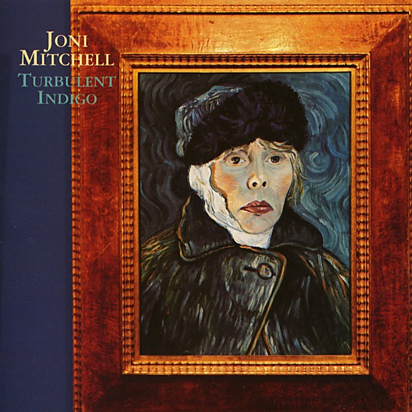

# Turbulent Indigo

By **Joni Mitchell**

## Album Data

- **Catalog:** Beets
- **Format:** Digital, Album
- **Album:** Turbulent Indigo
- **Artist:** Joni Mitchell
- **Albumartist:** Joni Mitchell
- **Genre:** Jazz
- **MusicBrainz Album Artist ID:** [a6de8ef9-b1a1-4756-97aa-481bbb8a4069](https://musicbrainz.org/artist/a6de8ef9-b1a1-4756-97aa-481bbb8a4069)
- **MusicBrainz Album ID:** [c0fb6968-b343-4f5f-a40d-0da944963182](https://musicbrainz.org/release/c0fb6968-b343-4f5f-a40d-0da944963182)
- **MusicBrainz Release Group ID:** [44c2e136-1f25-3497-bf10-cce444ed8003](https://musicbrainz.org/release-group/44c2e136-1f25-3497-bf10-cce444ed8003)
- **Year:** 1994
- **Catalog #:** 
- **Label:** Rhino
- **Total Tracks:** 10

## Album Tracks

### Track 01 - Sunny Sunday

- **Artist:** Joni Mitchell
- **Format:** MP3
- **Genre:** Jazz
- **Length:** 2:36
- **MusicBrainz Track ID:** [b564ea4d-1358-469e-b129-6ffaa12e82ac](https://musicbrainz.org/recording/b564ea4d-1358-469e-b129-6ffaa12e82ac)
- **Title:** Sunny Sunday
- **Track:** 01
- **Year:** 1994

### Track 02 - Sex Kills

- **Artist:** Joni Mitchell
- **Format:** MP3
- **Genre:** Rock
- **Length:** 3:56
- **MusicBrainz Track ID:** [5f9ae32e-953c-4837-b96a-c9c4ef08665a](https://musicbrainz.org/recording/5f9ae32e-953c-4837-b96a-c9c4ef08665a)
- **Title:** Sex Kills
- **Track:** 02
- **Year:** 1994

### Track 03 - How Do You Stop

- **Artist:** Joni Mitchell
- **Format:** MP3
- **Genre:** Americana
- **Length:** 4:08
- **MusicBrainz Track ID:** [8169e779-60c3-4c77-9196-add9042d346c](https://musicbrainz.org/recording/8169e779-60c3-4c77-9196-add9042d346c)
- **Title:** How Do You Stop
- **Track:** 03
- **Year:** 1994

### Track 04 - Turbulent Indigo

- **Artist:** Joni Mitchell
- **Format:** MP3
- **Genre:** Jazz
- **Length:** 3:33
- **MusicBrainz Track ID:** [96fb1075-57a7-4692-bf98-57bc7851169b](https://musicbrainz.org/recording/96fb1075-57a7-4692-bf98-57bc7851169b)
- **Title:** Turbulent Indigo
- **Track:** 04
- **Year:** 1994

### Track 05 - Last Chance Lost

- **Artist:** Joni Mitchell
- **Format:** MP3
- **Genre:** Pop
- **Length:** 3:14
- **MusicBrainz Track ID:** [a238c5a3-aa71-44ac-af26-9cafe8685fda](https://musicbrainz.org/recording/a238c5a3-aa71-44ac-af26-9cafe8685fda)
- **Title:** Last Chance Lost
- **Track:** 05
- **Year:** 1994

### Track 06 - The Magdalene Laundries

- **Artist:** Joni Mitchell
- **Format:** MP3
- **Genre:** Pop
- **Length:** 4:03
- **MusicBrainz Track ID:** [5f447341-605c-4156-9716-bcffb1f47c75](https://musicbrainz.org/recording/5f447341-605c-4156-9716-bcffb1f47c75)
- **Title:** The Magdalene Laundries
- **Track:** 06
- **Year:** 1994

### Track 07 - Not to Blame

- **Artist:** Joni Mitchell
- **Format:** MP3
- **Genre:** Soft Rock
- **Length:** 4:17
- **MusicBrainz Track ID:** [f55145ab-a7e4-496b-8ff2-28c9b885274f](https://musicbrainz.org/recording/f55145ab-a7e4-496b-8ff2-28c9b885274f)
- **Title:** Not to Blame
- **Track:** 07
- **Year:** 1994

### Track 08 - Borderline

- **Artist:** Joni Mitchell
- **Format:** MP3
- **Genre:** Vocal Jazz
- **Length:** 4:47
- **MusicBrainz Track ID:** [1e49b459-e067-421a-a5dc-dacb0d67ee2c](https://musicbrainz.org/recording/1e49b459-e067-421a-a5dc-dacb0d67ee2c)
- **Title:** Borderline
- **Track:** 08
- **Year:** 1994

### Track 09 - Yvette in English

- **Artist:** Joni Mitchell
- **Format:** MP3
- **Genre:** Jazz
- **Length:** 5:16
- **MusicBrainz Track ID:** [3b89935a-e601-4ef9-8f90-3dfacd1510c0](https://musicbrainz.org/recording/3b89935a-e601-4ef9-8f90-3dfacd1510c0)
- **Title:** Yvette in English
- **Track:** 09
- **Year:** 1994

### Track 10 - The Sire of Sorrow (Job's Sad Song)

- **Artist:** Joni Mitchell
- **Format:** MP3
- **Genre:** Pop
- **Length:** 7:06
- **MusicBrainz Track ID:** [d4968780-7c61-4a66-b4c9-c67d26c2876b](https://musicbrainz.org/recording/d4968780-7c61-4a66-b4c9-c67d26c2876b)
- **Title:** The Sire of Sorrow (Job's Sad Song)
- **Track:** 10
- **Year:** 1994

## See also

- [Blue](Blue.md)
- [Clouds](Clouds.md)
- [Court and Spark](Court_and_Spark.md)
- [For the Roses](For_the_Roses.md)
- [Hejira](Hejira.md)
- [Hits](Hits.md)
- [Ladies of the Canyon](Ladies_of_the_Canyon.md)
- [The Hissing of Summer Lawns](The_Hissing_of_Summer_Lawns.md)
- [Roon: Blue](../../Roon/Joni_Mitchell/Blue.md)
- [Roon: Clouds](../../Roon/Joni_Mitchell/Clouds.md)
- [Roon: Court And Spark](../../Roon/Joni_Mitchell/Court_And_Spark.md)
- [Roon: For the Roses](../../Roon/Joni_Mitchell/For_the_Roses.md)
- [Roon: Ladies Of The Canyon](../../Roon/Joni_Mitchell/Ladies_Of_The_Canyon.md)
- [Roon: The Hissing of Summer Lawns](../../Roon/Joni_Mitchell/The_Hissing_of_Summer_Lawns.md)
- [Roon: The Reprise Albums (1968-1971) (2021 Remaster)](../../Roon/Joni_Mitchell/The_Reprise_Albums_1968-1971_2021_Remaster.md)
- [Roon: Turbulent Indigo](../../Roon/Joni_Mitchell/Turbulent_Indigo.md)
- [Vinyl: Blue](../../Vinyl/Joni_Mitchell/Blue.md)
- [Vinyl: Court And Spark](../../Vinyl/Joni_Mitchell/Court_And_Spark.md)
- [Vinyl: ](../../Vinyl/Joni_Mitchell/Joni_Mitchell.md)
- [Vinyl: The Hissing Of Summer Lawns](../../Vinyl/Joni_Mitchell/The_Hissing_Of_Summer_Lawns.md)
