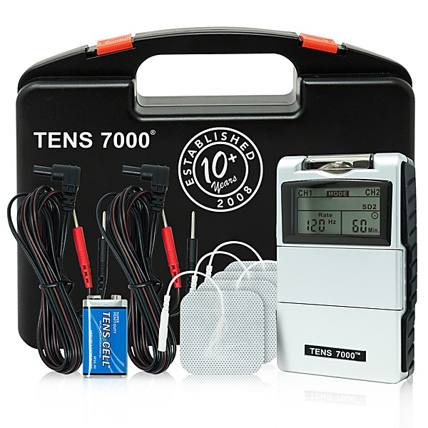

# Small World Big Band

By **Jools Holland & His Rhythm & Blues Orchestra**

## Album Data

- **Catalog:** Beets
- **Format:** Digital, Album
- **Album:** Small World Big Band
- **Artist:** Jools Holland & His Rhythm & Blues Orchestra
- **Albumartist:** Jools Holland & His Rhythm & Blues Orchestra
- **Genre:** Ska
- **MusicBrainz Album Artist ID:** [740b8198-f3be-4d81-aabd-3eccb35611a5](https://musicbrainz.org/artist/740b8198-f3be-4d81-aabd-3eccb35611a5)
- **MusicBrainz Album ID:** [b3485d49-2cf3-4240-b787-567cd0c675a3](https://musicbrainz.org/release/b3485d49-2cf3-4240-b787-567cd0c675a3)
- **MusicBrainz Release Group ID:** [0d377776-b45e-324d-9faf-f79c1dbf5c4e](https://musicbrainz.org/release-group/0d377776-b45e-324d-9faf-f79c1dbf5c4e)
- **Year:** 2001
- **Catalog #:** 0927 426562
- **Label:** Warner Strategic Marketing United Kingdom
- **Total Tracks:** 22

## Album Tracks

### Track 17 - Say Hello, Wave Goodbye

- **Artist:** Jools Holland & His Rhythm & Blues Orchestra feat. Marc Almond
- **Format:** MP3
- **Genre:** Ska
- **Length:** 4:35
- **MusicBrainz Track ID:** [b5a1be2b-74d8-4037-95a8-0430d6b15ee7](https://musicbrainz.org/recording/b5a1be2b-74d8-4037-95a8-0430d6b15ee7)
- **Title:** Say Hello, Wave Goodbye
- **Track:** 17
- **Year:** 2001

### Track 11 - All That You Are

- **Artist:** Jools Holland & His Rhythm & Blues Orchestra feat. Eric Bibb
- **Format:** MP3
- **Genre:** Ska
- **Length:** 3:15
- **MusicBrainz Track ID:** [ebdbe935-da41-4a26-b442-f223c0942fe4](https://musicbrainz.org/recording/ebdbe935-da41-4a26-b442-f223c0942fe4)
- **Title:** All That You Are
- **Track:** 11
- **Year:** 2001

### Track 04 - Valentine Moon

- **Artist:** Jools Holland & His Rhythm & Blues Orchestra feat. Sam Brown
- **Format:** MP3
- **Genre:** Ska
- **Length:** 4:02
- **MusicBrainz Track ID:** [9eb4418d-0274-42dd-907b-8705e8619b36](https://musicbrainz.org/recording/9eb4418d-0274-42dd-907b-8705e8619b36)
- **Title:** Valentine Moon
- **Track:** 04
- **Year:** 2001

### Track 15 - I Wanna Be Around

- **Artist:** Jools Holland & His Rhythm & Blues Orchestra feat. John Cale
- **Format:** MP3
- **Genre:** Ska
- **Length:** 3:04
- **MusicBrainz Track ID:** [449102f8-6d24-480d-970c-1e724b5cd66c](https://musicbrainz.org/recording/449102f8-6d24-480d-970c-1e724b5cd66c)
- **Title:** I Wanna Be Around
- **Track:** 15
- **Year:** 2001

### Track 19 - It's So Blue

- **Artist:** Jools Holland & His Rhythm & Blues Orchestra feat. Paul Carrack
- **Format:** MP3
- **Genre:** Ska
- **Length:** 4:01
- **MusicBrainz Track ID:** [25915bac-b81e-4992-9832-aa1edc13385c](https://musicbrainz.org/recording/25915bac-b81e-4992-9832-aa1edc13385c)
- **Title:** It's So Blue
- **Track:** 19
- **Year:** 2001

### Track 22 - What Would I Do Without You

- **Artist:** Jools Holland & His Rhythm & Blues Orchestra feat. Eric Clapton
- **Format:** MP3
- **Genre:** Ska
- **Length:** 3:27
- **MusicBrainz Track ID:** [a4d4e784-de77-48ec-885e-b9c78d017ad9](https://musicbrainz.org/recording/a4d4e784-de77-48ec-885e-b9c78d017ad9)
- **Title:** What Would I Do Without You
- **Track:** 22
- **Year:** 2001

### Track 14 - Town and Country Rhythm and Blues

- **Artist:** Jools Holland & His Rhythm & Blues Orchestra feat. Chris Difford
- **Format:** MP3
- **Genre:** Ska
- **Length:** 3:49
- **MusicBrainz Track ID:** [b27822b7-5ee7-49c3-ad4d-1955fee49908](https://musicbrainz.org/recording/b27822b7-5ee7-49c3-ad4d-1955fee49908)
- **Title:** Town and Country Rhythm and Blues
- **Track:** 14
- **Year:** 2001

### Track 06 - The Hand That Changed It's Mind

- **Artist:** Jools Holland & His Rhythm & Blues Orchestra feat. Dr. John
- **Format:** MP3
- **Genre:** Ska
- **Length:** 3:25
- **MusicBrainz Track ID:** [da561941-4af0-4d5d-a6c1-901ba1970f29](https://musicbrainz.org/recording/da561941-4af0-4d5d-a6c1-901ba1970f29)
- **Title:** The Hand That Changed It's Mind
- **Track:** 06
- **Year:** 2001

### Track 02 - Horse to Water

- **Artist:** Jools Holland & His Rhythm & Blues Orchestra feat. George Harrison
- **Format:** MP3
- **Genre:** Ska
- **Length:** 5:00
- **MusicBrainz Track ID:** [25813f16-1067-4d56-a8f5-03ff972b4e15](https://musicbrainz.org/recording/25813f16-1067-4d56-a8f5-03ff972b4e15)
- **Title:** Horse to Water
- **Track:** 02
- **Year:** 2001

### Track 18 - T-Bone Shuffle

- **Artist:** Jools Holland & His Rhythm & Blues Orchestra feat. Mick Hucknall
- **Format:** MP3
- **Genre:** Ska
- **Length:** 3:01
- **MusicBrainz Track ID:** [9d7f1dfe-3806-48e0-8c01-8847593f1d3c](https://musicbrainz.org/recording/9d7f1dfe-3806-48e0-8c01-8847593f1d3c)
- **Title:** T-Bone Shuffle
- **Track:** 18
- **Year:** 2001

### Track 21 - I'm in the Mood for Love

- **Artist:** Jools Holland & His Rhythm & Blues Orchestra feat. Jamiroquai
- **Format:** MP3
- **Genre:** Ska
- **Length:** 3:07
- **MusicBrainz Track ID:** [089a8699-88df-4c91-b49c-d752c69826b2](https://musicbrainz.org/recording/089a8699-88df-4c91-b49c-d752c69826b2)
- **Title:** I'm in the Mood for Love
- **Track:** 21
- **Year:** 2001

### Track 12 - Mademoiselle Will Decide

- **Artist:** Jools Holland & His Rhythm & Blues Orchestra feat. Mark Knopfler
- **Format:** MP3
- **Genre:** Ska
- **Length:** 2:23
- **MusicBrainz Track ID:** [2ba721ee-19de-4d8e-849e-e5c26d33ab79](https://musicbrainz.org/recording/2ba721ee-19de-4d8e-849e-e5c26d33ab79)
- **Title:** Mademoiselle Will Decide
- **Track:** 12
- **Year:** 2001

### Track 20 - Outskirts of Town

- **Artist:** Jools Holland & His Rhythm & Blues Orchestra feat. Taj Mahal
- **Format:** MP3
- **Genre:** Ska
- **Length:** 4:53
- **MusicBrainz Track ID:** [ce1b1156-65da-4d16-af15-008488c7db1f](https://musicbrainz.org/recording/ce1b1156-65da-4d16-af15-008488c7db1f)
- **Title:** Outskirts of Town
- **Track:** 20
- **Year:** 2001

### Track 13 - Back o' Town Blues

- **Artist:** Jools Holland & His Rhythm & Blues Orchestra feat. Van Morrison
- **Format:** MP3
- **Genre:** Ska
- **Length:** 3:26
- **MusicBrainz Track ID:** [393fa8f4-7dad-40ba-8d25-3f0fd0f91eba](https://musicbrainz.org/recording/393fa8f4-7dad-40ba-8d25-3f0fd0f91eba)
- **Title:** Back o' Town Blues
- **Track:** 13
- **Year:** 2001

### Track 09 - I Put a Spell on You

- **Artist:** Jools Holland & His Rhythm & Blues Orchestra feat. Mica Paris & David Gilmour
- **Format:** MP3
- **Genre:** Ska
- **Length:** 4:06
- **MusicBrainz Track ID:** [2f391c77-6b42-45b7-9823-d4c5c20b7b87](https://musicbrainz.org/recording/2f391c77-6b42-45b7-9823-d4c5c20b7b87)
- **Title:** I Put a Spell on You
- **Track:** 09
- **Year:** 2001

### Track 08 - Revolution

- **Artist:** Jools Holland & His Rhythm & Blues Orchestra feat. Stereophonics
- **Format:** MP3
- **Genre:** Ska
- **Length:** 3:18
- **MusicBrainz Track ID:** [4f28762b-2c64-4df3-9b8b-7ab26ba5fd6d](https://musicbrainz.org/recording/4f28762b-2c64-4df3-9b8b-7ab26ba5fd6d)
- **Title:** Revolution
- **Track:** 08
- **Year:** 2001

### Track 01 - Seventh Son

- **Artist:** Jools Holland & His Rhythm & Blues Orchestra feat. Sting
- **Format:** MP3
- **Genre:** Ska
- **Length:** 3:04
- **MusicBrainz Track ID:** [2bc9d819-c71f-4ec4-b8a3-cba8dcd15d21](https://musicbrainz.org/recording/2bc9d819-c71f-4ec4-b8a3-cba8dcd15d21)
- **Title:** Seventh Son
- **Track:** 01
- **Year:** 2001

### Track 05 - The Return of the Blues Cowboy

- **Artist:** Jools Holland & His Rhythm & Blues Orchestra feat. Joe Strummer
- **Format:** MP3
- **Genre:** Ska
- **Length:** 2:40
- **MusicBrainz Track ID:** [861653d9-73ed-40e5-93fe-6f5b2acd97b6](https://musicbrainz.org/recording/861653d9-73ed-40e5-93fe-6f5b2acd97b6)
- **Title:** The Return of the Blues Cowboy
- **Track:** 05
- **Year:** 2001

### Track 10 - Oranges and Lemons Again

- **Artist:** Jools Holland & His Rhythm & Blues Orchestra feat. Suggs
- **Format:** MP3
- **Genre:** Ska
- **Length:** 3:38
- **MusicBrainz Track ID:** [397fb387-4725-4c08-9f79-575873c05053](https://musicbrainz.org/recording/397fb387-4725-4c08-9f79-575873c05053)
- **Title:** Oranges and Lemons Again
- **Track:** 10
- **Year:** 2001

### Track 07 - Nobody but You

- **Artist:** Jools Holland & His Rhythm & Blues Orchestra feat. Ruby Turner
- **Format:** MP3
- **Genre:** Ska
- **Length:** 3:45
- **MusicBrainz Track ID:** [bcca8441-d847-4f00-b7e0-b5fac61c0bab](https://musicbrainz.org/recording/bcca8441-d847-4f00-b7e0-b5fac61c0bab)
- **Title:** Nobody but You
- **Track:** 07
- **Year:** 2001

### Track 03 - Will It Go Round in Circles

- **Artist:** Jools Holland & His Rhythm & Blues Orchestra feat. Paul Weller
- **Format:** MP3
- **Genre:** Ska
- **Length:** 3:31
- **MusicBrainz Track ID:** [aa06cc9f-596e-44b8-95e4-c2c88cff492e](https://musicbrainz.org/recording/aa06cc9f-596e-44b8-95e4-c2c88cff492e)
- **Title:** Will It Go Round in Circles
- **Track:** 03
- **Year:** 2001

### Track 16 - I'm Ready

- **Artist:** Jools Holland & His Rhythm & Blues Orchestra feat. Steve Winwood
- **Format:** MP3
- **Genre:** Ska
- **Length:** 3:15
- **MusicBrainz Track ID:** [ee311734-f0a6-4508-b4ac-0552588319b0](https://musicbrainz.org/recording/ee311734-f0a6-4508-b4ac-0552588319b0)
- **Title:** I'm Ready
- **Track:** 16
- **Year:** 2001

