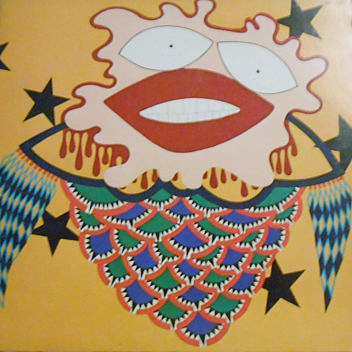

# Quah

By **Jorma Kaukonen with Tom Hobson**

## Album Data

- **Catalog:** Beets
- **Format:** Digital, Album
- **Album:** Quah
- **Artist:** Jorma Kaukonen With Tom Hobson
- **Albumartist:** Jorma Kaukonen with Tom Hobson
- **Genre:** Blues
- **MusicBrainz Album Artist ID:** [9753dd7c-63d4-4022-a0ec-fee4966c8cdd](https://musicbrainz.org/artist/9753dd7c-63d4-4022-a0ec-fee4966c8cdd)
- **MusicBrainz Album ID:** [9573da27-0a80-47cd-8427-3494efd5b6f8](https://musicbrainz.org/release/9573da27-0a80-47cd-8427-3494efd5b6f8)
- **MusicBrainz Release Group ID:** [f8dcad23-b53f-3619-8253-58c515e05c48](https://musicbrainz.org/release-group/f8dcad23-b53f-3619-8253-58c515e05c48)
- **Year:** 1974
- **Catalog #:** BFL1-0209
- **Label:** Grunt
- **Total Tracks:** 11

## Album Tracks

### Track 01 - Genesis

- **Artist:** Jorma Kaukonen with Tom Hobson
- **Format:** MP3
- **Genre:** Blues
- **Length:** 4:17
- **MusicBrainz Track ID:** [e01886d1-a575-4703-8d2a-6ddfc383aaa9](https://musicbrainz.org/recording/e01886d1-a575-4703-8d2a-6ddfc383aaa9)
- **Title:** Genesis
- **Track:** 01
- **Year:** 1974

### Track 02 - I'll Be All Right

- **Artist:** Jorma Kaukonen with Tom Hobson
- **Format:** MP3
- **Genre:** Blues
- **Length:** 3:07
- **MusicBrainz Track ID:** [44e21ca9-bc43-44fc-9460-fb3d3daf3082](https://musicbrainz.org/recording/44e21ca9-bc43-44fc-9460-fb3d3daf3082)
- **Title:** I'll Be All Right
- **Track:** 02
- **Year:** 1974

### Track 03 - Song for the North Star

- **Artist:** Jorma Kaukonen with Tom Hobson
- **Format:** MP3
- **Genre:** Blues
- **Length:** 2:51
- **MusicBrainz Track ID:** [bd0bb4c7-5503-445c-9662-40fcbcdaea98](https://musicbrainz.org/recording/bd0bb4c7-5503-445c-9662-40fcbcdaea98)
- **Title:** Song for the North Star
- **Track:** 03
- **Year:** 1974

### Track 04 - I'll Let You Know Before I Leave

- **Artist:** Jorma Kaukonen with Tom Hobson
- **Format:** MP3
- **Genre:** Blues
- **Length:** 2:16
- **MusicBrainz Track ID:** [a9ca6013-9f5d-4dd7-be1a-b7451373e9dd](https://musicbrainz.org/recording/a9ca6013-9f5d-4dd7-be1a-b7451373e9dd)
- **Title:** I'll Let You Know Before I Leave
- **Track:** 04
- **Year:** 1974

### Track 05 - Flying Clouds

- **Artist:** Jorma Kaukonen with Tom Hobson
- **Format:** MP3
- **Genre:** Blues
- **Length:** 4:03
- **MusicBrainz Track ID:** [a360d8e4-b7f4-4587-af07-69f6ebe475f3](https://musicbrainz.org/recording/a360d8e4-b7f4-4587-af07-69f6ebe475f3)
- **Title:** Flying Clouds
- **Track:** 05
- **Year:** 1974

### Track 06 - Another Man Done Gone

- **Artist:** Jorma Kaukonen with Tom Hobson
- **Format:** MP3
- **Genre:** Blues
- **Length:** 2:57
- **MusicBrainz Track ID:** [6e874f0c-5c1f-4d65-af7e-d11dcd4978b6](https://musicbrainz.org/recording/6e874f0c-5c1f-4d65-af7e-d11dcd4978b6)
- **Title:** Another Man Done Gone
- **Track:** 06
- **Year:** 1974

### Track 07 - I Am the Light of the World

- **Artist:** Jorma Kaukonen with Tom Hobson
- **Format:** MP3
- **Genre:** Blues
- **Length:** 3:46
- **MusicBrainz Track ID:** [6200435c-75ef-45ed-aeef-6a6116f6021c](https://musicbrainz.org/recording/6200435c-75ef-45ed-aeef-6a6116f6021c)
- **Title:** I Am the Light of the World
- **Track:** 07
- **Year:** 1974

### Track 08 - Police Dog Blues

- **Artist:** Jorma Kaukonen with Tom Hobson
- **Format:** MP3
- **Genre:** Blues
- **Length:** 3:42
- **MusicBrainz Track ID:** [cf90972b-b10d-41fb-8ed8-1215d677a3a8](https://musicbrainz.org/recording/cf90972b-b10d-41fb-8ed8-1215d677a3a8)
- **Title:** Police Dog Blues
- **Track:** 08
- **Year:** 1974

### Track 09 - Blue Prelude

- **Artist:** Jorma Kaukonen with Tom Hobson
- **Format:** MP3
- **Genre:** Blues
- **Length:** 4:03
- **MusicBrainz Track ID:** [bc2b7dde-d93c-489b-8a1f-50b56dd47b6e](https://musicbrainz.org/recording/bc2b7dde-d93c-489b-8a1f-50b56dd47b6e)
- **Title:** Blue Prelude
- **Track:** 09
- **Year:** 1974

### Track 10 - Sweet Hawaiian Sunshine

- **Artist:** Jorma Kaukonen with Tom Hobson
- **Format:** MP3
- **Genre:** Blues
- **Length:** 2:38
- **MusicBrainz Track ID:** [b004ad90-c56a-4f1c-b542-0cfe28e3c54c](https://musicbrainz.org/recording/b004ad90-c56a-4f1c-b542-0cfe28e3c54c)
- **Title:** Sweet Hawaiian Sunshine
- **Track:** 10
- **Year:** 1974

### Track 11 - Hamar Promenade

- **Artist:** Jorma Kaukonen with Tom Hobson
- **Format:** MP3
- **Genre:** Blues
- **Length:** 4:32
- **MusicBrainz Track ID:** [a0681442-99cb-4d3d-a03d-89e4e6e0a46f](https://musicbrainz.org/recording/a0681442-99cb-4d3d-a03d-89e4e6e0a46f)
- **Title:** Hamar Promenade
- **Track:** 11
- **Year:** 1974

## See also

- [Vinyl: ](../../Vinyl/Jorma_Kaukonen_With_Tom_Hobson/Jorma_Kaukonen_With_Tom_Hobson.md)
- [Vinyl: Quah](../../Vinyl/Jorma_Kaukonen_With_Tom_Hobson/Quah.md)
