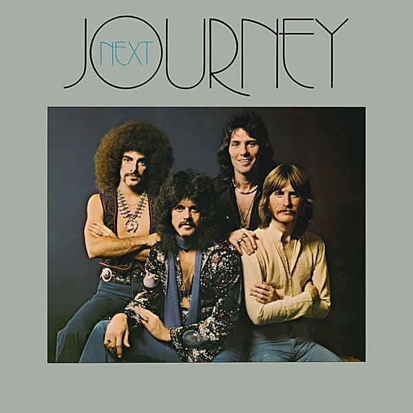

# Next

By **Journey**

## Album Data

- **Catalog:** Beets
- **Format:** Digital, Album
- **Album:** Next
- **Artist:** Journey
- **Albumartist:** Journey
- **Genre:** Progressive Rock
- **MusicBrainz Album Artist ID:** [abd506e1-6f2b-4d6f-b937-92c267f6f88b](https://musicbrainz.org/artist/abd506e1-6f2b-4d6f-b937-92c267f6f88b)
- **MusicBrainz Album ID:** [04eaa038-899a-4748-8cfb-9dde07393ab8](https://musicbrainz.org/release/04eaa038-899a-4748-8cfb-9dde07393ab8)
- **MusicBrainz Release Group ID:** [1c0ee2ea-38b3-3092-9835-de60a2c11c42](https://musicbrainz.org/release-group/1c0ee2ea-38b3-3092-9835-de60a2c11c42)
- **Year:** 1991
- **Catalog #:** CK 34311
- **Label:** Columbia
- **Total Tracks:** 08

## Album Tracks

### Track 01 - Spaceman

- **Artist:** Journey
- **Format:** AAC
- **Genre:** Progressive Rock
- **Length:** 4:03
- **MusicBrainz Track ID:** [b683691e-12bc-44a6-86da-dca9f831a246](https://musicbrainz.org/recording/b683691e-12bc-44a6-86da-dca9f831a246)
- **Title:** Spaceman
- **Track:** 01
- **Year:** 1991

### Track 02 - People

- **Artist:** Journey
- **Format:** AAC
- **Genre:** Progressive Rock
- **Length:** 5:26
- **MusicBrainz Track ID:** [f3bd9bf7-9af7-456f-ad9c-c82655c7828e](https://musicbrainz.org/recording/f3bd9bf7-9af7-456f-ad9c-c82655c7828e)
- **Title:** People
- **Track:** 02
- **Year:** 1991

### Track 03 - I Would Find You

- **Artist:** Journey
- **Format:** AAC
- **Genre:** Progressive Rock
- **Length:** 6:00
- **MusicBrainz Track ID:** [1e2cf549-4047-49c8-b119-2918cc17dcb5](https://musicbrainz.org/recording/1e2cf549-4047-49c8-b119-2918cc17dcb5)
- **Title:** I Would Find You
- **Track:** 03
- **Year:** 1991

### Track 04 - Here We Are

- **Artist:** Journey
- **Format:** AAC
- **Genre:** Hard Rock
- **Length:** 4:15
- **MusicBrainz Track ID:** [3ba7762a-f910-415f-909c-946629658a00](https://musicbrainz.org/recording/3ba7762a-f910-415f-909c-946629658a00)
- **Title:** Here We Are
- **Track:** 04
- **Year:** 1991

### Track 05 - Hustler

- **Artist:** Journey
- **Format:** AAC
- **Genre:** Hard Rock
- **Length:** 3:18
- **MusicBrainz Track ID:** [c54aaf9b-b271-4ec6-b8e0-170b8e9b379d](https://musicbrainz.org/recording/c54aaf9b-b271-4ec6-b8e0-170b8e9b379d)
- **Title:** Hustler
- **Track:** 05
- **Year:** 1991

### Track 06 - Next

- **Artist:** Journey
- **Format:** AAC
- **Genre:** Progressive Rock
- **Length:** 5:34
- **MusicBrainz Track ID:** [087d5a1d-2a94-4c88-8872-4f09bccf09f6](https://musicbrainz.org/recording/087d5a1d-2a94-4c88-8872-4f09bccf09f6)
- **Title:** Next
- **Track:** 06
- **Year:** 1991

### Track 07 - Nickel and Dime

- **Artist:** Journey
- **Format:** AAC
- **Genre:** Progressive Rock
- **Length:** 4:18
- **MusicBrainz Track ID:** [4e3a97b5-6cf9-463c-8652-bf26a0552e64](https://musicbrainz.org/recording/4e3a97b5-6cf9-463c-8652-bf26a0552e64)
- **Title:** Nickel and Dime
- **Track:** 07
- **Year:** 1991

### Track 08 - Karma

- **Artist:** Journey
- **Format:** AAC
- **Genre:** Hard Rock
- **Length:** 5:14
- **MusicBrainz Track ID:** [df61c39e-2145-45d5-964d-d94edd5a02b4](https://musicbrainz.org/recording/df61c39e-2145-45d5-964d-d94edd5a02b4)
- **Title:** Karma
- **Track:** 08
- **Year:** 1991

## See also

- [Journey](Journey.md)
