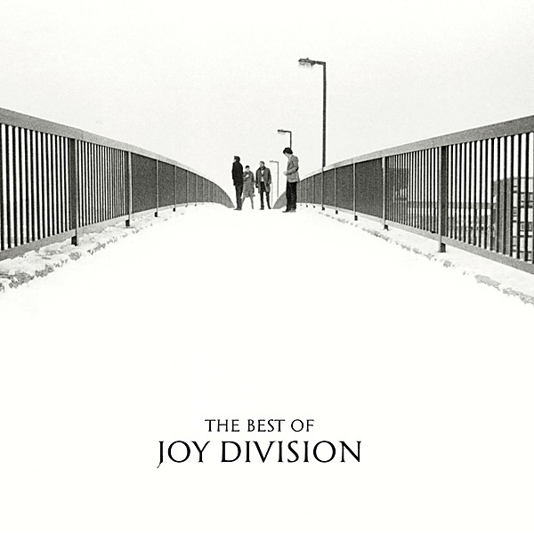

# The Best of Joy Division

By **Joy Division**

## Album Data

- **Catalog:** Beets
- **Format:** Digital, Album
- **Album:** The Best of Joy Division
- **Artist:** Joy Division
- **Albumartist:** Joy Division
- **Genre:** Gothic Rock
- **MusicBrainz Album Artist ID:** [9a58fda3-f4ed-4080-a3a5-f457aac9fcdd](https://musicbrainz.org/artist/9a58fda3-f4ed-4080-a3a5-f457aac9fcdd)
- **MusicBrainz Album ID:** [e3fc5dee-b353-386a-8c54-54324c2c6013](https://musicbrainz.org/release/e3fc5dee-b353-386a-8c54-54324c2c6013)
- **MusicBrainz Release Group ID:** [7a37fc35-e4c5-3045-a3f3-839ac215796e](https://musicbrainz.org/release-group/7a37fc35-e4c5-3045-a3f3-839ac215796e)
- **Year:** 2008
- **Catalog #:** R2 474236
- **Label:** Rhino
- **Total Tracks:** 14

## Album Tracks

### Track 01 - Digital

- **Artist:** Joy Division
- **Format:** AAC
- **Genre:** Post-Punk
- **Length:** 2:49
- **MusicBrainz Track ID:** [5eb06bb0-9cb5-4913-952f-a8feb1f1faa5](https://musicbrainz.org/recording/5eb06bb0-9cb5-4913-952f-a8feb1f1faa5)
- **Title:** Digital
- **Track:** 01
- **Year:** 2008

### Track 02 - Disorder

- **Artist:** Joy Division
- **Format:** AAC
- **Genre:** Post-Punk
- **Length:** 3:29
- **MusicBrainz Track ID:** [f962828d-b970-4d0c-9d4b-dcac8f064a89](https://musicbrainz.org/recording/f962828d-b970-4d0c-9d4b-dcac8f064a89)
- **Title:** Disorder
- **Track:** 02
- **Year:** 2008

### Track 03 - Shadowplay

- **Artist:** Joy Division
- **Format:** AAC
- **Genre:** Post-Punk
- **Length:** 3:53
- **MusicBrainz Track ID:** [17ddd699-a35f-4f80-8064-9a807ad2799f](https://musicbrainz.org/recording/17ddd699-a35f-4f80-8064-9a807ad2799f)
- **Title:** Shadowplay
- **Track:** 03
- **Year:** 2008

### Track 04 - New Dawn Fades

- **Artist:** Joy Division
- **Format:** AAC
- **Genre:** Post-Punk
- **Length:** 4:51
- **MusicBrainz Track ID:** [fc425fc4-e883-4c10-9345-63c99a0126b9](https://musicbrainz.org/recording/fc425fc4-e883-4c10-9345-63c99a0126b9)
- **Title:** New Dawn Fades
- **Track:** 04
- **Year:** 2008

### Track 05 - Transmission

- **Artist:** Joy Division
- **Format:** AAC
- **Genre:** Post-Punk
- **Length:** 3:38
- **MusicBrainz Track ID:** [4356bba2-853c-4ac0-b43f-c6e8f6bc9735](https://musicbrainz.org/recording/4356bba2-853c-4ac0-b43f-c6e8f6bc9735)
- **Title:** Transmission
- **Track:** 05
- **Year:** 2008

### Track 06 - Atmosphere

- **Artist:** Joy Division
- **Format:** AAC
- **Genre:** Post-Punk
- **Length:** 4:08
- **MusicBrainz Track ID:** [7b744b0b-06ea-4140-bf38-59f74d2c5a8c](https://musicbrainz.org/recording/7b744b0b-06ea-4140-bf38-59f74d2c5a8c)
- **Title:** Atmosphere
- **Track:** 06
- **Year:** 2008

### Track 07 - Dead Souls

- **Artist:** Joy Division
- **Format:** AAC
- **Genre:** Post-Punk
- **Length:** 4:55
- **MusicBrainz Track ID:** [b6e2c951-1c10-4179-92d9-4bffe9b48c01](https://musicbrainz.org/recording/b6e2c951-1c10-4179-92d9-4bffe9b48c01)
- **Title:** Dead Souls
- **Track:** 07
- **Year:** 2008

### Track 08 - She's Lost Control

- **Artist:** Joy Division
- **Format:** MP3
- **Genre:** Post-Punk
- **Length:** 4:56
- **MusicBrainz Track ID:** [23184aa6-7d77-4ce3-b093-fe2407af5036](https://musicbrainz.org/recording/23184aa6-7d77-4ce3-b093-fe2407af5036)
- **Title:** She's Lost Control
- **Track:** 08
- **Year:** 2008

### Track 09 - Love Will Tear Us Apart

- **Artist:** Joy Division
- **Format:** AAC
- **Genre:** Post-Punk
- **Length:** 3:22
- **MusicBrainz Track ID:** [2afa76b8-7857-40dc-97a8-2c6f457becb4](https://musicbrainz.org/recording/2afa76b8-7857-40dc-97a8-2c6f457becb4)
- **Title:** Love Will Tear Us Apart
- **Track:** 09
- **Year:** 2008

### Track 10 - These Days

- **Artist:** Joy Division
- **Format:** AAC
- **Genre:** Post-Punk
- **Length:** 3:24
- **MusicBrainz Track ID:** [0d250fda-2e8e-4ca0-910a-015acdf51131](https://musicbrainz.org/recording/0d250fda-2e8e-4ca0-910a-015acdf51131)
- **Title:** These Days
- **Track:** 10
- **Year:** 2008

### Track 11 - Twenty Four Hours

- **Artist:** Joy Division
- **Format:** AAC
- **Genre:** Gothic Rock
- **Length:** 4:28
- **MusicBrainz Track ID:** [68bbef4b-5cdb-44b0-be36-2fe3f43d4087](https://musicbrainz.org/recording/68bbef4b-5cdb-44b0-be36-2fe3f43d4087)
- **Title:** Twenty Four Hours
- **Track:** 11
- **Year:** 2008

### Track 12 - Heart and Soul

- **Artist:** Joy Division
- **Format:** AAC
- **Genre:** Post-Punk
- **Length:** 5:48
- **MusicBrainz Track ID:** [3a41df18-4b6d-4aff-8151-31817ff9a265](https://musicbrainz.org/recording/3a41df18-4b6d-4aff-8151-31817ff9a265)
- **Title:** Heart and Soul
- **Track:** 12
- **Year:** 2008

### Track 13 - Incubation

- **Artist:** Joy Division
- **Format:** AAC
- **Genre:** Post-Punk
- **Length:** 2:52
- **MusicBrainz Track ID:** [e3e325ee-6df6-49c0-97ec-607fdb4ca23f](https://musicbrainz.org/recording/e3e325ee-6df6-49c0-97ec-607fdb4ca23f)
- **Title:** Incubation
- **Track:** 13
- **Year:** 2008

### Track 14 - Isolation

- **Artist:** Joy Division
- **Format:** AAC
- **Genre:** Post-Punk
- **Length:** 2:55
- **MusicBrainz Track ID:** [00728804-620b-452d-989c-d3d5a8b0b9c7](https://musicbrainz.org/recording/00728804-620b-452d-989c-d3d5a8b0b9c7)
- **Title:** Isolation
- **Track:** 14
- **Year:** 2008

## See also

- [Roon: Atmosphere (2020 Digital Remaster)](../../Roon/Joy_Division/Atmosphere_2020_Digital_Remaster.md)
- [Roon: Closer (40th Anniversary; 2020 Digital Master)](../../Roon/Joy_Division/Closer_40th_Anniversary;_2020_Digital_Master.md)
- [Roon: Love Will Tear Us Apart (2020 Digital Remaster)](../../Roon/Joy_Division/Love_Will_Tear_Us_Apart_2020_Digital_Remaster.md)
- [Roon: Substance 1977 - 1980](../../Roon/Joy_Division/Substance_1977_-_1980.md)
- [Roon: TOTAL](../../Roon/Joy_Division/TOTAL.md)
- [Roon: Transmission (2020 Digital Remaster)](../../Roon/Joy_Division/Transmission_2020_Digital_Remaster.md)
- [Roon: Unknown Pleasures (2019 Digital Master)](../../Roon/Joy_Division/Unknown_Pleasures_2019_Digital_Master.md)
