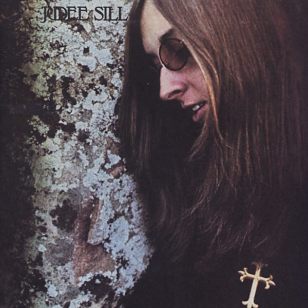

# Abracadabra

By **Judee Sill**

## Album Data

- **Catalog:** Beets
- **Format:** Digital, Album
- **Album:** Abracadabra
- **Artist:** Judee Sill
- **Albumartist:** Judee Sill
- **Genre:** Folk Rock
- **MusicBrainz Album Artist ID:** 
- **MusicBrainz Album ID:** 
- **MusicBrainz Release Group ID:** 
- **Year:** 1973
- **Catalog #:** 
- **Label:** 
- **Total Tracks:** 20

## Album Tracks

### Track 01 - There's A Rugged Road

- **Artist:** Judee Sill
- **Format:** ALAC
- **Genre:** Soft Rock
- **Length:** 3:44
- **MusicBrainz Track ID:** 
- **Title:** There's A Rugged Road
- **Track:** 01
- **Year:** 1973

### Track 02 - The Kiss

- **Artist:** Judee Sill
- **Format:** ALAC
- **Genre:** Folktronica
- **Length:** 4:36
- **MusicBrainz Track ID:** 
- **Title:** The Kiss
- **Track:** 02
- **Year:** 1973

### Track 03 - The Pearl

- **Artist:** Judee Sill
- **Format:** ALAC
- **Genre:** Folk Rock
- **Length:** 1:55
- **MusicBrainz Track ID:** 
- **Title:** The Pearl
- **Track:** 03
- **Year:** 1973

### Track 04 - Down Where The Valleys Are Low

- **Artist:** Judee Sill
- **Format:** ALAC
- **Genre:** Soft Rock
- **Length:** 3:52
- **MusicBrainz Track ID:** 
- **Title:** Down Where The Valleys Are Low
- **Track:** 04
- **Year:** 1973

### Track 05 - The Vigilante

- **Artist:** Judee Sill
- **Format:** ALAC
- **Genre:** Folk Rock
- **Length:** 3:50
- **MusicBrainz Track ID:** 
- **Title:** The Vigilante
- **Track:** 05
- **Year:** 1973

### Track 06 - Soldier Of The Heart

- **Artist:** Judee Sill
- **Format:** ALAC
- **Genre:** Folk Rock
- **Length:** 3:34
- **MusicBrainz Track ID:** 
- **Title:** Soldier Of The Heart
- **Track:** 06
- **Year:** 1973

### Track 07 - The Phoenix

- **Artist:** Judee Sill
- **Format:** ALAC
- **Genre:** Soft Rock
- **Length:** 2:37
- **MusicBrainz Track ID:** 
- **Title:** The Phoenix
- **Track:** 07
- **Year:** 1973

### Track 08 - When The Bridegroom Comes

- **Artist:** Judee Sill
- **Format:** ALAC
- **Genre:** Folk Rock
- **Length:** 4:14
- **MusicBrainz Track ID:** 
- **Title:** When The Bridegroom Comes
- **Track:** 08
- **Year:** 1973

### Track 09 - The Donor

- **Artist:** Judee Sill
- **Format:** ALAC
- **Genre:** Folk Rock
- **Length:** 7:54
- **MusicBrainz Track ID:** 
- **Title:** The Donor
- **Track:** 09
- **Year:** 1973

### Track 10 - Untitled

- **Artist:** Judee Sill
- **Format:** ALAC
- **Genre:** Folk Rock
- **Length:** 1:03
- **MusicBrainz Track ID:** 
- **Title:** Untitled
- **Track:** 10
- **Year:** 1973

### Track 11 - The Desperado

- **Artist:** Judee Sill
- **Format:** ALAC
- **Genre:** Folk Rock
- **Length:** 3:57
- **MusicBrainz Track ID:** 
- **Title:** The Desperado
- **Track:** 11
- **Year:** 1973

### Track 12 - The Kiss

- **Artist:** Judee Sill
- **Format:** ALAC
- **Genre:** Folktronica
- **Length:** 4:12
- **MusicBrainz Track ID:** 
- **Title:** The Kiss
- **Track:** 12
- **Year:** 1973

### Track 13 - Down Where The Valjeys Are Low

- **Artist:** Judee Sill
- **Format:** ALAC
- **Genre:** Soft Rock
- **Length:** 4:49
- **MusicBrainz Track ID:** 
- **Title:** Down Where The Valjeys Are Low
- **Track:** 13
- **Year:** 1973

### Track 14 - The Donor

- **Artist:** Judee Sill
- **Format:** ALAC
- **Genre:** Folk Rock
- **Length:** 4:43
- **MusicBrainz Track ID:** 
- **Title:** The Donor
- **Track:** 14
- **Year:** 1973

### Track 15 - Soldier Of The Heart

- **Artist:** Judee Sill
- **Format:** ALAC
- **Genre:** Folk Rock
- **Length:** 3:06
- **MusicBrainz Track ID:** 
- **Title:** Soldier Of The Heart
- **Track:** 15
- **Year:** 1973

### Track 16 - The Phoenix

- **Artist:** Judee Sill
- **Format:** ALAC
- **Genre:** Soft Rock
- **Length:** 2:29
- **MusicBrainz Track ID:** 
- **Title:** The Phoenix
- **Track:** 16
- **Year:** 1973

### Track 17 - The Vigilante

- **Artist:** Judee Sill
- **Format:** ALAC
- **Genre:** Folk Rock
- **Length:** 3:44
- **MusicBrainz Track ID:** 
- **Title:** The Vigilante
- **Track:** 17
- **Year:** 1973

### Track 18 - The Pearl

- **Artist:** Judee Sill
- **Format:** ALAC
- **Genre:** Folk Rock
- **Length:** 1:58
- **MusicBrainz Track ID:** 
- **Title:** The Pearl
- **Track:** 18
- **Year:** 1973

### Track 19 - There's A Rugged Road

- **Artist:** Judee Sill
- **Format:** ALAC
- **Genre:** Soft Rock
- **Length:** 3:42
- **MusicBrainz Track ID:** 
- **Title:** There's A Rugged Road
- **Track:** 19
- **Year:** 1973

### Track 20 - The Donor (Alternate Mix)

- **Artist:** Judee Sill
- **Format:** ALAC
- **Genre:** Folk Rock
- **Length:** 7:50
- **MusicBrainz Track ID:** 
- **Title:** The Donor (Alternate Mix)
- **Track:** 20
- **Year:** 1973

## See also

- [Abracadabra](Abracadabra.md)
- [Roon: Heart Food](../../Roon/Judee_Sill/Heart_Food.md)
- [Roon: Judee Sill](../../Roon/Judee_Sill/Judee_Sill.md)
