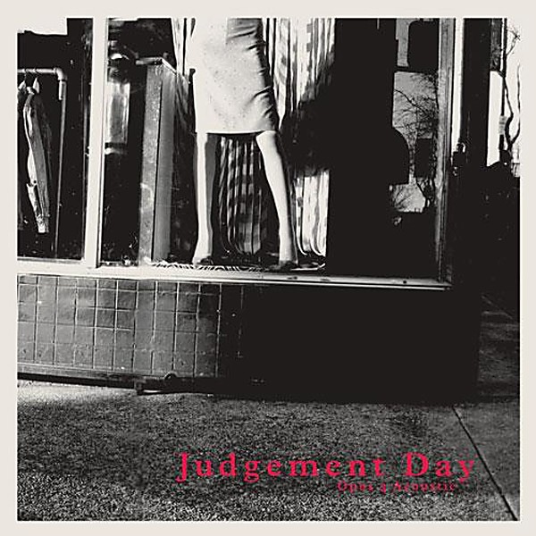

# Acoustic EP

By **Judgement Day**

## Album Data

- **Catalog:** Beets
- **Format:** Digital, Album
- **Album:** Acoustic EP
- **Artist:** Judgement Day
- **Albumartist:** Judgement Day
- **Genre:** Thrash Metal
- **MusicBrainz Album Artist ID:** [cc30cf0b-446b-46d2-aaa9-f7912e1cc48c](https://musicbrainz.org/artist/cc30cf0b-446b-46d2-aaa9-f7912e1cc48c)
- **MusicBrainz Album ID:** [fd47b496-21fc-4fa6-822c-abfb9f017d61](https://musicbrainz.org/release/fd47b496-21fc-4fa6-822c-abfb9f017d61)
- **MusicBrainz Release Group ID:** [a4daa07a-9e8f-3f5d-a4e5-86878c649d64](https://musicbrainz.org/release-group/a4daa07a-9e8f-3f5d-a4e5-86878c649d64)
- **Year:** 2008
- **Catalog #:** 
- **Label:** 
- **Total Tracks:** 08

## Album Tracks

### Track 01 - Intro

- **Artist:** Judgement Day
- **Format:** MP3
- **Genre:** Thrash Metal
- **Length:** 0:59
- **MusicBrainz Track ID:** [46ffa7ea-43a8-4416-9aa5-d720c5b94480](https://musicbrainz.org/recording/46ffa7ea-43a8-4416-9aa5-d720c5b94480)
- **Title:** Intro
- **Track:** 01
- **Year:** 2008

### Track 02 - Air Raid

- **Artist:** Judgement Day
- **Format:** MP3
- **Genre:** Thrash Metal
- **Length:** 2:21
- **MusicBrainz Track ID:** [4dd3a862-3392-4caa-a7c3-18381501bb98](https://musicbrainz.org/recording/4dd3a862-3392-4caa-a7c3-18381501bb98)
- **Title:** Air Raid
- **Track:** 02
- **Year:** 2008

### Track 03 - Carol of the Bells

- **Artist:** Judgement Day
- **Format:** MP3
- **Genre:** Thrash Metal
- **Length:** 2:25
- **MusicBrainz Track ID:** [64317a37-0e88-4d2a-a4d4-14a7a2f15d10](https://musicbrainz.org/recording/64317a37-0e88-4d2a-a4d4-14a7a2f15d10)
- **Title:** Carol of the Bells
- **Track:** 03
- **Year:** 2008

### Track 04 - Interlude

- **Artist:** Judgement Day
- **Format:** MP3
- **Genre:** Thrash Metal
- **Length:** 2:19
- **MusicBrainz Track ID:** [5e8022c1-0601-44a0-a324-fbedaad30338](https://musicbrainz.org/recording/5e8022c1-0601-44a0-a324-fbedaad30338)
- **Title:** Interlude
- **Track:** 04
- **Year:** 2008

### Track 05 - Pitfires

- **Artist:** Judgement Day
- **Format:** MP3
- **Genre:** Thrash Metal
- **Length:** 1:36
- **MusicBrainz Track ID:** [66ab5d8b-d247-4208-831f-7bb72aed686a](https://musicbrainz.org/recording/66ab5d8b-d247-4208-831f-7bb72aed686a)
- **Title:** Pitfires
- **Track:** 05
- **Year:** 2008

### Track 06 - In the Hall of the Mountain King

- **Artist:** Judgement Day
- **Format:** MP3
- **Genre:** Thrash Metal
- **Length:** 2:33
- **MusicBrainz Track ID:** [35e60af5-7684-4167-9b03-506442ddc832](https://musicbrainz.org/recording/35e60af5-7684-4167-9b03-506442ddc832)
- **Title:** In the Hall of the Mountain King
- **Track:** 06
- **Year:** 2008

### Track 07 - Flight

- **Artist:** Judgement Day
- **Format:** MP3
- **Genre:** Thrash Metal
- **Length:** 2:40
- **MusicBrainz Track ID:** [797a9c56-965f-4df2-8c08-0dd9f5aa8dd5](https://musicbrainz.org/recording/797a9c56-965f-4df2-8c08-0dd9f5aa8dd5)
- **Title:** Flight
- **Track:** 07
- **Year:** 2008

