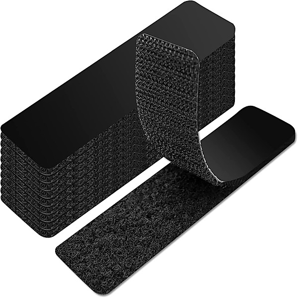

# Both Sides Now (1998)

By **Judy Collins**

## Album Data

- **Catalog:** Beets
- **Format:** Digital, Album
- **Album:** Both Sides Now (1998)
- **Artist:** Judy Collins
- **Albumartist:** Judy Collins
- **Genre:** Easy Listening
- **MusicBrainz Album Artist ID:** 
- **MusicBrainz Album ID:** 
- **MusicBrainz Release Group ID:** 
- **Year:** 0000
- **Catalog #:** 
- **Label:** 
- **Total Tracks:** 00

## Album Tracks

### Track 00 - Send In The Clowns

- **Artist:** Judy Collins
- **Format:** MP3
- **Genre:** Pop
- **Length:** 4:05
- **MusicBrainz Track ID:** 
- **Title:** Send In The Clowns
- **Track:** 00
- **Year:** 1975

## See also

- [Judith](Judith.md)
- [Napster/Collins](Napster-Collins.md)
