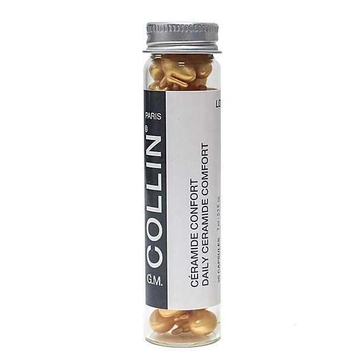

# Napster/Collins

By **Judy Collins**

## Album Data

- **Catalog:** Beets
- **Format:** Digital, Album
- **Album:** Napster/Collins
- **Artist:** Judy Collins
- **Albumartist:** Judy Collins
- **Genre:** Unknown
- **MusicBrainz Album Artist ID:** 
- **MusicBrainz Album ID:** 
- **MusicBrainz Release Group ID:** 
- **Year:** 0000
- **Catalog #:** 
- **Label:** 
- **Total Tracks:** 00

## Album Tracks

### Track 01 - Mr Tambourine Man

- **Artist:** Judy Collins
- **Format:** MP3
- **Genre:** Unknown
- **Length:** 4:40
- **MusicBrainz Track ID:** 
- **Title:** Mr Tambourine Man
- **Track:** 01
- **Year:** 0000

## See also

- [Both Sides Now (1998)](Both_Sides_Now_1998.md)
- [Judith](Judith.md)
