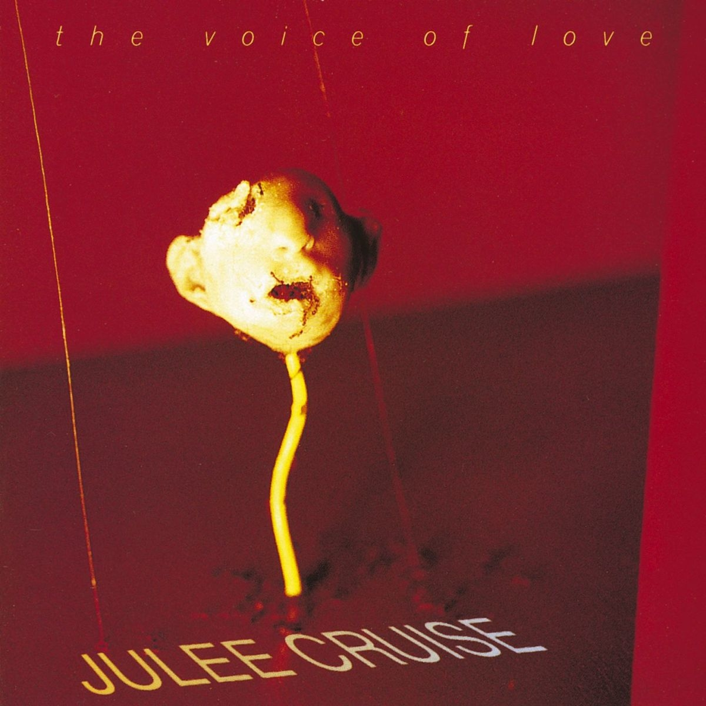

# The Voice of Love

By **Julee Cruise**

## Album Data

- **Catalog:** Beets
- **Format:** Digital, Album
- **Album:** The Voice of Love
- **Artist:** Julee Cruise
- **Albumartist:** Julee Cruise
- **Genre:** Dream Pop
- **MusicBrainz Album Artist ID:** [3b7865df-3c91-48dd-9126-a71e0dfe7f8d](https://musicbrainz.org/artist/3b7865df-3c91-48dd-9126-a71e0dfe7f8d)
- **MusicBrainz Album ID:** [86087f92-9cf4-4f91-8343-0c95c83545a9](https://musicbrainz.org/release/86087f92-9cf4-4f91-8343-0c95c83545a9)
- **MusicBrainz Release Group ID:** [74c420f3-a323-3fba-9651-a91da2907518](https://musicbrainz.org/release-group/74c420f3-a323-3fba-9651-a91da2907518)
- **Year:** 2010
- **Catalog #:** 
- **Label:** Warner Bros. Records
- **Total Tracks:** 11

## Album Tracks

### Track 01 - This Is Our Night

- **Artist:** Julee Cruise
- **Format:** MP3
- **Genre:** Dream Pop
- **Length:** 4:06
- **MusicBrainz Track ID:** [71b8335f-78f4-46dc-b02d-02024c69896f](https://musicbrainz.org/recording/71b8335f-78f4-46dc-b02d-02024c69896f)
- **Title:** This Is Our Night
- **Track:** 01
- **Year:** 2010

### Track 02 - The Space for Love

- **Artist:** Julee Cruise
- **Format:** MP3
- **Genre:** Shoegaze
- **Length:** 3:24
- **MusicBrainz Track ID:** [c78d411a-ded2-409d-83ab-2844789569e9](https://musicbrainz.org/recording/c78d411a-ded2-409d-83ab-2844789569e9)
- **Title:** The Space for Love
- **Track:** 02
- **Year:** 2010

### Track 03 - Movin’ in on You

- **Artist:** Julee Cruise
- **Format:** MP3
- **Genre:** Dream Pop
- **Length:** 4:03
- **MusicBrainz Track ID:** [9d5fd863-19de-4d3e-8ab8-0912f14dfb9f](https://musicbrainz.org/recording/9d5fd863-19de-4d3e-8ab8-0912f14dfb9f)
- **Title:** Movin’ in on You
- **Track:** 03
- **Year:** 2010

### Track 04 - Friends for Life

- **Artist:** Julee Cruise
- **Format:** MP3
- **Genre:** Dream Pop
- **Length:** 4:43
- **MusicBrainz Track ID:** [c1e2be8c-fdc2-4516-83c4-0eac9b4ae522](https://musicbrainz.org/recording/c1e2be8c-fdc2-4516-83c4-0eac9b4ae522)
- **Title:** Friends for Life
- **Track:** 04
- **Year:** 2010

### Track 05 - Up in Flames

- **Artist:** Julee Cruise
- **Format:** MP3
- **Genre:** Dream Pop
- **Length:** 4:39
- **MusicBrainz Track ID:** [9befaff7-f691-485d-9615-58c9d758c4a5](https://musicbrainz.org/recording/9befaff7-f691-485d-9615-58c9d758c4a5)
- **Title:** Up in Flames
- **Track:** 05
- **Year:** 2010

### Track 06 - Kool Kat Walk

- **Artist:** Julee Cruise
- **Format:** MP3
- **Genre:** Jazz
- **Length:** 6:22
- **MusicBrainz Track ID:** [b3275c82-9086-4348-8e76-7c8b93bce7e5](https://musicbrainz.org/recording/b3275c82-9086-4348-8e76-7c8b93bce7e5)
- **Title:** Kool Kat Walk
- **Track:** 06
- **Year:** 2010

### Track 07 - Until the End of the World

- **Artist:** Julee Cruise
- **Format:** MP3
- **Genre:** Dream Pop
- **Length:** 5:32
- **MusicBrainz Track ID:** [ec3031d2-7d07-42f3-97e8-756b90959526](https://musicbrainz.org/recording/ec3031d2-7d07-42f3-97e8-756b90959526)
- **Title:** Until the End of the World
- **Track:** 07
- **Year:** 2010

### Track 08 - She Would Die for Love

- **Artist:** Julee Cruise
- **Format:** MP3
- **Genre:** Rock
- **Length:** 6:06
- **MusicBrainz Track ID:** [8a429f89-9074-4f43-87c2-d258aac62462](https://musicbrainz.org/recording/8a429f89-9074-4f43-87c2-d258aac62462)
- **Title:** She Would Die for Love
- **Track:** 08
- **Year:** 2010

### Track 09 - In My Other World

- **Artist:** Julee Cruise
- **Format:** MP3
- **Genre:** Dream Pop
- **Length:** 4:46
- **MusicBrainz Track ID:** [de04e1a4-603e-46c4-96cb-9d7827fcd7d7](https://musicbrainz.org/recording/de04e1a4-603e-46c4-96cb-9d7827fcd7d7)
- **Title:** In My Other World
- **Track:** 09
- **Year:** 2010

### Track 10 - Questions in a World of Blue

- **Artist:** Julee Cruise
- **Format:** MP3
- **Genre:** Dream Pop
- **Length:** 4:47
- **MusicBrainz Track ID:** [85253730-fde7-425a-af48-d7a050ffb7aa](https://musicbrainz.org/recording/85253730-fde7-425a-af48-d7a050ffb7aa)
- **Title:** Questions in a World of Blue
- **Track:** 10
- **Year:** 2010

### Track 11 - The Voice of Love

- **Artist:** Julee Cruise
- **Format:** MP3
- **Genre:** Dream Pop
- **Length:** 3:14
- **MusicBrainz Track ID:** [ffb31937-fa2f-455c-8e6f-921964de4ba8](https://musicbrainz.org/recording/ffb31937-fa2f-455c-8e6f-921964de4ba8)
- **Title:** The Voice of Love
- **Track:** 11
- **Year:** 2010

