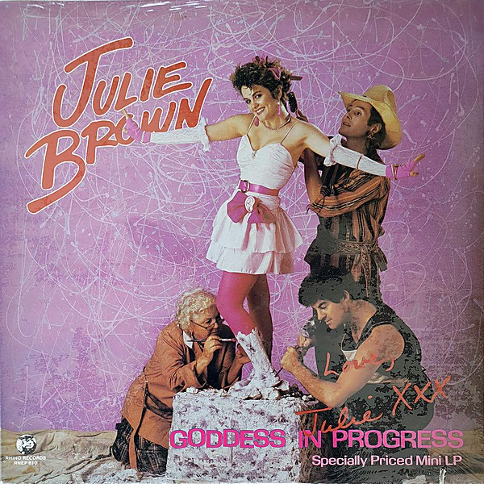

# Goddess in Progress

By **Julie Brown**

## Album Data

- **Catalog:** Beets
- **Format:** Digital, Album
- **Album:** Goddess in Progress
- **Artist:** Julie Brown
- **Albumartist:** Julie Brown
- **Genre:** Pop
- **MusicBrainz Album Artist ID:** [71fb6bba-d31b-4538-b982-ccd2ffe34071](https://musicbrainz.org/artist/71fb6bba-d31b-4538-b982-ccd2ffe34071)
- **MusicBrainz Album ID:** [4aeea1eb-08ac-4266-b02e-3517b5b74bd0](https://musicbrainz.org/release/4aeea1eb-08ac-4266-b02e-3517b5b74bd0)
- **MusicBrainz Release Group ID:** [4193a163-b4c4-44f7-9647-2df431db84cc](https://musicbrainz.org/release-group/4193a163-b4c4-44f7-9647-2df431db84cc)
- **Year:** 1984
- **Catalog #:** RNEP 610
- **Label:** Rhino
- **Total Tracks:** 05

## Album Tracks

### Track 01 - I Like ’em Big & Stupid

- **Artist:** Julie Brown
- **Format:** MP3
- **Genre:** Pop
- **Length:** 2:42
- **MusicBrainz Track ID:** [927bef35-6e34-4abe-96a2-dd67a807717a](https://musicbrainz.org/recording/927bef35-6e34-4abe-96a2-dd67a807717a)
- **Title:** I Like ’em Big & Stupid
- **Track:** 01
- **Year:** 1984

### Track 02 - Homecoming Queen’s Got a Gun

- **Artist:** Julie Brown
- **Format:** MP3
- **Genre:** Pop
- **Length:** 4:39
- **MusicBrainz Track ID:** [6000484c-fb33-49c6-8aee-25a2f2ad8d22](https://musicbrainz.org/recording/6000484c-fb33-49c6-8aee-25a2f2ad8d22)
- **Title:** Homecoming Queen’s Got a Gun
- **Track:** 02
- **Year:** 1984

### Track 03 - Will I Make It Through the Eighties

- **Artist:** Julie Brown
- **Format:** MP3
- **Genre:** Pop
- **Length:** 2:26
- **MusicBrainz Track ID:** [610cbb9f-038a-40dd-89c0-8c23ff118a01](https://musicbrainz.org/recording/610cbb9f-038a-40dd-89c0-8c23ff118a01)
- **Title:** Will I Make It Through the Eighties
- **Track:** 03
- **Year:** 1984

### Track 04 - ’Cause I’m a Blond

- **Artist:** Julie Brown
- **Format:** MP3
- **Genre:** Pop
- **Length:** 2:18
- **MusicBrainz Track ID:** [9d3dd738-3df4-4fcb-b9c8-7dba360920c6](https://musicbrainz.org/recording/9d3dd738-3df4-4fcb-b9c8-7dba360920c6)
- **Title:** ’Cause I’m a Blond
- **Track:** 04
- **Year:** 1984

### Track 05 - Earth Girls Are Easy

- **Artist:** Julie Brown
- **Format:** MP3
- **Genre:** Pop
- **Length:** 4:46
- **MusicBrainz Track ID:** [5408345d-4b9f-4bed-932d-240faaac4b97](https://musicbrainz.org/recording/5408345d-4b9f-4bed-932d-240faaac4b97)
- **Title:** Earth Girls Are Easy
- **Track:** 05
- **Year:** 1984

## See also

- [Vinyl: Goddess In Progress](../../Vinyl/Julie_Brown/Goddess_In_Progress.md)
- [Vinyl: ](../../Vinyl/Julie_Brown/Julie_Brown.md)
