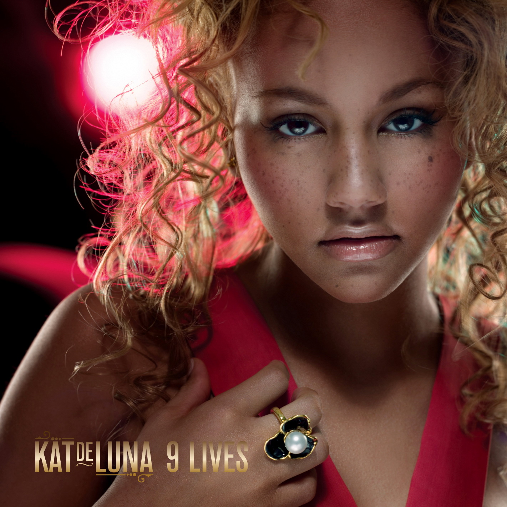

# 9 Lives

By **Kat DeLuna**

## Album Data

- **Catalog:** Beets
- **Format:** Digital, Album
- **Album:** 9 Lives
- **Artist:** Kat Deluna
- **Albumartist:** Kat DeLuna
- **Genre:** Latin Pop
- **MusicBrainz Album Artist ID:** [ddd4c4bc-a4ae-4946-b59c-a86aea7fa4f0](https://musicbrainz.org/artist/ddd4c4bc-a4ae-4946-b59c-a86aea7fa4f0)
- **MusicBrainz Album ID:** [3b6e4b62-b194-4a4c-a318-6eaf02c9ce3c](https://musicbrainz.org/release/3b6e4b62-b194-4a4c-a318-6eaf02c9ce3c)
- **MusicBrainz Release Group ID:** [0564dc30-1a4b-328c-ae55-98b55118a09c](https://musicbrainz.org/release-group/0564dc30-1a4b-328c-ae55-98b55118a09c)
- **Year:** 2007
- **Catalog #:** 
- **Label:** Epic
- **Total Tracks:** 14

## Album Tracks

### Track 01 - 9 Lives (intro)

- **Artist:** Kat DeLuna
- **Format:** ALAC
- **Genre:** Electronica
- **Length:** 1:06
- **MusicBrainz Track ID:** [bd351c6f-2136-4b8e-92da-fbec708ecce8](https://musicbrainz.org/recording/bd351c6f-2136-4b8e-92da-fbec708ecce8)
- **Title:** 9 Lives (intro)
- **Track:** 01
- **Year:** 2007

### Track 05 - Feel What I Feel

- **Artist:** Kat DeLuna
- **Format:** ALAC
- **Genre:** Pop
- **Length:** 4:04
- **MusicBrainz Track ID:** [05deeacc-83f4-4df7-b3ab-2f2b52ecb3ca](https://musicbrainz.org/recording/05deeacc-83f4-4df7-b3ab-2f2b52ecb3ca)
- **Title:** Feel What I Feel
- **Track:** 05
- **Year:** 2007

### Track 06 - Love Me, Leave Me

- **Artist:** Kat DeLuna
- **Format:** ALAC
- **Genre:** Pop
- **Length:** 4:11
- **MusicBrainz Track ID:** [1cca02e5-811d-4b95-bb9d-e54c6f383e81](https://musicbrainz.org/recording/1cca02e5-811d-4b95-bb9d-e54c6f383e81)
- **Title:** Love Me, Leave Me
- **Track:** 06
- **Year:** 2007

### Track 07 - In the End

- **Artist:** Kat DeLuna
- **Format:** ALAC
- **Genre:** Dancehall
- **Length:** 3:23
- **MusicBrainz Track ID:** [52802b37-48dd-4a38-b6d9-d0456f9bf520](https://musicbrainz.org/recording/52802b37-48dd-4a38-b6d9-d0456f9bf520)
- **Title:** In the End
- **Track:** 07
- **Year:** 2007

### Track 08 - Love Confusion

- **Artist:** Kat DeLuna
- **Format:** ALAC
- **Genre:** Soul
- **Length:** 4:02
- **MusicBrainz Track ID:** [79f79fa0-abda-4b4f-b346-e87e97132319](https://musicbrainz.org/recording/79f79fa0-abda-4b4f-b346-e87e97132319)
- **Title:** Love Confusion
- **Track:** 08
- **Year:** 2007

### Track 09 - Animal

- **Artist:** Kat DeLuna
- **Format:** ALAC
- **Genre:** Pop
- **Length:** 3:23
- **MusicBrainz Track ID:** [a5155b1c-59ef-4e79-826c-efea7659c131](https://musicbrainz.org/recording/a5155b1c-59ef-4e79-826c-efea7659c131)
- **Title:** Animal
- **Track:** 09
- **Year:** 2007

### Track 11 - Enjoy Saying Goodbye

- **Artist:** Kat DeLuna
- **Format:** ALAC
- **Genre:** Dancehall
- **Length:** 4:05
- **MusicBrainz Track ID:** [0c9e16e8-aa8b-4563-a63a-876fc4bf2fe1](https://musicbrainz.org/recording/0c9e16e8-aa8b-4563-a63a-876fc4bf2fe1)
- **Title:** Enjoy Saying Goodbye
- **Track:** 11
- **Year:** 2007

### Track 13 - Como un sueño (Am I Dreaming)

- **Artist:** Kat DeLuna
- **Format:** ALAC
- **Genre:** Latin Pop
- **Length:** 3:59
- **MusicBrainz Track ID:** [a7439705-f6a8-4745-be88-4e2fee3dbaed](https://musicbrainz.org/recording/a7439705-f6a8-4745-be88-4e2fee3dbaed)
- **Title:** Como un sueño (Am I Dreaming)
- **Track:** 13
- **Year:** 2007

### Track 03 - Am I Dreaming

- **Artist:** Kat DeLuna feat. Akon
- **Format:** ALAC
- **Genre:** Latin Pop
- **Length:** 4:14
- **MusicBrainz Track ID:** [fc188f10-bb75-4c7a-96fd-7b78d522a2b6](https://musicbrainz.org/recording/fc188f10-bb75-4c7a-96fd-7b78d522a2b6)
- **Title:** Am I Dreaming
- **Track:** 03
- **Year:** 2007

### Track 14 - Run the Show

- **Artist:** Kat DeLuna feat. Don Omar
- **Format:** ALAC
- **Genre:** Latin Pop
- **Length:** 3:30
- **MusicBrainz Track ID:** [cbbc737c-dfee-47d5-9a2e-82ebad65af72](https://musicbrainz.org/recording/cbbc737c-dfee-47d5-9a2e-82ebad65af72)
- **Title:** Run the Show
- **Track:** 14
- **Year:** 2007

### Track 04 - Whine Up

- **Artist:** Kat DeLuna feat. Elephant Man
- **Format:** ALAC
- **Genre:** Dancehall
- **Length:** 3:25
- **MusicBrainz Track ID:** [0d0b7c6d-abda-4187-a904-1acf6e38b16f](https://musicbrainz.org/recording/0d0b7c6d-abda-4187-a904-1acf6e38b16f)
- **Title:** Whine Up
- **Track:** 04
- **Year:** 2007

### Track 12 - Whine Up (En Español)

- **Artist:** Kat DeLuna feat. Elephant Man
- **Format:** ALAC
- **Genre:** Pop
- **Length:** 3:25
- **MusicBrainz Track ID:** [f578af26-5c36-4ab5-aa5f-d185d6a12a8b](https://musicbrainz.org/recording/f578af26-5c36-4ab5-aa5f-d185d6a12a8b)
- **Title:** Whine Up (En Español)
- **Track:** 12
- **Year:** 2007

### Track 02 - Run the Show

- **Artist:** Kat DeLuna feat. Shaka Dee
- **Format:** ALAC
- **Genre:** Latin Pop
- **Length:** 3:31
- **MusicBrainz Track ID:** [5a70eab2-12ee-4d50-bdfc-cfd8c9f6ab30](https://musicbrainz.org/recording/5a70eab2-12ee-4d50-bdfc-cfd8c9f6ab30)
- **Title:** Run the Show
- **Track:** 02
- **Year:** 2007

### Track 10 - Be Remembered

- **Artist:** Kat DeLuna feat. Shaka Dee
- **Format:** ALAC
- **Genre:** Latin Pop
- **Length:** 3:37
- **MusicBrainz Track ID:** [8d86cc20-073f-4ae3-9dd1-d2f2ece1dec6](https://musicbrainz.org/recording/8d86cc20-073f-4ae3-9dd1-d2f2ece1dec6)
- **Title:** Be Remembered
- **Track:** 10
- **Year:** 2007

