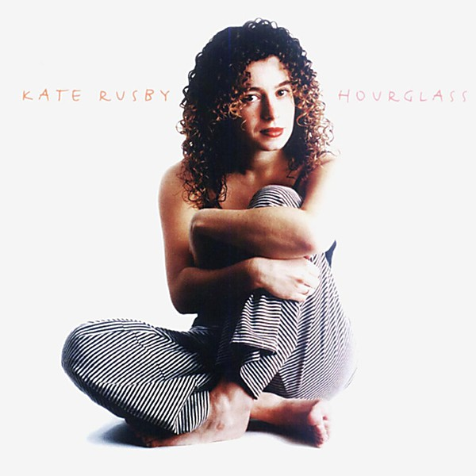

# Hourglass

By **Kate Rusby**

## Album Data

- **Catalog:** Beets
- **Format:** Digital, Album
- **Album:** Hourglass
- **Artist:** Kate Rusby
- **Albumartist:** Kate Rusby
- **Genre:** Pop
- **MusicBrainz Album Artist ID:** 
- **MusicBrainz Album ID:** 
- **MusicBrainz Release Group ID:** 
- **Year:** 2000
- **Catalog #:** 
- **Label:** 
- **Total Tracks:** 00

## Album Tracks

### Track 07 - The Moon and St. Christopher

- **Artist:** Kate Rusby
- **Format:** MP3
- **Genre:** Unknown
- **Length:** 4:06
- **MusicBrainz Track ID:** 
- **Title:** The Moon and St. Christopher
- **Track:** 07
- **Year:** 0000

## See also

- [intuition](intuition.md)
- [Sleepless](Sleepless.md)
